# One API (songquanpeng/one-api) 源码架构深度分析报告

> **分析版本**: 基于最新 main 分支  
> **分析日期**: 2026-07-12  
> **分析目的**: 为 DDW AI Hub 的 `ddw-llm-gateway` 和 `ddw-token-manager` 插件提供技术参考  
> **源码路径**: `/Users/chenye/workspace/llm-gateway-research/one-api/`  
> **许可证**: MIT License

---

## 目录

1. [整体架构设计](#1-整体架构设计)
2. [路由引擎（Relay模块）完整代码分析](#2-路由引擎relay模块完整代码分析)
3. [额度管理系统完整代码分析](#3-额度管理系统完整代码分析)
4. [渠道管理完整代码分析](#4-渠道管理完整代码分析)
5. [负载均衡与失败切换机制](#5-负载均衡与失败切换机制)
6. [中间件链设计](#6-中间件链设计)
7. [数据库 Schema 设计](#7-数据库-schema-设计)
8. [可复用的代码模式和设计模式](#8-可复用的代码模式和设计模式)
9. [与 DDW 插件体系的适配建议](#9-与-ddw-插件体系的适配建议)
10. [不可复用的部分和改进建议](#10-不可复用的部分和改进建议)

---

## 1. 整体架构设计

### 1.1 项目目录结构

One API 采用经典的 Go Web 项目分层架构，目录结构如下：

```
one-api/
├── main.go                    # 入口文件，初始化所有子系统
├── router/                    # 路由注册层
│   ├── api.go                 # 管理API路由（/api/*）
│   ├── relay.go               # Relay代理路由（/v1/*）
│   ├── dashboard.go           # Dashboard路由
│   ├── web.go                 # 前端静态文件路由
│   └── main.go                # 路由总入口
├── middleware/                 # 中间件层
│   ├── auth.go                # 认证中间件（Session/Token/Admin/Root）
│   ├── distributor.go         # 渠道分发中间件
│   ├── rate-limit.go          # 限流中间件
│   ├── cors.go                # CORS跨域
│   ├── gzip.go                # Gzip压缩
│   ├── recover.go             # Panic恢复
│   ├── request-id.go          # 请求ID追踪
│   ├── logger.go              # 请求日志
│   ├── cache.go               # 缓存中间件
│   ├── language.go            # 国际化
│   └── turnstile-check.go     # Cloudflare Turnstile验证
├── controller/                # 控制器层
│   ├── relay.go               # Relay入口控制器
│   ├── token.go               # Token CRUD控制器
│   ├── channel.go             # 渠道CRUD控制器
│   ├── billing.go             # 计费接口控制器
│   ├── user.go                # 用户管理控制器
│   ├── log.go                 # 日志查询控制器
│   ├── option.go              # 系统选项控制器
│   ├── channel-test.go        # 渠道测试控制器
│   └── auth/                  # OAuth认证控制器
├── relay/                     # 核心Relay引擎
│   ├── adaptor.go             # Adaptor工厂（switch分发）
│   ├── adaptor/               # 各API适配器实现
│   │   ├── interface.go       # Adaptor接口定义
│   │   ├── common.go          # 公共工具函数
│   │   ├── openai/            # OpenAI适配器（最复杂）
│   │   ├── anthropic/         # Anthropic适配器
│   │   ├── gemini/            # Google Gemini适配器
│   │   ├── ali/               # 阿里云通义适配器
│   │   ├── zhipu/             # 智谱AI适配器
│   │   ├── baidu/             # 百度文心适配器
│   │   └── ...                # 共20+个适配器
│   ├── apitype/               # API类型常量定义
│   ├── channeltype/           # 渠道类型常量定义
│   ├── billing/               # 计费引擎
│   │   ├── billing.go         # 预消费/后消费逻辑
│   │   └── ratio/             # 模型倍率和组倍率
│   ├── controller/            # Relay内部控制器
│   │   ├── text.go            # 文本类请求处理
│   │   ├── image.go           # 图像类请求处理
│   │   ├── audio.go           # 音频类请求处理
│   │   ├── proxy.go           # 代理类请求处理
│   │   ├── error.go           # 错误处理
│   │   └── helper.go          # 辅助函数（配额计算等）
│   ├── meta/                  # 请求元数据
│   ├── model/                 # Relay层数据模型
│   ├── relaymode/             # Relay模式定义
│   └── constant/              # 常量定义
├── model/                     # 数据模型层（ORM）
│   ├── main.go                # 数据库初始化、迁移
│   ├── channel.go             # Channel模型
│   ├── token.go               # Token模型
│   ├── user.go                # User模型
│   ├── log.go                 # Log模型
│   ├── ability.go             # Ability模型（渠道-模型映射）
│   ├── option.go              # Option模型（系统配置）
│   ├── redemption.go          # Redemption模型（兑换码）
│   ├── cache.go               # 缓存层（Redis/内存）
│   └── utils.go               # 批量更新器
├── monitor/                   # 监控模块
│   ├── metric.go              # 渠道成功率监控
│   └── channel.go             # 渠道状态管理（自动禁用/启用）
├── common/                    # 公共库
│   ├── config/config.go       # 全局配置变量
│   ├── redis.go               # Redis操作封装
│   ├── database.go            # 数据库兼容性工具
│   ├── crypto.go              # 加密工具
│   ├── constants.go           # 全局常量
│   ├── logger/                # 日志模块
│   ├── client/                # HTTP客户端初始化
│   ├── i18n/                  # 国际化
│   └── ...
└── web/                       # 前端（React build产物）
```

### 1.2 整体架构图

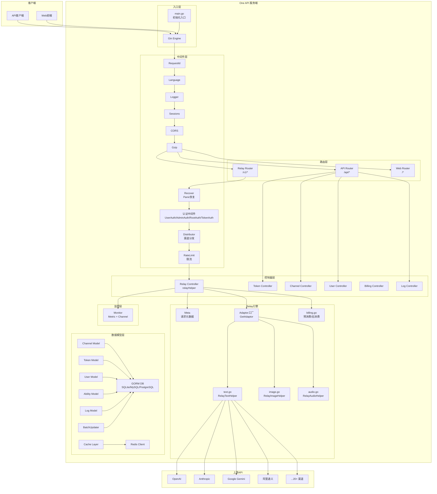

### 1.3 请求处理核心流程图

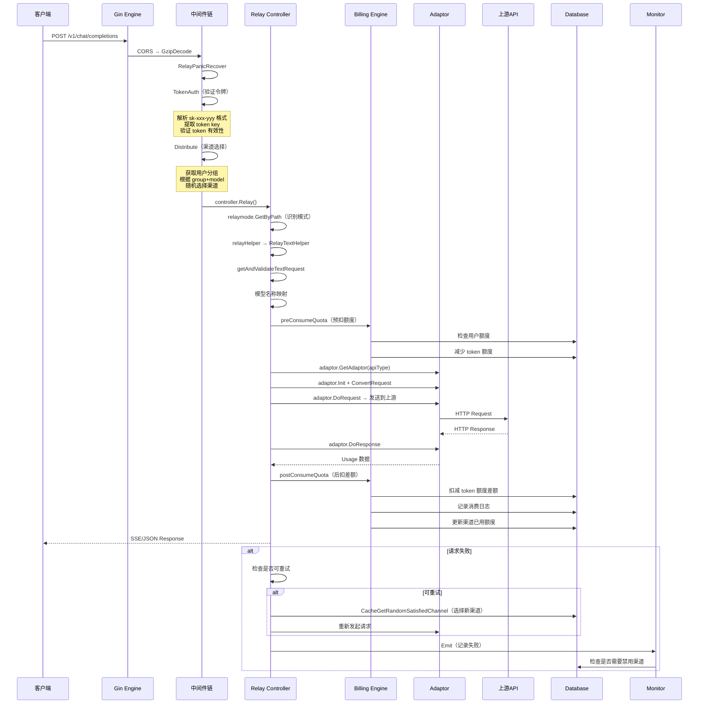

### 1.4 初始化顺序

入口文件 `main.go`（`/Users/chenye/workspace/llm-gateway-research/one-api/main.go`）展示了清晰的初始化顺序：

1. **第30行**: `common.Init()` — 初始化公共库（日志、配置等）
2. **第31行**: `logger.SetupLogger()` — 设置日志系统
3. **第42-43行**: `model.InitDB()` + `model.InitLogDB()` — 初始化数据库连接并执行迁移
4. **第46行**: `model.CreateRootAccountIfNeed()` — 确保根用户存在
5. **第58行**: `common.InitRedisClient()` — 初始化 Redis 连接
6. **第64行**: `model.InitOptionMap()` — 从数据库加载系统配置
7. **第73行**: `model.InitChannelCache()` — 初始化渠道内存缓存
8. **第76-77行**: 启动 `SyncOptions` 和 `SyncChannelCache` 定时同步协程
9. **第94行**: `openai.InitTokenEncoders()` — 初始化 Token 计数器
10. **第95行**: `client.Init()` — 初始化全局 HTTP 客户端
11. **第98行**: `i18n.Init()` — 初始化国际化
12. **第103-112行**: 创建 Gin 引擎并挂载中间件
13. **第114行**: `router.SetRouter(server, buildFS)` — 注册所有路由

```go
// main.go 第29-124行
func main() {
    common.Init()
    logger.SetupLogger()
    logger.SysLogf("One API %s started", common.Version)
    
    // ... 环境变量处理 ...
    
    model.InitDB()           // 数据库初始化
    model.InitLogDB()        // 日志数据库初始化
    model.CreateRootAccountIfNeed() // 创建根账户
    
    common.InitRedisClient() // Redis初始化
    model.InitOptionMap()    // 系统配置初始化
    
    if config.MemoryCacheEnabled {
        model.InitChannelCache()         // 渠道缓存
        go model.SyncOptions(...)        // 定时同步选项
        go model.SyncChannelCache(...)   // 定时同步渠道
    }
    
    openai.InitTokenEncoders() // Token计数器
    client.Init()              // HTTP客户端
    i18n.Init()                // 国际化
    
    server := gin.New()
    server.Use(gin.Recovery())
    server.Use(middleware.RequestId())
    server.Use(middleware.Language())
    // ... session 和路由设置 ...
    router.SetRouter(server, buildFS)
    server.Run(":" + port)
}
```

---

## 2. 路由引擎（Relay模块）完整代码分析

### 2.1 路由注册架构

路由系统分为三个层级：

```go
// router/main.go 第14-31行
func SetRouter(router *gin.Engine, buildFS embed.FS) {
    SetApiRouter(router)       // 管理API路由
    SetDashboardRouter(router) // Dashboard路由
    SetRelayRouter(router)     // Relay代理路由
    // ... 前端路由 ...
}
```

#### 2.1.1 API路由（`router/api.go`）

管理后台的 REST API，使用标准的 CRUD 模式：

```go
// router/api.go 第12-121行
func SetApiRouter(router *gin.Engine) {
    apiRouter := router.Group("/api")
    apiRouter.Use(gzip.Gzip(gzip.DefaultCompression))
    apiRouter.Use(middleware.GlobalAPIRateLimit())  // 全局API限流
    
    // 公开路由（无需认证）
    apiRouter.GET("/status", controller.GetStatus)
    apiRouter.GET("/notice", controller.GetNotice)
    apiRouter.GET("/verification", middleware.CriticalRateLimit(), ...)
    
    // 用户路由
    userRoute := apiRouter.Group("/user")
    // 认证路由（UserAuth）
    selfRoute := userRoute.Group("/")
    selfRoute.Use(middleware.UserAuth())
    
    // 管理员路由（AdminAuth）
    adminRoute := userRoute.Group("/")
    adminRoute.Use(middleware.AdminAuth())
    
    // 渠道管理（AdminAuth）
    channelRoute := apiRouter.Group("/channel")
    channelRoute.Use(middleware.AdminAuth())
    
    // Token管理（UserAuth）
    tokenRoute := apiRouter.Group("/token")
    tokenRoute.Use(middleware.UserAuth())
    
    // 兑换码管理（AdminAuth）
    redemptionRoute := apiRouter.Group("/redemption")
    redemptionRoute.Use(middleware.AdminAuth())
}
```

**路由层级设计模式**：

| 路由组 | 前缀 | 认证级别 | 用途 |
|--------|------|----------|------|
| 公开 | `/api/status`, `/api/notice` | 无需认证 | 系统状态信息 |
| 用户 | `/api/user/*` | UserAuth (role≥1) | 用户自管理 |
| 管理员 | `/api/user/*` | AdminAuth (role≥10) | 用户管理 |
| Root | `/api/option/*` | RootAuth (role≥100) | 系统配置 |
| 渠道 | `/api/channel/*` | AdminAuth | 渠道CRUD |
| Token | `/api/token/*` | UserAuth | Token管理 |
| 日志 | `/api/log/*` | AdminAuth/UserAuth | 日志查询 |

#### 2.1.2 Relay路由（`router/relay.go`）

```go
// router/relay.go 第10-74行
func SetRelayRouter(router *gin.Engine) {
    router.Use(middleware.CORS())
    router.Use(middleware.GzipDecodeMiddleware())
    
    // 模型列表路由（仅需Token认证）
    modelsRouter := router.Group("/v1/models")
    modelsRouter.Use(middleware.TokenAuth())
    modelsRouter.GET("", controller.ListModels)
    
    // Relay代理路由（完整中间件链）
    relayV1Router := router.Group("/v1")
    relayV1Router.Use(
        middleware.RelayPanicRecover(),  // Panic恢复
        middleware.TokenAuth(),           // 令牌认证
        middleware.Distribute(),          // 渠道分发
    )
    {
        relayV1Router.POST("/chat/completions", controller.Relay)
        relayV1Router.POST("/completions", controller.Relay)
        relayV1Router.POST("/embeddings", controller.Relay)
        relayV1Router.POST("/images/generations", controller.Relay)
        relayV1Router.POST("/audio/transcriptions", controller.Relay)
        relayV1Router.POST("/audio/speech", controller.Relay)
        relayV1Router.Any("/oneapi/proxy/:channelid/*target", controller.Relay)
        // ... 其他路由 ...
    }
}
```

**Relay路由中间件链**：

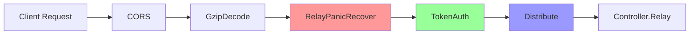

### 2.2 Relay 控制器核心逻辑

#### 2.2.1 入口函数 `Relay`

`controller/relay.go` 第45-103行是整个 Relay 系统的核心入口：

```go
// controller/relay.go 第45-103行
func Relay(c *gin.Context) {
    ctx := c.Request.Context()
    // 1. 识别请求模式
    relayMode := relaymode.GetByPath(c.Request.URL.Path)
    
    // 2. 调用 relayHelper 处理请求
    channelId := c.GetInt(ctxkey.ChannelId)
    userId := c.GetInt(ctxkey.Id)
    bizErr := relayHelper(c, relayMode)
    
    if bizErr == nil {
        monitor.Emit(channelId, true)  // 成功 → 记录指标
        return
    }
    
    // 3. 失败重试逻辑
    lastFailedChannelId := channelId
    retryTimes := config.RetryTimes
    if !shouldRetry(c, bizErr.StatusCode) {
        retryTimes = 0  // 不可重试的错误码
    }
    
    for i := retryTimes; i > 0; i-- {
        // 选择新的渠道（ignoreFirstPriority=true 跳过最高优先级）
        channel, err := dbmodel.CacheGetRandomSatisfiedChannel(
            group, originalModel, i != retryTimes)
        if err != nil {
            break  // 没有更多可用渠道
        }
        if channel.Id == lastFailedChannelId {
            continue  // 跳过刚失败的渠道
        }
        
        // 重新设置上下文并重试
        middleware.SetupContextForSelectedChannel(c, channel, originalModel)
        c.Request.Body = io.NopCloser(bytes.NewBuffer(requestBody))
        bizErr = relayHelper(c, relayMode)
        if bizErr == nil {
            return  // 重试成功
        }
        // 记录失败渠道
        go processChannelRelayError(ctx, userId, channel.Id, channel.Name, *bizErr)
    }
    
    // 所有重试都失败
    if bizErr != nil {
        bizErr.Error.Message = helper.MessageWithRequestId(bizErr.Error.Message, requestId)
        c.JSON(bizErr.StatusCode, gin.H{"error": bizErr.Error})
    }
}
```

#### 2.2.2 模式分发函数 `relayHelper`

```go
// controller/relay.go 第26-43行
func relayHelper(c *gin.Context, relayMode int) *model.ErrorWithStatusCode {
    switch relayMode {
    case relaymode.ImagesGenerations:
        return controller.RelayImageHelper(c, relayMode)
    case relaymode.AudioSpeech, relaymode.AudioTranslation, relaymode.AudioTranscription:
        return controller.RelayAudioHelper(c, relayMode)
    case relaymode.Proxy:
        return controller.RelayProxyHelper(c, relayMode)
    default:
        return controller.RelayTextHelper(c)  // Chat/Completions/Embeddings/Moderations
    }
}
```

#### 2.2.3 文本处理核心 `RelayTextHelper`

这是最核心的函数（`relay/controller/text.go` 第25-88行），展示了完整的请求处理流程：

```go
// relay/controller/text.go 第25-88行
func RelayTextHelper(c *gin.Context) *model.ErrorWithStatusCode {
    ctx := c.Request.Context()
    
    // 1. 从上下文提取元数据
    meta := meta.GetByContext(c)
    
    // 2. 获取并验证请求体
    textRequest, err := getAndValidateTextRequest(c, meta.Mode)
    if err != nil {
        return openai.ErrorWrapper(err, "invalid_text_request", http.StatusBadRequest)
    }
    meta.IsStream = textRequest.Stream
    
    // 3. 模型名称映射
    meta.OriginModelName = textRequest.Model
    textRequest.Model, _ = getMappedModelName(textRequest.Model, meta.ModelMapping)
    meta.ActualModelName = textRequest.Model
    
    // 4. 设置系统提示词（如果渠道配置了强制系统提示词）
    systemPromptReset := setSystemPrompt(ctx, textRequest, meta.ForcedSystemPrompt)
    
    // 5. 计算计费倍率
    modelRatio := billingratio.GetModelRatio(textRequest.Model, meta.ChannelType)
    groupRatio := billingratio.GetGroupRatio(meta.Group)
    ratio := modelRatio * groupRatio
    
    // 6. 预扣额度
    promptTokens := getPromptTokens(textRequest, meta.Mode)
    meta.PromptTokens = promptTokens
    preConsumedQuota, bizErr := preConsumeQuota(ctx, textRequest, promptTokens, ratio, meta)
    if bizErr != nil {
        return bizErr
    }
    
    // 7. 获取并初始化Adaptor
    adaptor := relay.GetAdaptor(meta.APIType)
    if adaptor == nil {
        return openai.ErrorWrapper(fmt.Errorf("invalid api type"), "invalid_api_type", 400)
    }
    adaptor.Init(meta)
    
    // 8. 转换请求体
    requestBody, err := getRequestBody(c, meta, textRequest, adaptor)
    if err != nil {
        return openai.ErrorWrapper(err, "convert_request_failed", 500)
    }
    
    // 9. 发送请求到上游
    resp, err := adaptor.DoRequest(c, meta, requestBody)
    if err != nil {
        return openai.ErrorWrapper(err, "do_request_failed", 500)
    }
    
    // 10. 检查是否发生错误
    if isErrorHappened(meta, resp) {
        billing.ReturnPreConsumedQuota(ctx, preConsumedQuota, meta.TokenId)
        return RelayErrorHandler(resp)
    }
    
    // 11. 处理响应
    usage, respErr := adaptor.DoResponse(c, resp, meta)
    if respErr != nil {
        billing.ReturnPreConsumedQuota(ctx, preConsumedQuota, meta.TokenId)
        return respErr
    }
    
    // 12. 异步后扣额度差额
    go postConsumeQuota(ctx, usage, meta, textRequest, ratio, preConsumedQuota, modelRatio, groupRatio, systemPromptReset)
    return nil
}
```

### 2.3 Adaptor 适配器模式

#### 2.3.1 Adaptor 接口定义

```go
// relay/adaptor/interface.go 第11-21行
type Adaptor interface {
    Init(meta *meta.Meta)                                    // 初始化
    GetRequestURL(meta *meta.Meta) (string, error)           // 构建请求URL
    SetupRequestHeader(c *gin.Context, req *http.Request, meta *meta.Meta) error  // 设置请求头
    ConvertRequest(c *gin.Context, relayMode int, request *model.GeneralOpenAIRequest) (any, error)  // 转换请求
    ConvertImageRequest(request *model.ImageRequest) (any, error)  // 转换图像请求
    DoRequest(c *gin.Context, meta *meta.Meta, requestBody io.Reader) (*http.Response, error)  // 发送请求
    DoResponse(c *gin.Context, resp *http.Response, meta *meta.Meta) (*model.Usage, *model.ErrorWithStatusCode)  // 处理响应
    GetModelList() []string    // 获取模型列表
    GetChannelName() string    // 获取渠道名称
}
```

#### 2.3.2 Adaptor 工厂

```go
// relay/adaptor.go 第27-69行
func GetAdaptor(apiType int) adaptor.Adaptor {
    switch apiType {
    case apitype.OpenAI:       return &openai.Adaptor{}
    case apitype.Anthropic:    return &anthropic.Adaptor{}
    case apitype.Gemini:       return &gemini.Adaptor{}
    case apitype.Ali:          return &ali.Adaptor{}
    case apitype.Zhipu:        return &zhipu.Adaptor{}
    case apitype.Baidu:        return &baidu.Adaptor{}
    case apitype.Tencent:      return &tencent.Adaptor{}
    case apitype.Xunfei:       return &xunfei.Adaptor{}
    case apitype.Ollama:       return &ollama.Adaptor{}
    case apitype.Coze:         return &coze.Adaptor{}
    case apitype.Cohere:       return &cohere.Adaptor{}
    case apitype.Cloudflare:   return &cloudflare.Adaptor{}
    case apitype.DeepL:        return &deepl.Adaptor{}
    case apitype.VertexAI:     return &vertexai.Adaptor{}
    case apitype.AwsClaude:    return &aws.Adaptor{}
    case apitype.Proxy:        return &proxy.Adaptor{}
    case apitype.Replicate:    return &replicate.Adaptor{}
    case apitype.PaLM:         return &palm.Adaptor{}
    case apitype.AIProxyLibrary: return &aiproxy.Adaptor{}
    }
    return nil
}
```

#### 2.3.3 API类型定义

```go
// relay/apitype/define.go 第1-25行
const (
    OpenAI = iota       // 0 - OpenAI兼容
    Anthropic           // 1
    PaLM                // 2
    Baidu               // 3
    Zhipu               // 4
    Ali                 // 5
    Xunfei              // 6
    AIProxyLibrary      // 7
    Tencent             // 8
    Gemini              // 9
    Ollama              // 10
    AwsClaude           // 11
    Coze                // 12
    Cohere              // 13
    Cloudflare          // 14
    DeepL               // 15
    VertexAI            // 16
    Proxy               // 17
    Replicate           // 18
    Dummy               // 计数用，不用于实际渠道
)
```

#### 2.3.4 渠道类型定义（ChannelType vs APIType）

渠道类型（`relay/channeltype/define.go`）比 API 类型多得多（56种 vs 19种），因为很多渠道虽然使用 OpenAI 兼容 API，但有不同的 URL 格式和认证方式：

```go
// relay/channeltype/define.go
const (
    Unknown = iota
    OpenAI           // 标准OpenAI
    API2D            // API2D
    Azure            // Azure OpenAI
    CloseAI          // CloseAI
    OpenAISB         // OpenAI SB
    // ... 大量OpenAI兼容变体 ...
    Custom           // 自定义
    Anthropic        // Anthropic
    Baidu            // 百度
    Zhipu            // 智谱
    Ali              // 阿里
    Xunfei           // 讯飞
    // ... 更多渠道 ...
    OpenAICompatible // 最终的OpenAI兼容渠道
    GeminiOpenAICompatible // Gemini OpenAI兼容
)
```

**关键映射关系**：`channeltype.ToAPIType()` 将渠道类型映射到 API 类型，多个渠道类型可以映射到同一个 API 类型。

#### 2.3.5 RelayMeta 请求元数据

```go
// relay/meta/relay_meta.go 第15-38行
type Meta struct {
    Mode               int                // Relay模式（Chat/Completions/Embeddings等）
    ChannelType        int                // 渠道类型
    ChannelId          int                // 渠道ID
    TokenId            int                // Token ID
    TokenName          string             // Token名称
    UserId             int                // 用户ID
    Group              string             // 用户分组
    ModelMapping       map[string]string  // 模型名称映射
    BaseURL            string             // 上游API基础URL
    APIKey             string             // API密钥
    APIType            int                // API类型
    Config             model.ChannelConfig // 渠道配置
    IsStream           bool               // 是否流式
    OriginModelName    string             // 原始模型名称
    ActualModelName    string             // 映射后模型名称
    RequestURLPath     string             // 请求路径
    PromptTokens       int                // 提示词token数
    ForcedSystemPrompt string             // 强制系统提示词
    StartTime          time.Time          // 请求开始时间
}
```

### 2.4 重试判定逻辑

```go
// controller/relay.go 第105-122行
func shouldRetry(c *gin.Context, statusCode int) bool {
    // 指定渠道时不重试
    if _, ok := c.Get(ctxkey.SpecificChannelId); ok {
        return false
    }
    // 429 Too Many Requests → 可重试
    if statusCode == http.StatusTooManyRequests {
        return true
    }
    // 5xx 服务器错误 → 可重试
    if statusCode/100 == 5 {
        return true
    }
    // 400 Bad Request → 不重试（客户端错误）
    if statusCode == http.StatusBadRequest {
        return false
    }
    // 2xx 成功 → 不重试
    if statusCode/100 == 2 {
        return false
    }
    // 其他（401/403/404等）→ 可重试
    return true
}
```

### 2.5 Relay模式定义

```go
// relay/relaymode/define.go
const (
    Unknown = iota
    ChatCompletions     // 1 - /v1/chat/completions
    Completions         // 2 - /v1/completions
    Embeddings          // 3 - /v1/embeddings
    Moderations         // 4 - /v1/moderations
    ImagesGenerations   // 5 - /v1/images/generations
    Edits               // 6 - /v1/edits
    AudioSpeech         // 7 - /v1/audio/speech
    AudioTranscription  // 8 - /v1/audio/transcriptions
    AudioTranslation    // 9 - /v1/audio/translations
    Proxy               // 10 - /v1/oneapi/proxy
)

// relay/relaymode/helper.go 第5-31行
func GetByPath(path string) int {
    if strings.HasPrefix(path, "/v1/chat/completions") {
        return ChatCompletions
    } else if strings.HasPrefix(path, "/v1/completions") {
        return Completions
    }
    // ... 其他模式匹配 ...
}
```

---

## 3. 额度管理系统完整代码分析

One API 的额度管理是一个**多层级、预消费+后调整**的复杂系统，涉及用户额度、Token额度、渠道额度三个维度。

### 3.1 额度体系架构图

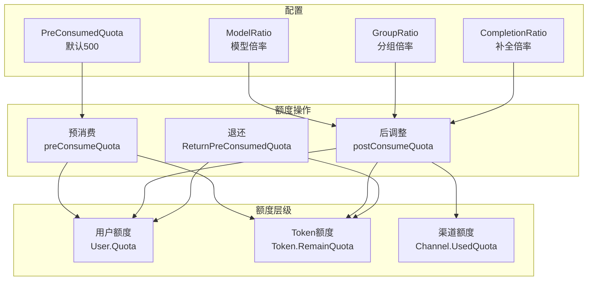

### 3.2 预消费机制（Pre-Consume）

预消费是 One API 的核心设计，解决了"先消费再计费"的超支问题：

```go
// relay/controller/helper.go 第60-95行
func preConsumeQuota(ctx context.Context, textRequest, promptTokens, ratio, meta) (int64, *ErrorWithStatusCode) {
    // 1. 计算预消费额度
    preConsumedQuota := getPreConsumedQuota(textRequest, promptTokens, ratio)
    
    // 2. 检查用户余额是否充足
    userQuota, err := model.CacheGetUserQuota(ctx, meta.UserId)
    if userQuota - preConsumedQuota < 0 {
        return preConsumedQuota, openai.ErrorWrapper(errors.New("user quota is not enough"), "insufficient_user_quota", 403)
    }
    
    // 3. Redis 中预扣用户额度
    err = model.CacheDecreaseUserQuota(meta.UserId, preConsumedQuota)
    
    // 4. 高额度用户信任机制
    if userQuota > 100 * preConsumedQuota {
        preConsumedQuota = 0  // 信任用户，不预扣Token额度
    }
    
    // 5. 预扣Token额度（如果需要）
    if preConsumedQuota > 0 {
        err = model.PreConsumeTokenQuota(meta.TokenId, preConsumedQuota)
    }
    
    return preConsumedQuota, nil
}
```

预消费额度的计算公式：

```go
// relay/controller/helper.go 第60-66行
func getPreConsumedQuota(textRequest, promptTokens, ratio) int64 {
    preConsumedTokens := config.PreConsumedQuota + int64(promptTokens)
    if textRequest.MaxTokens != 0 {
        preConsumedTokens += int64(textRequest.MaxTokens)
    }
    return int64(float64(preConsumedTokens) * ratio)
}
```

**公式解读**：
- `PreConsumedQuota`（默认500）：基础安全余量
- `promptTokens`：已知的输入token数
- `MaxTokens`：请求中指定的最大输出token数（未指定则为0）
- `ratio`：ModelRatio × GroupRatio

### 3.3 后消费机制（Post-Consume）

```go
// relay/controller/helper.go 第97-141行
func postConsumeQuota(ctx, usage, meta, textRequest, ratio, preConsumedQuota, modelRatio, groupRatio, systemPromptReset) {
    // 1. 根据实际usage计算真实消费
    completionRatio := billingratio.GetCompletionRatio(textRequest.Model, meta.ChannelType)
    quota := int64(math.Ceil(
        (float64(usage.PromptTokens) + float64(usage.CompletionTokens) * completionRatio) * ratio
    ))
    
    // 2. 计算差额（实际消费 - 预消费）
    quotaDelta := quota - preConsumedQuota
    
    // 3. 扣减差额
    model.PostConsumeTokenQuota(meta.TokenId, quotaDelta)
    model.CacheUpdateUserQuota(ctx, meta.UserId)
    
    // 4. 记录消费日志
    model.RecordConsumeLog(ctx, &model.Log{
        UserId:           meta.UserId,
        ChannelId:        meta.ChannelId,
        PromptTokens:     usage.PromptTokens,
        CompletionTokens: usage.CompletionTokens,
        ModelName:        textRequest.Model,
        Quota:            int(quota),
        Content:          fmt.Sprintf("倍率：%.2f × %.2f × %.2f", modelRatio, groupRatio, completionRatio),
    })
    
    // 5. 更新渠道和用户的已用额度
    model.UpdateUserUsedQuotaAndRequestCount(meta.UserId, quota)
    model.UpdateChannelUsedQuota(meta.ChannelId, quota)
}
```

### 3.4 Token 模型详细分析

```go
// model/token.go 第23-37行
type Token struct {
    Id             int     `json:"id"`
    UserId         int     `json:"user_id"`
    Key            string  `json:"key" gorm:"type:char(48);uniqueIndex"`
    Status         int     `json:"status" gorm:"default:1"`
    Name           string  `json:"name" gorm:"index"`
    CreatedTime    int64   `json:"created_time" gorm:"bigint"`
    AccessedTime   int64   `json:"accessed_time" gorm:"bigint"`
    ExpiredTime    int64   `json:"expired_time" gorm:"bigint;default:-1"` // -1 = 永不过期
    RemainQuota    int64   `json:"remain_quota" gorm:"bigint;default:0"`
    UnlimitedQuota bool    `json:"unlimited_quota" gorm:"default:false"`
    UsedQuota      int64   `json:"used_quota" gorm:"bigint;default:0"`
    Models         *string `json:"models" gorm:"type:text"`     // 限制可用模型
    Subnet         *string `json:"subnet" gorm:"default:''"`    // 限制来源IP网段
}
```

**Token状态机**：

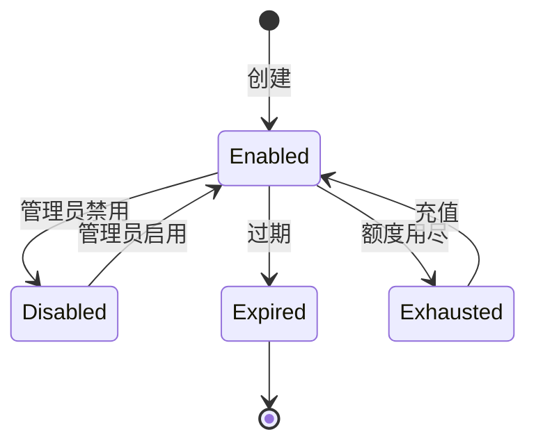

#### 3.4.1 Token 验证流程

```go
// model/token.go 第62-103行
func ValidateUserToken(key string) (token *Token, err error) {
    if key == "" {
        return nil, errors.New("未提供令牌")
    }
    
    // 1. 从缓存/数据库获取Token
    token, err = CacheGetTokenByKey(key)
    
    // 2. 状态检查
    if token.Status == TokenStatusExhausted {
        return nil, fmt.Errorf("令牌 %s（#%d）额度已用尽", token.Name, token.Id)
    }
    if token.Status == TokenStatusExpired {
        return nil, errors.New("该令牌已过期")
    }
    if token.Status != TokenStatusEnabled {
        return nil, errors.New("该令牌状态不可用")
    }
    
    // 3. 过期时间检查
    if token.ExpiredTime != -1 && token.ExpiredTime < helper.GetTimestamp() {
        if !common.RedisEnabled {
            token.Status = TokenStatusExpired
            token.SelectUpdate()  // 更新数据库状态
        }
        return nil, errors.New("该令牌已过期")
    }
    
    // 4. 额度检查
    if !token.UnlimitedQuota && token.RemainQuota <= 0 {
        if !common.RedisEnabled {
            token.Status = TokenStatusExhausted
            token.SelectUpdate()
        }
        return nil, errors.New("该令牌额度已用尽")
    }
    
    return token, nil
}
```

#### 3.4.2 额度预扣与回退

```go
// model/token.go 第217-280行
func PreConsumeTokenQuota(tokenId int, quota int64) (err error) {
    token, err := GetTokenById(tokenId)
    
    // 检查Token额度
    if !token.UnlimitedQuota && token.RemainQuota < quota {
        return errors.New("令牌额度不足")
    }
    
    // 检查用户额度
    userQuota, err := GetUserQuota(token.UserId)
    if userQuota < quota {
        return errors.New("用户额度不足")
    }
    
    // 额度提醒（异步发邮件）
    quotaTooLow := userQuota >= config.QuotaRemindThreshold && userQuota-quota < config.QuotaRemindThreshold
    noMoreQuota := userQuota-quota <= 0
    if quotaTooLow || noMoreQuota {
        go func() {
            // 发送额度提醒邮件...
        }()
    }
    
    // 扣减Token和用户额度
    if !token.UnlimitedQuota {
        DecreaseTokenQuota(tokenId, quota)
    }
    DecreaseUserQuota(token.UserId, quota)
    return nil
}

// model/token.go 第282-303行
func PostConsumeTokenQuota(tokenId int, quota int64) (err error) {
    token, err := GetTokenById(tokenId)
    
    // 扣减/增加用户额度差额
    if quota > 0 {
        err = DecreaseUserQuota(token.UserId, quota)
    } else {
        err = IncreaseUserQuota(token.UserId, -quota)
    }
    
    // 扣减/增加Token额度差额
    if !token.UnlimitedQuota {
        if quota > 0 {
            err = DecreaseTokenQuota(tokenId, quota)
        } else {
            err = IncreaseTokenQuota(tokenId, -quota)
        }
    }
    return nil
}
```

### 3.5 倍率系统

#### 3.5.1 ModelRatio（模型倍率）

```go
// relay/billing/ratio/model.go 第12-17行
const (
    USD2RMB   = 7           // 美元兑人民币汇率
    USD       = 500         // $0.002 = 1 quota单位 → $1 = 500
    MILLI_USD = 1.0/1000*USD
    RMB       = USD/USD2RMB
)

// relay/billing/ratio/model.go 第27行起
var ModelRatio = map[string]float64{
    "gpt-4":               15,       // $0.030 / 1K tokens
    "gpt-4o":              2.5,      // $0.005 / 1K tokens
    "gpt-4o-mini":         0.075,    // $0.00015 / 1K tokens
    "claude-3-5-sonnet-20241022": 3.0/1000*USD,
    "deepseek-r1":         0.002*RMB,
    // ... 数百个模型的倍率配置 ...
}
```

**计费基准**：1 quota 单位 = $0.002 / 1K tokens

#### 3.5.2 GroupRatio（分组倍率）

```go
// relay/billing/ratio/group.go 第10-14行
var GroupRatio = map[string]float64{
    "default": 1,
    "vip":     1,
    "svip":    1,
}
```

#### 3.5.3 CompletionRatio（补全倍率）

用于处理输入和输出 token 不同定价的模型（如 Anthropic Claude）。

### 3.6 批量更新器

为了减少数据库写入压力，One API 实现了批量更新器：

```go
// model/utils.go 第10-78行
const (
    BatchUpdateTypeUserQuota = iota
    BatchUpdateTypeTokenQuota
    BatchUpdateTypeUsedQuota
    BatchUpdateTypeChannelUsedQuota
    BatchUpdateTypeRequestCount
    BatchUpdateTypeCount
)

var batchUpdateStores []map[int]int64  // 内存缓冲区
var batchUpdateLocks []sync.Mutex      // 互斥锁

func addNewRecord(type_ int, id int, value int64) {
    batchUpdateLocks[type_].Lock()
    defer batchUpdateLocks[type_].Unlock()
    batchUpdateStores[type_][id] += value  // 累加到缓冲区
}

func batchUpdate() {
    for i := 0; i < BatchUpdateTypeCount; i++ {
        batchUpdateLocks[i].Lock()
        store := batchUpdateStores[i]
        batchUpdateStores[i] = make(map[int]int64)  // 清空缓冲区
        batchUpdateLocks[i].Unlock()
        
        for key, value := range store {
            switch i {
            case BatchUpdateTypeUserQuota:
                increaseUserQuota(key, value)
            case BatchUpdateTypeTokenQuota:
                increaseTokenQuota(key, value)
            // ... 其他类型 ...
            }
        }
    }
}
```

**批量更新流程**：

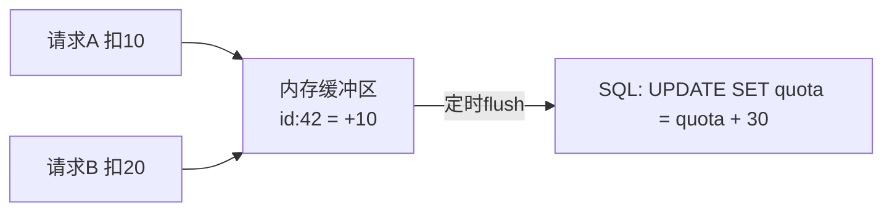

---

## 4. 渠道管理完整代码分析

### 4.1 Channel 模型

```go
// model/channel.go 第20-41行
type Channel struct {
    Id                 int     `json:"id"`
    Type               int     `json:"type" gorm:"default:0"`     // 渠道类型
    Key                string  `json:"key" gorm:"type:text"`       // API密钥
    Status             int     `json:"status" gorm:"default:1"`    // 状态
    Name               string  `json:"name" gorm:"index"`          // 渠道名称
    Weight             *uint   `json:"weight" gorm:"default:0"`    // 权重（未使用）
    CreatedTime        int64   `json:"created_time" gorm:"bigint"`
    TestTime           int64   `json:"test_time" gorm:"bigint"`    // 最后测试时间
    ResponseTime       int     `json:"response_time"`              // 响应时间(ms)
    BaseURL            *string `json:"base_url" gorm:"default:''"` // 上游基础URL
    Other              *string `json:"other"`                      // 已废弃
    Balance            float64 `json:"balance"`                    // 上游余额(USD)
    BalanceUpdatedTime int64   `json:"balance_updated_time" gorm:"bigint"`
    Models             string  `json:"models"`                     // 支持的模型列表
    Group              string  `json:"group" gorm:"default:'default'"` // 所属分组
    UsedQuota          int64   `json:"used_quota" gorm:"bigint;default:0"` // 已用额度
    ModelMapping       *string `json:"model_mapping" gorm:"default:''"`   // 模型映射
    Priority           *int64  `json:"priority" gorm:"bigint;default:0"`  // 优先级
    Config             string  `json:"config"`                            // 扩展配置JSON
    SystemPrompt       *string `json:"system_prompt" gorm:"type:text"`    // 强制系统提示词
}
```

### 4.2 Channel 状态机

```go
// model/channel.go 第13-18行
const (
    ChannelStatusUnknown          = 0
    ChannelStatusEnabled          = 1  // 启用（注意：不能用0，0是默认值）
    ChannelStatusManuallyDisabled = 2  // 手动禁用
    ChannelStatusAutoDisabled     = 3  // 自动禁用
)
```

### 4.3 Ability 模型（渠道-模型映射）

```go
// model/ability.go 第14-20行
type Ability struct {
    Group     string `gorm:"primaryKey;autoIncrement:false"` // 分组
    Model     string `gorm:"primaryKey;autoIncrement:false"` // 模型
    ChannelId int    `gorm:"primaryKey;autoIncrement:false;index"` // 渠道ID
    Enabled   bool   `json:"enabled"`
    Priority  *int64 `gorm:"bigint;default:0;index"`
}
```

**Ability 是核心路由表**，存储了「分组 + 模型 + 渠道」的三元组关系。

#### 4.3.1 渠道创建时自动创建 Ability

```go
// model/ability.go 第53-71行
func (channel *Channel) AddAbilities() error {
    models_ := strings.Split(channel.Models, ",")  // 解析模型列表
    models_ = utils.DeDuplication(models_)          // 去重
    groups_ := strings.Split(channel.Group, ",")    // 解析分组列表
    
    abilities := make([]Ability, 0, len(models_))
    for _, model := range models_ {
        for _, group := range groups_ {
            ability := Ability{
                Group:     group,
                Model:     model,
                ChannelId: channel.Id,
                Enabled:   channel.Status == ChannelStatusEnabled,
                Priority:  channel.Priority,
            }
            abilities = append(abilities, ability)
        }
    }
    return DB.Create(&abilities).Error
}
```

### 4.4 渠道配置扩展

```go
// model/channel.go 第43-53行
type ChannelConfig struct {
    Region            string `json:"region,omitempty"`             // AWS/Azure区域
    SK                string `json:"sk,omitempty"`                 // Secret Key
    AK                string `json:"ak,omitempty"`                 // Access Key
    UserID            string `json:"user_id,omitempty"`            // 用户ID（讯飞等）
    APIVersion        string `json:"api_version,omitempty"`        // API版本
    LibraryID         string `json:"library_id,omitempty"`         // AIProxy Library ID
    Plugin            string `json:"plugin,omitempty"`             // 插件（阿里）
    VertexAIProjectID string `json:"vertex_ai_project_id,omitempty"` // VertexAI项目ID
    VertexAIADC       string `json:"vertex_ai_adc,omitempty"`     // VertexAI凭证
}
```

### 4.5 渠道查询与缓存

#### 4.5.1 数据库直接查询

```go
// model/channel.go 第55-67行
func GetAllChannels(startIdx int, num int, scope string) ([]*Channel, error) {
    var channels []*Channel
    switch scope {
    case "all":
        err = DB.Order("id desc").Find(&channels).Error
    case "disabled":
        err = DB.Where("status = ? or status = ?", ChannelStatusAutoDisabled, ChannelStatusManuallyDisabled).Find(&channels).Error
    default:
        err = DB.Limit(num).Offset(startIdx).Omit("key").Find(&channels).Error  // 注意：隐藏Key
    }
    return channels, err
}
```

#### 4.5.2 内存缓存初始化

```go
// model/cache.go 第173-217行
func InitChannelCache() {
    // 1. 从数据库加载所有启用的渠道
    newChannelId2channel := make(map[int]*Channel)
    DB.Where("status = ?", ChannelStatusEnabled).Find(&channels)
    
    // 2. 加载所有Ability
    var abilities []*Ability
    DB.Find(&abilities)
    
    // 3. 构建 group → model → []Channel 的三维映射
    newGroup2model2channels := make(map[string]map[string][]*Channel)
    for _, channel := range channels {
        for _, group := range strings.Split(channel.Group, ",") {
            for _, model := range strings.Split(channel.Models, ",") {
                newGroup2model2channels[group][model] = append(
                    newGroup2model2channels[group][model], channel)
            }
        }
    }
    
    // 4. 按优先级排序
    for group, model2channels := range newGroup2model2channels {
        for model, channels := range model2channels {
            sort.Slice(channels, func(i, j int) bool {
                return channels[i].GetPriority() > channels[j].GetPriority()
            })
        }
    }
    
    // 5. 原子替换缓存
    channelSyncLock.Lock()
    group2model2channels = newGroup2model2channels
    channelSyncLock.Unlock()
}
```

#### 4.5.3 缓存查询与渠道选择

```go
// model/cache.go 第227-255行
func CacheGetRandomSatisfiedChannel(group string, model string, ignoreFirstPriority bool) (*Channel, error) {
    if !config.MemoryCacheEnabled {
        return GetRandomSatisfiedChannel(group, model, ignoreFirstPriority)
    }
    
    channelSyncLock.RLock()
    defer channelSyncLock.RUnlock()
    
    channels := group2model2channels[group][model]
    if len(channels) == 0 {
        return nil, errors.New("channel not found")
    }
    
    endIdx := len(channels)
    firstChannel := channels[0]
    
    // 选择最高优先级的渠道范围
    if firstChannel.GetPriority() > 0 {
        for i := range channels {
            if channels[i].GetPriority() != firstChannel.GetPriority() {
                endIdx = i
                break
            }
        }
    }
    
    // 在最高优先级范围内随机选择
    idx := rand.Intn(endIdx)
    
    // 重试时忽略最高优先级
    if ignoreFirstPriority {
        if endIdx < len(channels) {
            idx = random.RandRange(endIdx, len(channels))
        }
    }
    
    return channels[idx], nil
}
```

---

## 5. 负载均衡与失败切换机制

### 5.1 负载均衡策略

One API 使用**基于优先级的随机负载均衡**：

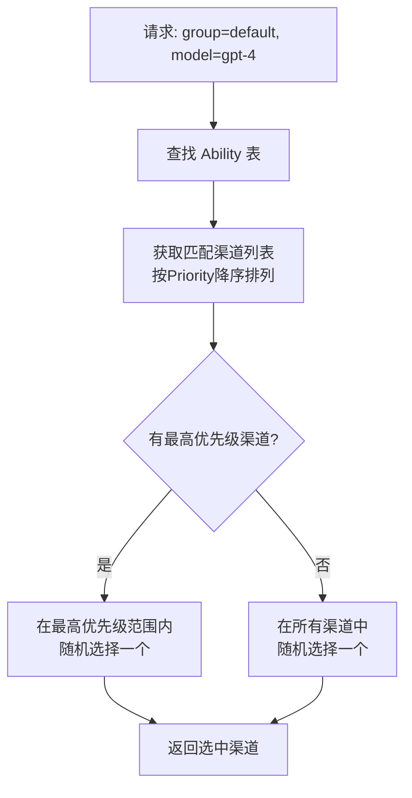

**渠道选择算法**（无缓存模式，`model/ability.go` 第22-51行）：

```go
func GetRandomSatisfiedChannel(group string, model string, ignoreFirstPriority bool) (*Channel, error) {
    var channelQuery *gorm.DB
    if ignoreFirstPriority {
        // 重试：忽略最高优先级，在次级中随机选择
        channelQuery = DB.Where(groupCol+" = ? and model = ? and enabled = "+trueVal, group, model)
    } else {
        // 首次：只选择最高优先级的渠道
        maxPrioritySubQuery := DB.Model(&Ability{}).Select("MAX(priority)").
            Where(groupCol+" = ? and model = ? and enabled = "+trueVal, group, model)
        channelQuery = DB.Where(groupCol+" = ? and model = ? and enabled = "+trueVal+
            " and priority = (?)", group, model, maxPrioritySubQuery)
    }
    
    // SQLite/PostgreSQL 用 RANDOM()，MySQL 用 RAND()
    if common.UsingSQLite || common.UsingPostgreSQL {
        err = channelQuery.Order("RANDOM()").First(&ability).Error
    } else {
        err = channelQuery.Order("RAND()").First(&ability).Error
    }
    
    // 根据 ability.ChannelId 获取完整渠道信息
    channel := Channel{}
    err = DB.First(&channel, "id = ? ability.ChannelId).Error
    return &channel, err
}
```

### 5.2 失败切换（Failover）流程

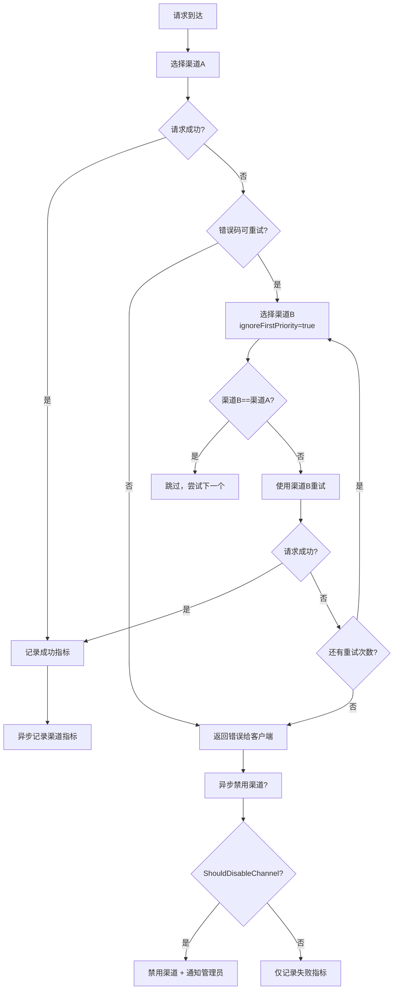

### 5.3 渠道自动禁用机制

#### 5.3.1 错误码触发禁用

```go
// monitor/manage.go 第11-44行
func ShouldDisableChannel(err *model.Error, statusCode int) bool {
    if !config.AutomaticDisableChannelEnabled {
        return false
    }
    
    // HTTP 401 直接禁用
    if statusCode == http.StatusUnauthorized {
        return true
    }
    
    // 特定错误类型触发禁用
    switch err.Type {
    case "insufficient_quota", "authentication_error", "permission_error", "forbidden":
        return true
    }
    
    // 特定错误码触发禁用
    if err.Code == "invalid_api_key" || err.Code == "account_deactivated" {
        return true
    }
    
    // 错误消息关键词匹配（多语言支持）
    lowerMessage := strings.ToLower(err.Message)
    if strings.Contains(lowerMessage, "your access was terminated") ||
        strings.Contains(lowerMessage, "credit") ||
        strings.Contains(lowerMessage, "balance") ||
        strings.Contains(lowerMessage, "已欠费") {
        return true
    }
    
    return false
}
```

#### 5.3.2 基于指标的自动禁用

```go
// monitor/metric.go 第18-38行
func consumeFail(channelId int) (bool, float64) {
    // 维护一个固定大小的成功/失败队列
    if len(store[channelId]) > config.MetricQueueSize {
        store[channelId] = store[channelId][1:]  // 移除最旧记录
    }
    store[channelId] = append(store[channelId], false)
    
    // 计算成功率
    successCount := 0
    for _, success := range store[channelId] {
        if success {
            successCount++
        }
    }
    successRate := float64(successCount) / float64(len(store[channelId]))
    
    // 如果样本量足够且成功率低于阈值 → 禁用
    if len(store[channelId]) >= config.MetricQueueSize &&
       successRate < config.MetricSuccessRateThreshold {
        store[channelId] = make([]bool, 0)
        return true, successRate
    }
    return false, successRate
}
```

### 5.4 指标系统架构

```mermaid
graph LR
    subgraph "指标收集"
        EMIT[Emit函数]
        SUCC[metricSuccessChan]
        FAIL[metricFailChan]
    end

    subgraph "指标处理"
        SUCC_CONS[metricSuccessConsumer]
        FAIL_CONS[metricFailConsumer]
        STORE[store map<br/>channelId → []bool]
    end

    subgraph "渠道管理"
        DISABLE[DisableChannel]
        ENABLE[EnableChannel]
        EMAIL[通知管理员]
    end

    EMIT --> SUCC
    EMIT --> FAIL
    SUCC --> SUCC_CONS
    FAIL --> FAIL_CONS
    SUCC_CONS --> STORE
    FAIL_CONS --> STORE
    FAIL_CONS -->|成功率 < 阈值| DISABLE
    DISABLE --> EMAIL
```

---

## 6. 中间件链设计

### 6.1 中间件执行顺序

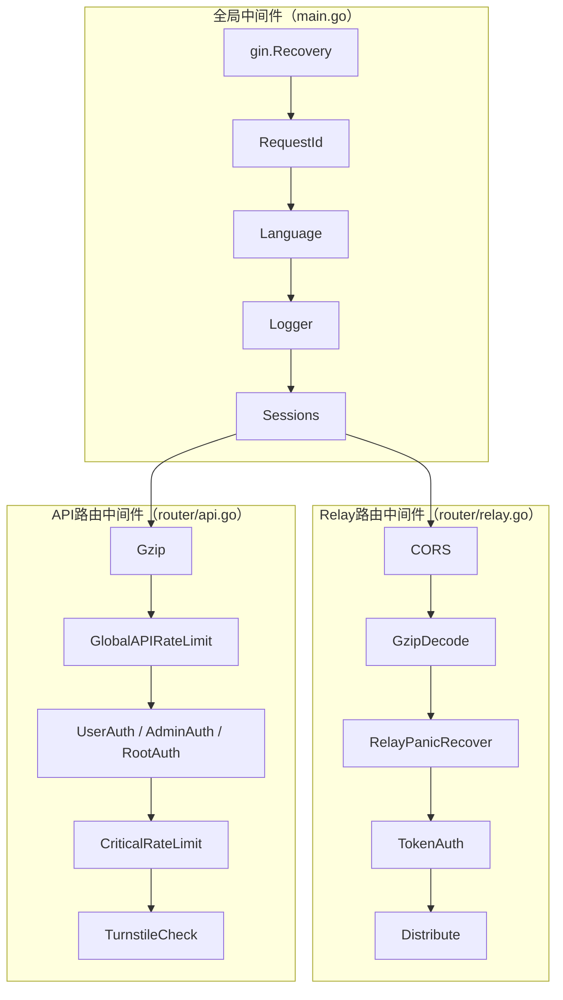

### 6.2 认证中间件详解

#### 6.2.1 Session认证（`middleware/auth.go` 第15-71行）

```go
func authHelper(c *gin.Context, minRole int) {
    session := sessions.Default(c)
    username := session.Get("username")
    role := session.Get("role")
    id := session.Get("id")
    status := session.Get("status")
    
    if username == nil {
        // 无Session → 检查 Access Token
        accessToken := c.Request.Header.Get("Authorization")
        user := model.ValidateAccessToken(accessToken)
        if user != nil && user.Username != "" {
            username = user.Username
            role = user.Role
            id = user.Id
            status = user.Status
        } else {
            c.JSON(401, gin.H{"success": false, "message": "无权进行此操作"})
            c.Abort()
            return
        }
    }
    
    // 检查用户状态
    if status.(int) == model.UserStatusDisabled || blacklist.IsUserBanned(id.(int)) {
        session.Clear()
        c.Abort()
        return
    }
    
    // 检查角色权限
    if role.(int) < minRole {
        c.JSON(200, gin.H{"success": false, "message": "权限不足"})
        c.Abort()
        return
    }
    
    c.Set("username", username)
    c.Set("role", role)
    c.Set("id", id)
    c.Next()
}
```

#### 6.2.2 Token认证（`middleware/auth.go` 第91-151行）

```go
func TokenAuth() func(c *gin.Context) {
    return func(c *gin.Context) {
        key := c.Request.Header.Get("Authorization")
        key = strings.TrimPrefix(key, "Bearer ")
        key = strings.TrimPrefix(key, "sk-")
        parts := strings.Split(key, "-")
        key = parts[0]  // 取第一段作为token key
        
        // 验证Token
        token, err := model.ValidateUserToken(key)
        if err != nil {
            abortWithMessage(c, 401, err.Error())
            return
        }
        
        // 检查IP白名单
        if token.Subnet != nil && *token.Subnet != "" {
            if !network.IsIpInSubnets(ctx, c.ClientIP(), *token.Subnet) {
                abortWithMessage(c, 403, "该令牌只能在指定网段使用")
                return
            }
        }
        
        // 检查用户状态
        userEnabled, err := model.CacheIsUserEnabled(token.UserId)
        if !userEnabled || blacklist.IsUserBanned(token.UserId) {
            abortWithMessage(c, 403, "用户已被封禁")
            return
        }
        
        // 检查模型权限
        requestModel, err := getRequestModel(c)
        if token.Models != nil && *token.Models != "" {
            if requestModel != "" && !isModelInList(requestModel, *token.Models) {
                abortWithMessage(c, 403, "该令牌无权使用该模型")
                return
            }
        }
        
        // 设置上下文
        c.Set(ctxkey.Id, token.UserId)
        c.Set(ctxkey.TokenId, token.Id)
        c.Set(ctxkey.TokenName, token.Name)
        
        // 支持指定渠道（格式：sk-tokenkey-channelid）
        if len(parts) > 1 {
            if model.IsAdmin(token.UserId) {
                c.Set(ctxkey.SpecificChannelId, parts[1])
            }
        }
        
        c.Next()
    }
}
```

**Token格式解析**：

```
sk-{token_key}                    → 标准请求，随机选择渠道
sk-{token_key}-{channel_id}       → 管理员指定渠道
Bearer {access_token}             → 管理API的Access Token
```

### 6.3 分发中间件

```go
// middleware/distributor.go 第20-62行
func Distribute() func(c *gin.Context) {
    return func(c *gin.Context) {
        userId := c.GetInt(ctxkey.Id)
        
        // 1. 获取用户分组
        userGroup, _ := model.CacheGetUserGroup(userId)
        c.Set(ctxkey.Group, userGroup)
        
        // 2. 检查是否指定了渠道
        channelId, ok := c.Get(ctxkey.SpecificChannelId)
        if ok {
            // 管理员指定了渠道
            channel, err = model.GetChannelById(id, true)
            if channel.Status != model.ChannelStatusEnabled {
                abortWithMessage(c, 403, "该渠道已被禁用")
                return
            }
        } else {
            // 自动选择渠道
            channel, err = model.CacheGetRandomSatisfiedChannel(userGroup, requestModel, false)
            if err != nil {
                abortWithMessage(c, 503, "当前分组下对于该模型无可用渠道")
                return
            }
        }
        
        // 3. 设置渠道上下文
        SetupContextForSelectedChannel(c, channel, requestModel)
        c.Next()
    }
}
```

### 6.4 限流中间件

```go
// middleware/rate-limit.go 第74-91行
func rateLimitFactory(maxRequestNum int, duration int64, mark string) func(c *gin.Context) {
    if maxRequestNum == 0 || config.DebugEnabled {
        return func(c *gin.Context) { c.Next() }  // Debug模式或配置为0则跳过
    }
    
    if common.RedisEnabled {
        return func(c *gin.Context) {
            redisRateLimiter(c, maxRequestNum, duration, mark)  // Redis分布式限流
        }
    } else {
        inMemoryRateLimiter.Init(config.RateLimitKeyExpirationDuration)
        return func(c *gin.Context) {
            memoryRateLimiter(c, maxRequestNum, duration, mark)  // 内存限流
        }
    }
}
```

**限流层级**：

| 中间件 | 默认值 | 用途 |
|--------|--------|------|
| GlobalAPIRateLimit | 480次/3分钟 | 全局API限流 |
| GlobalWebRateLimit | 240次/3分钟 | 全局Web限流 |
| CriticalRateLimit | 20次/20分钟 | 关键操作限流（注册、登录） |
| UploadRateLimit | 10次/分钟 | 上传限流 |
| DownloadRateLimit | 10次/分钟 | 下载限流 |

### 6.5 Recover 中间件

```go
// middleware/recover.go 第12-33行
func RelayPanicRecover() gin.HandlerFunc {
    return func(c *gin.Context) {
        defer func() {
            if err := recover(); err != nil {
                ctx := c.Request.Context()
                logger.Errorf(ctx, fmt.Sprintf("panic detected: %v", err))
                logger.Errorf(ctx, fmt.Sprintf("stacktrace: %s", string(debug.Stack())))
                logger.Errorf(ctx, fmt.Sprintf("request: %s %s", c.Request.Method, c.Request.URL.Path))
                c.JSON(500, gin.H{
                    "error": gin.H{
                        "message": fmt.Sprintf("Panic detected: %v", err),
                        "type":    "one_api_panic",
                    },
                })
                c.Abort()
            }
        }()
        c.Next()
    }
}
```

---

## 7. 数据库 Schema 设计

### 7.1 数据库选择

```go
// model/main.go 第67-81行
func chooseDB(envName string) (*gorm.DB, error) {
    dsn := os.Getenv(envName)
    switch {
    case strings.HasPrefix(dsn, "postgres://"):
        return openPostgreSQL(dsn)  // PostgreSQL
    case dsn != "":
        return openMySQL(dsn)       // MySQL
    default:
        return openSQLite()         // SQLite（默认）
    }
}
```

### 7.2 核心表结构

```mermaid
erDiagram
    users {
        int id PK
        string username UK
        string password
        string display_name
        int role "0=guest, 1=user, 10=admin, 100=root"
        int status "1=enabled, 2=disabled, 3=deleted"
        string email
        string github_id
        string wechat_id
        string access_token UK
        bigint quota "剩余额度"
        bigint used_quota "已用额度"
        int request_count
        varchar group "default"
        varchar aff_code UK
        int inviter_id
    }

    tokens {
        int id PK
        int user_id FK
        char key UK "48字符唯一密钥"
        int status "1=enabled, 2=disabled, 3=expired, 4=exhausted"
        string name
        bigint created_time
        bigint accessed_time
        bigint expired_time "-1=永不过期"
        bigint remain_quota
        bool unlimited_quota
        bigint used_quota
        text models "限制可用模型"
        varchar subnet "IP白名单"
    }

    channels {
        int id PK
        int type "渠道类型"
        text key "API密钥"
        int status "1=enabled, 2=manual_disabled, 3=auto_disabled"
        string name
        bigint created_time
        bigint test_time
        int response_time "响应时间(ms)"
        varchar base_url
        float balance "上游余额(USD)"
        bigint balance_updated_time
        text models "支持模型列表"
        varchar group "所属分组"
        bigint used_quota "已用额度"
        varchar model_mapping "模型映射"
        bigint priority "优先级"
        text config "扩展配置JSON"
        text system_prompt "强制系统提示词"
    }

    abilities {
        varchar group PK "分组"
        string model PK "模型"
        int channel_id PK FK "渠道ID"
        bool enabled
        bigint priority
    }

    logs {
        int id PK
        int user_id FK
        bigint created_at
        int type "0=unknown, 1=topup, 2=consume, 3=manage, 4=system, 5=test"
        string content
        string username
        string token_name
        string model_name
        int quota
        int prompt_tokens
        int completion_tokens
        int channel_id FK
        string request_id
        bigint elapsed_time "ms"
        bool is_stream
    }

    redemptions {
        int id PK
        int user_id FK
        char key UK "32字符兑换码"
        int status "1=enabled, 2=disabled, 3=used"
        string name
        bigint quota "兑换额度"
        bigint created_time
        bigint redeemed_time
    }

    options {
        varchar key PK "配置键"
        varchar value "配置值"
    }

    users ||--o{ tokens : "has"
    users ||--o{ logs : "generates"
    users ||--o{ redemptions : "redeems"
    channels ||--o{ abilities : "supports"
    tokens ||--o{ logs : "records"
```

### 7.3 数据库迁移

```go
// model/main.go 第137-164行
func migrateDB() error {
    if err = DB.AutoMigrate(&Channel{}); err != nil { return err }
    if err = DB.AutoMigrate(&Token{}); err != nil { return err }
    if err = DB.AutoMigrate(&User{}); err != nil { return err }
    if err = DB.AutoMigrate(&Option{}); err != nil { return err }
    if err = DB.AutoMigrate(&Redemption{}); err != nil { return err }
    if err = DB.AutoMigrate(&Ability{}); err != nil { return err }
    if err = DB.AutoMigrate(&Log{}); err != nil { return err }
    return nil
}
```

### 7.4 数据库连接池配置

```go
// model/main.go 第203-218行
func setDBConns(db *gorm.DB) *sql.DB {
    sqlDB, err := db.DB()
    sqlDB.SetMaxIdleConns(env.Int("SQL_MAX_IDLE_CONNS", 100))    // 最大空闲连接
    sqlDB.SetMaxOpenConns(env.Int("SQL_MAX_OPEN_CONNS", 1000))   // 最大打开连接
    sqlDB.SetConnMaxLifetime(time.Second * time.Duration(env.Int("SQL_MAX_LIFETIME", 60))) // 连接最大生命周期
    return sqlDB
}
```

### 7.5 Log 表特殊设计

Log 表支持独立的数据库实例（`LOG_SQL_DSN`），用于将高频日志写入与核心业务数据隔离：

```go
// model/main.go 第166-201行
func InitLogDB() {
    if os.Getenv("LOG_SQL_DSN") == "" {
        LOG_DB = DB  // 默认使用主数据库
        return
    }
    // 使用独立的二级数据库
    LOG_DB, err = chooseDB("LOG_SQL_DSN")
}
```

---

## 8. 可复用的代码模式和设计模式

### 8.1 适配器模式（Adapter Pattern）

**应用位置**：`relay/adaptor/` 整个目录

One API 的核心设计就是适配器模式。通过统一的 `Adaptor` 接口，将不同上游 API 的差异封装在各自的适配器实现中：

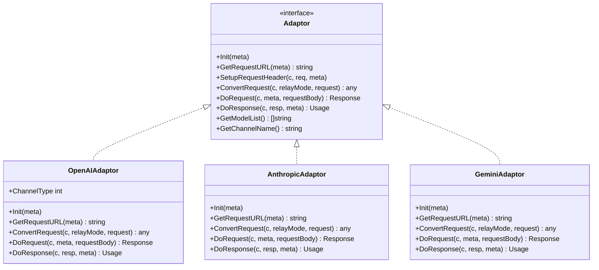

**复用价值**：★★★★★  
**DDW适配建议**：ddw-llm-gateway 可直接复用此模式，甚至直接 fork relay/adaptor/ 目录。

### 8.2 工厂模式（Factory Pattern）

**应用位置**：`relay/adaptor.go`

通过 `GetAdaptor(apiType)` 工厂函数，根据 API 类型创建对应的适配器实例：

```go
func GetAdaptor(apiType int) adaptor.Adaptor {
    switch apiType {
    case apitype.OpenAI:    return &openai.Adaptor{}
    case apitype.Anthropic: return &anthropic.Adaptor{}
    // ...
    }
    return nil
}
```

### 8.3 预消费+后调整模式（Pre-Consume + Post-Adjust）

**应用位置**：`relay/controller/text.go` + `relay/billing/billing.go`

这是解决分布式系统中"先消费再计费"超支问题的经典方案：

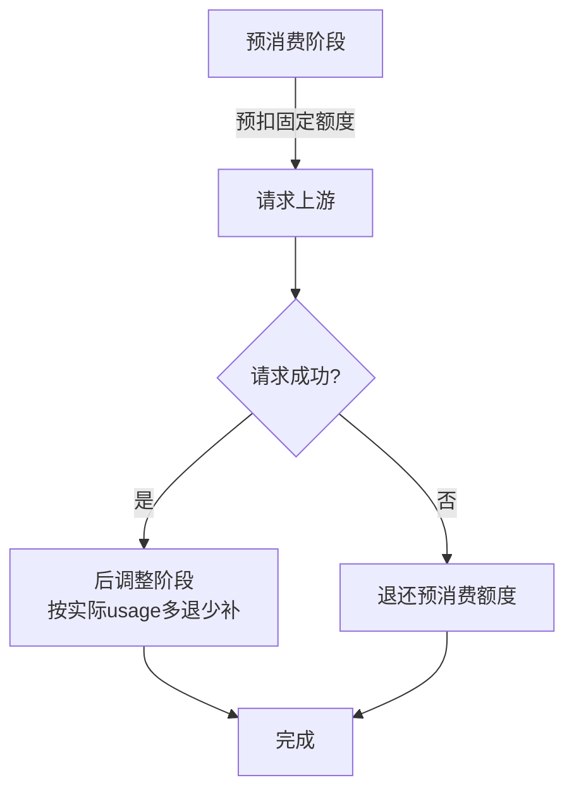

**复用价值**：★★★★★  
**DDW适配建议**：ddw-token-manager 应直接复用此模式，但建议加入更精细的额度等级。

### 8.4 批量更新模式（Batch Update）

**应用位置**：`model/utils.go`

通过内存缓冲区 + 定时刷写，减少数据库写入频率：

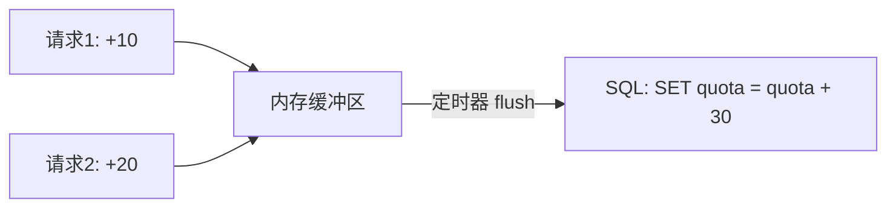

**复用价值**：★★★★☆  
**DDW适配建议**：ddw-token-manager 的高频额度更新应使用此模式。

### 8.5 缓存层模式（Cache-Through）

**应用位置**：`model/cache.go`

统一的缓存读写模式，支持 Redis 和内存双后端：

```go
func CacheGetTokenByKey(key string) (*Token, error) {
    if !common.RedisEnabled {
        return DB.Where(...).First(&token)  // 无Redis时直接查DB
    }
    // 先查Redis
    tokenObjectString, err := common.RedisGet(fmt.Sprintf("token:%s", key))
    if err != nil {
        // Redis未命中 → 查DB → 写入Redis
        err = DB.Where(...).First(&token)
        jsonBytes, _ := json.Marshal(token)
        common.RedisSet(key, string(jsonBytes), TTL)
        return &token, nil
    }
    // Redis命中 → 反序列化
    json.Unmarshal([]byte(tokenObjectString), &token)
    return &token, err
}
```

**复用价值**：★★★★☆  
**DDW适配建议**：ddw-llm-gateway 的缓存层可参考此模式。

### 8.6 Channel Type → API Type 映射模式

**应用位置**：`relay/channeltype/helper.go`

多个渠道类型映射到同一个 API 类型，复用适配器逻辑：

```
OpenAI(1) → APIType: OpenAI(0)
API2D(2) → APIType: OpenAI(0)
Azure(3) → APIType: OpenAI(0)
CloseAI(4) → APIType: OpenAI(0)
...更多OpenAI兼容渠道 → APIType: OpenAI(0)
Anthropic(14) → APIType: Anthropic(1)
Baidu(15) → APIType: Baidu(3)
```

**复用价值**：★★★★★

### 8.7 配置动态更新模式

**应用位置**：`model/option.go`

系统配置存储在数据库中，支持运行时热更新：

```go
func updateOptionMap(key string, value string) error {
    config.OptionMapRWMutex.Lock()
    defer config.OptionMapRWMutex.Unlock()
    config.OptionMap[key] = value
    
    // 根据配置键名动态更新对应的全局变量
    if strings.HasSuffix(key, "Enabled") {
        switch key {
        case "PasswordLoginEnabled":
            config.PasswordLoginEnabled = value == "true"
        // ... 大量case分支 ...
        }
    }
    return nil
}
```

### 8.8 请求体可复用模式

```go
// common/utils.go
func GetRequestBody(c *gin.Context) ([]byte, error) {
    // 读取一次请求体后缓存，支持多次读取
    if c.GetBool(ctxkey.RequestBody) {
        return c.Get(ctxkey.RequestBody).([]byte), nil
    }
    body, err := io.ReadAll(c.Request.Body)
    c.Set(ctxkey.RequestBody, body)
    c.Set(ctxkey.RequestBody, true)
    c.Request.Body = io.NopCloser(bytes.NewBuffer(body))
    return body, err
}
```

---

## 9. 与 DDW 插件体系的适配建议

### 9.1 ddw-llm-gateway 插件适配建议

#### 9.1.1 可直接复用的模块

| 模块 | 源码路径 | 复用方式 | 优先级 |
|------|---------|---------|--------|
| Adaptor 接口+工厂 | `relay/adaptor/` | 直接引入 | P0 |
| OpenAI 适配器 | `relay/adaptor/openai/` | 直接引入 | P0 |
| Relay 控制器 | `relay/controller/` | 适配后引入 | P0 |
| Meta 元数据 | `relay/meta/` | 直接引入 | P0 |
| 渠道类型定义 | `relay/channeltype/` | 直接引入 | P1 |
| API类型定义 | `relay/apitype/` | 直接引入 | P1 |
| Relay模式 | `relay/relaymode/` | 直接引入 | P1 |
| 错误处理 | `relay/controller/error.go` | 直接引入 | P1 |
| SSE流式处理 | `relay/adaptor/openai/main.go` | 适配后引入 | P0 |

#### 9.1.2 需要适配改造的模块

| 模块 | 问题 | 建议 |
|------|------|------|
| Gin → Hermes HTTP | One API 使用 Gin，DDW 使用 Hermes HTTP 插件 | 将 `gin.Context` 参数替换为标准 `http.Request/ResponseWriter` |
| 认证中间件 | 依赖 Session | 简化为纯 Token 认证 |
| Distribute 中间件 | 与 model 层强耦合 | 抽离为独立的 ChannelSelector 接口 |
| 配额预消费 | 与 User/Token 模型强耦合 | 抽离为独立的 QuotaManager 接口 |
| 监控模块 | 与 model 层耦合 | 抽离为 EventEmitter 接口 |

#### 9.1.3 建议的适配架构

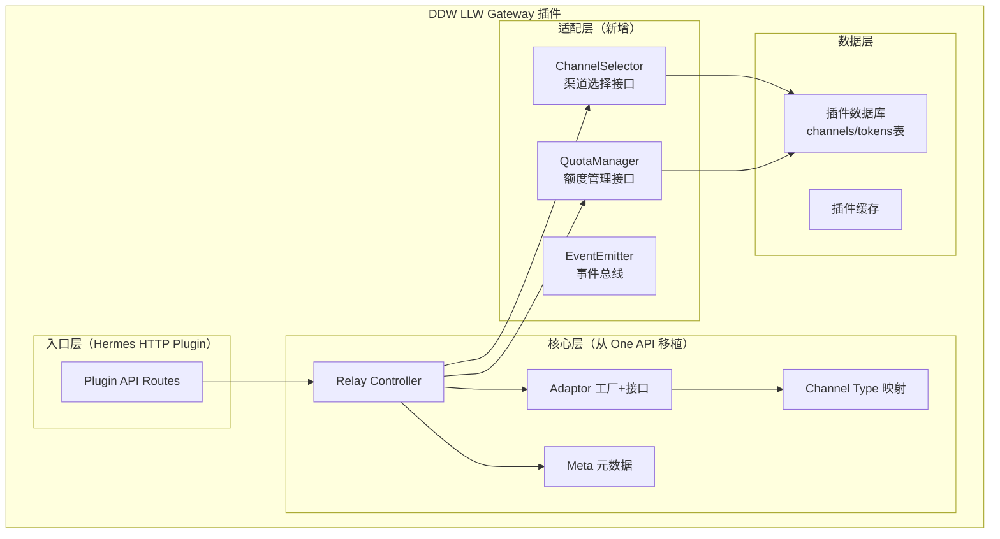

#### 9.1.4 接口抽象建议

```go
// 建议的 QuotaManager 接口
type QuotaManager interface {
    PreConsumeQuota(ctx context.Context, tokenId int, quota int64) error
    PostConsumeQuota(ctx context.Context, tokenId int, quotaDelta int64, totalQuota int64) error
    ReturnPreConsumedQuota(ctx context.Context, preConsumedQuota int64, tokenId int)
    GetUserQuota(userId int) (int64, error)
    GetTokenQuota(tokenId int) (int64, error)
}

// 建议的 ChannelSelector 接口
type ChannelSelector interface {
    SelectChannel(group string, model string, ignoreFirstPriority bool) (*Channel, error)
    OnRequestSuccess(channelId int)
    OnRequestFailure(channelId int, err error)
}

// 建议的 EventEmitter 接口
type EventEmitter interface {
    OnRequestComplete(channelId int, userId int, success bool, quota int64)
    OnChannelDisabled(channelId int, reason string)
}
```

### 9.2 ddw-token-manager 插件适配建议

#### 9.2.2 需要自研的模块

| 功能 | 说明 | One API 参考 |
|------|------|-------------|
| Token CRUD | 创建、查询、更新、删除 Token | `model/token.go` |
| 多层级额度 | 用户级、Token级、应用级 | `model/token.go` + `model/user.go` |
| 预消费引擎 | 参考 One API 的 Pre/Post 消费模式 | `relay/controller/helper.go` |
| 额度账本 | 完整的额度变更记录 | `model/log.go` + `model/utils.go` |
| 批量更新 | 高频额度更新的批量化 | `model/utils.go` |
| 额度提醒 | 额度不足时的通知 | `model/token.go` 第238-270行 |
| 兑换码系统 | 预付额度兑换 | `model/redemption.go` |

#### 9.2.3 建议的数据模型增强

```go
// 增强的 Token 模型（相比 One API）
type DDWToken struct {
    // 基础字段（从 One API 复用）
    Id             int
    UserId         int
    Key            string
    Status         int
    Name           string
    CreatedTime    int64
    AccessedTime   int64
    ExpiredTime    int64
    UnlimitedQuota bool
    Models         *string
    Subnet         *string
    
    // DDW 增强字段
    DailyQuota     int64    // 每日额度上限
    DailyUsed      int64    // 当日已用
    MonthlyQuota   int64    // 每月额度上限
    MonthlyUsed    int64    // 当月已用
    RateLimit      int      // 请求频率限制（次/分钟）
    AllowModels    *string  // 白名单模型
    DenyModels     *string  // 黑名单模型
    Tags           *string  // 自定义标签（JSON）
    Metadata       *string  // 元数据（JSON）
    LastUsedModel  string   // 最后使用的模型
    LastUsedTime   int64    // 最后使用时间
    TotalRequests  int64    // 总请求次数
}

// 增强的额度账本
type QuotaLedger struct {
    Id         int
    UserId     int
    TokenId    int
    Operation  string   // "pre_consume", "post_consume", "refund", "topup", "transfer"
    Amount     int64    // 变更金额（正数=增加，负数=减少）
    Balance    int64    // 变更后余额
    ModelName  string
    ChannelId  int
    RequestId  string
    Content    string   // 描述
    CreatedAt  int64
}
```

### 9.3 集成建议

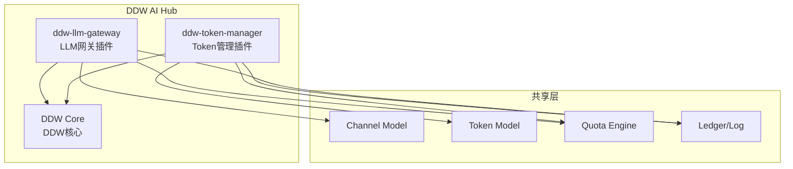

---

## 10. 不可复用的部分和改进建议

### 10.1 不可直接复用的模块

#### 10.1.1 前端（`web/`）

- **原因**：One API 的前端是独立的 React 应用，与 DDW Hub 的前端完全不兼容
- **建议**：ddw-llm-gateway 不需要独立前端，通过 DDW Hub 的管理界面统一管理

#### 10.1.2 用户管理（`model/user.go` + `controller/user.go`）

- **原因**：One API 有完整的用户系统（注册、登录、OAuth），DDW Hub 已有自己的用户系统
- **建议**：ddw-llm-gateway 应复用 DDW Hub 的用户系统，不重复实现

#### 10.1.3 Session 管理

- **原因**：One API 使用 Cookie-based Session（`gin-contrib/sessions`），DDW Hub 可能使用其他认证方式
- **建议**：简化认证为纯 Token 模式

#### 10.1.4 OAuth 认证（`controller/auth/`）

- **原因**：GitHub/WeChat/Lark/OIDC OAuth 是独立的用户注册流程
- **建议**：由 DDW Hub 的用户系统统一处理

#### 10.1.5 Option 系统（`model/option.go`）

- **原因**：One API 的 Option 系统是一个运行时配置热更新机制，但实现较粗糙（大量 switch-case）
- **建议**：DDW Hub 应使用更结构化的配置管理

### 10.2 代码质量问题

#### 10.2.1 缺少单元测试

```bash
find /Users/chenye/workspace/llm-gateway-research/one-api/ -name "*_test.go" | wc -l
# 结果：仅约 5-10 个测试文件，覆盖率极低
```

- **问题**：235个 Go 源文件中只有不到 10 个测试文件
- **影响**：难以保证重构后的正确性
- **建议**：ddw-llm-gateway 应至少覆盖核心计费逻辑的单元测试

#### 10.2.2 硬编码的倍率表

```go
// relay/billing/ratio/model.go
var ModelRatio = map[string]float64{
    "gpt-4": 15,
    "gpt-4o": 2.5,
    // ... 数百个模型硬编码 ...
}
```

- **问题**：新模型发布后必须更新代码并重新编译
- **影响**：运维成本高，模型价格变更不及时
- **建议**：将倍率表存储在数据库中，支持通过 API 动态更新（One API 已有部分支持，但默认值仍是硬编码的）

#### 10.2.3 状态码用整数表示

```go
const (
    ChannelStatusUnknown          = 0
    ChannelStatusEnabled          = 1
    ChannelStatusManuallyDisabled = 2
    ChannelStatusAutoDisabled     = 3
)
```

- **问题**：使用 `0` 作为 "Unknown" 状态，但 Go 的零值恰好是 `0`
- **影响**：新创建的对象默认状态为 `0`（Unknown），容易导致误判
- **One API 的做法**：明确注释 `// don't use 0, 0 is the default value!`
- **建议**：DDW 应使用 `iota + 1` 或自定义类型避免此问题

#### 10.2.4 指标系统的竞态条件

```go
// monitor/metric.go
var store = make(map[int][]bool)  // 全局 map，无锁保护

func consumeSuccess(channelId int) {
    store[channelId] = append(store[channelId], true)  // 无锁写入
}

func consumeFail(channelId int) (bool, float64) {
    store[channelId] = append(store[channelId], false)  // 无锁写入
    // ... 遍历计算成功率 ...
}
```

- **问题**：`store` map 被多个 goroutine 并发读写，没有锁保护
- **影响**：可能的 data race 和 panic
- **建议**：使用 `sync.Map` 或加读写锁

#### 10.2.5 粗粒度的错误处理

```go
// controller/relay.go 第97行
// BUG: bizErr is in race condition
bizErr.Error.Message = helper.MessageWithRequestId(bizErr.Error.Message, requestId)
```

- **问题**：源码中自己都标注了 `// BUG: bizErr is in race condition`
- **影响**：在高并发下可能出现消息混乱
- **建议**：创建新的 Error 对象而非修改现有对象

### 10.3 架构改进建议

#### 10.3.1 Adaptor 注册表改用注册模式

**现状**（`relay/adaptor.go`）：
```go
func GetAdaptor(apiType int) adaptor.Adaptor {
    switch apiType {
    case apitype.OpenAI: return &openai.Adaptor{}
    case apitype.Anthropic: return &anthropic.Adaptor{}
    // ... 每增加一个渠道都要修改这个函数 ...
    }
    return nil
}
```

**建议**（注册表模式）：
```go
var adaptorRegistry = map[int]func() adaptor.Adaptor{}

func RegisterAdaptor(apiType int, factory func() adaptor.Adaptor) {
    adaptorRegistry[apiType] = factory
}

func GetAdaptor(apiType int) adaptor.Adaptor {
    factory, ok := adaptorRegistry[apiType]
    if !ok {
        return nil
    }
    return factory()
}

// 各适配器在 init() 中注册
func init() {
    relay.RegisterAdaptor(apitype.OpenAI, func() adaptor.Adaptor {
        return &openai.Adaptor{}
    })
}
```

**好处**：新增渠道无需修改工厂函数，符合开闭原则。

#### 10.3.2 引入 Context 传播

One API 在部分地方使用了 `context.Context`，但不够一致：

- `relay/controller/helper.go` 使用了 `ctx`
- `model/channel.go` 的大部分函数没有 ctx 参数
- Redis 操作使用了 `context.Background()`

**建议**：DDW 应统一使用 `context.Context` 传播，支持超时控制和链路追踪。

#### 10.3.3 错误分类改进

**现状**：One API 的错误处理比较粗糙，大量使用字符串匹配：

```go
lowerMessage := strings.ToLower(err.Message)
if strings.Contains(lowerMessage, "credit") || strings.Contains(lowerMessage, "已欠费") {
    // 禁用渠道
}
```

**建议**：定义结构化的错误类型和错误码：

```go
type GatewayError struct {
    Code       string  // "QUOTA_EXCEEDED", "AUTH_FAILED", "RATE_LIMITED" 等
    Severity   string  // "retryable", "fatal", "transient"
    Source     string  // "upstream", "local", "config"
    StatusCode int
    Message    string
    RawError   error
}
```

#### 10.3.4 日志系统改进

**现状**：One API 混合使用了多种日志方式：

- `logger.SysLog` / `logger.SysError` — 系统级日志
- `logger.Error` / `logger.Infof` — 请求级日志
- `fmt.Println` — 在 rate-limit.go 中直接使用了 fmt.Println

**建议**：统一使用结构化日志（如 slog 或 zerolog），支持 JSON 输出和日志级别控制。

#### 10.3.5 请求限流改进

**现状**：限流基于 IP 地址，没有基于用户/Token 的限流：

```go
key := "rateLimit:" + mark + c.ClientIP()
```

**建议**：增加基于 Token 的限流维度，支持不同 Token 设置不同的限流策略。

### 10.4 性能改进建议

#### 10.4.1 渠道缓存热更新

**现状**：`SyncChannelCache` 每 `SyncFrequency` 秒（默认10分钟）全量同步一次：

```go
func SyncChannelCache(frequency int) {
    for {
        time.Sleep(time.Duration(frequency) * time.Second)
        InitChannelCache()  // 全量重新加载
    }
}
```

**建议**：使用 Redis Pub/Sub 或事件驱动，在渠道变更时增量更新缓存。

#### 10.4.2 日志异步写入

**现状**：日志同步写入数据库，高频请求下可能成为瓶颈：

```go
func recordLogHelper(ctx context.Context, log *Log) {
    err := LOG_DB.Create(log).Error  // 同步写入
}
```

**建议**：使用 Channel + 批量写入模式，将日志写入异步化。

#### 10.4.3 Token 计数器优化

**现状**：使用 tiktoken-go 进行 token 计数，对每个请求都执行：

```go
func getPromptTokens(textRequest, relayMode) int {
    switch relayMode {
    case relaymode.ChatCompletions:
        return openai.CountTokenMessages(textRequest.Messages, textRequest.Model)
    }
}
```

**建议**：对于大请求，可使用近似计数（One API 已有 `ApproximateTokenEnabled` 配置），或者基于字符数的快速估算。

### 10.5 安全改进建议

#### 10.5.1 API Key 加密存储

**现状**：渠道密钥明文存储在数据库中：

```go
type Channel struct {
    Key string `json:"key" gorm:"type:text"`  // 明文存储
}
```

**建议**：使用 AES 加密存储密钥，运行时解密使用。

#### 10.5.2 请求体大小限制

**现状**：没有对请求体大小进行限制

**建议**：添加中间件限制请求体大小，防止 DoS 攻击。

#### 10.5.3 SQL 注入防护

**现状**：部分查询使用了字符串拼接：

```go
err = DB.Where("id = ? or name LIKE ?", helper.String2Int(keyword), keyword+"%").Find(&channels).Error
```

虽然使用了 GORM 的参数化查询，但 `helper.String2Int` 的实现需要检查是否安全。

---

## 附录 A：One API 代码行数统计

| 目录 | Go 文件数 | 估计行数 | 复杂度 |
|------|----------|---------|--------|
| `relay/adaptor/` | ~100+ | ~15000 | 高 |
| `model/` | ~10 | ~1500 | 中 |
| `controller/` | ~15 | ~2000 | 中 |
| `middleware/` | ~11 | ~800 | 低-中 |
| `relay/controller/` | ~6 | ~700 | 高 |
| `relay/billing/` | ~3 | ~900 | 中 |
| `common/` | ~30 | ~2000 | 低 |
| `router/` | ~5 | ~300 | 低 |
| `monitor/` | ~3 | ~200 | 低 |
| **总计** | **~235** | **~23000+** | - |

## 附录 B：关键设计决策总结

| 设计决策 | One API 的选择 | 评价 | DDW 建议 |
|---------|---------------|------|---------|
| 语言 | Go | ✅ 高性能，适合网关 | 使用 Go 或 TS |
| Web框架 | Gin | ✅ 成熟稳定 | Hermes HTTP Plugin |
| ORM | GORM | ⚠️ 性能一般 | 保持 GORM 或用 raw SQL |
| 数据库 | SQLite/MySQL/PostgreSQL | ✅ 多数据库支持 | PostgreSQL only |
| 缓存 | Redis + 内存 | ✅ 分布式友好 | 保持 |
| 认证 | Session + Token | ⚠️ 过于复杂 | 纯 Token |
| 计费 | 预消费+后调整 | ✅ 精确可靠 | 保持 |
| 负载均衡 | 优先级+随机 | ✅ 简单有效 | 保持+加权 |
| 配置管理 | 数据库+内存 | ⚠️ 实现粗糙 | 结构化配置 |
| 日志 | 文件+数据库 | ⚠️ 不统一 | 统一结构化日志 |
| 测试 | 极少 | ❌ 严重不足 | 必须覆盖核心 |

## 附录 C：OpenAI 适配器深度分析

### C.1 请求URL构建逻辑

OpenAI 适配器是最复杂的适配器（`relay/adaptor/openai/adaptor.go`），需要处理多种渠道变体：

```go
// relay/adaptor/openai/adaptor.go 第33-68行
func (a *Adaptor) GetRequestURL(meta *meta.Meta) (string, error) {
    switch meta.ChannelType {
    case channeltype.Azure:
        if meta.Mode == relaymode.ImagesGenerations {
            // Azure DALL-E 3: {endpoint}/openai/deployments/{model}/images/generations?api-version=...
            fullRequestURL := fmt.Sprintf("%s/openai/deployments/%s/images/generations?api-version=%s",
                meta.BaseURL, meta.ActualModelName, meta.Config.APIVersion)
            return fullRequestURL, nil
        }
        // Azure Chat: {endpoint}/openai/deployments/{model}/chat/completions?api-version=...
        requestURL := strings.Split(meta.RequestURLPath, "?")[0]
        requestURL = fmt.Sprintf("%s?api-version=%s", requestURL, meta.Config.APIVersion)
        model_ := strings.Replace(meta.ActualModelName, ".", "", -1)
        requestURL = fmt.Sprintf("/openai/deployments/%s/%s", model_, task)
        return GetFullRequestURL(meta.BaseURL, requestURL, meta.ChannelType), nil
    
    case channeltype.Minimax:
        return minimax.GetRequestURL(meta)
    case channeltype.Doubao:
        return doubao.GetRequestURL(meta)
    // ... 其他特殊渠道 ...
    
    default:
        // 标准OpenAI格式: {baseURL}{requestURLPath}
        return GetFullRequestURL(meta.BaseURL, meta.RequestURLPath, meta.ChannelType), nil
    }
}
```

### C.2 URL 构建辅助函数

```go
// relay/adaptor/openai/helper.go 第19-34行
func GetFullRequestURL(baseURL string, requestURL string, channelType int) string {
    // OpenAI兼容渠道：去掉 /v1 前缀
    if channelType == channeltype.OpenAICompatible {
        return fmt.Sprintf("%s%s",
            strings.TrimSuffix(baseURL, "/"),
            strings.TrimPrefix(requestURL, "/v1"))
    }
    // 标准渠道：直接拼接
    fullRequestURL := fmt.Sprintf("%s%s", baseURL, requestURL)
    
    // Cloudflare AI Gateway 特殊处理
    if strings.HasPrefix(baseURL, "https://gateway.ai.cloudflare.com") {
        switch channelType {
        case channeltype.OpenAI:
            fullRequestURL = fmt.Sprintf("%s%s", baseURL, strings.TrimPrefix(requestURL, "/v1"))
        case channeltype.Azure:
            fullRequestURL = fmt.Sprintf("%s%s", baseURL, strings.TrimPrefix(requestURL, "/openai/deployments"))
        }
    }
    return fullRequestURL
}
```

**URL构建规则总结**：

| 渠道类型 | URL格式 | 示例 |
|---------|---------|------|
| OpenAI | `{baseURL}{path}` | `https://api.openai.com/v1/chat/completions` |
| OpenAICompatible | `{baseURL}{path}` (去掉/v1) | `https://custom.com/chat/completions` |
| Azure | `{baseURL}/openai/deployments/{model}/{task}?api-version={ver}` | Azure特定格式 |
| Cloudflare | 特殊路径映射 | 通过 Cloudflare AI Gateway |

### C.3 请求头设置

```go
// relay/adaptor/openai/adaptor.go 第70-82行
func (a *Adaptor) SetupRequestHeader(c *gin.Context, req *http.Request, meta *meta.Meta) error {
    // 设置通用请求头
    adaptor.SetupCommonRequestHeader(c, req, meta)
    
    // Azure 使用 api-key 头
    if meta.ChannelType == channeltype.Azure {
        req.Header.Set("api-key", meta.APIKey)
        return nil
    }
    
    // 其他渠道使用 Bearer Token
    req.Header.Set("Authorization", "Bearer "+meta.APIKey)
    
    // OpenRouter 特殊头
    if meta.ChannelType == channeltype.OpenRouter {
        req.Header.Set("HTTP-Referer", "https://github.com/songquanpeng/one-api")
        req.Header.Set("X-Title", "One API")
    }
    return nil
}
```

### C.4 请求转换

```go
// relay/adaptor/openai/adaptor.go 第84-96行
func (a *Adaptor) ConvertRequest(c *gin.Context, relayMode int, request *model.GeneralOpenAIRequest) (any, error) {
    if request == nil {
        return nil, errors.New("request is nil")
    }
    // 流式模式强制包含 usage
    if request.Stream {
        if request.StreamOptions == nil {
            request.StreamOptions = &model.StreamOptions{}
        }
        request.StreamOptions.IncludeUsage = true
    }
    return request, nil
}
```

**注意**：OpenAI 适配器的 `ConvertRequest` 几乎不做转换，直接返回原始请求。这是因为 OpenAI 格式已经是"标准格式"。其他适配器（如 Anthropic、Gemini）则需要大量转换。

### C.5 流式响应处理

```go
// relay/adaptor/openai/main.go 第27-97行
func StreamHandler(c *gin.Context, resp *http.Response, relayMode int) (*model.ErrorWithStatusCode, string, *model.Usage) {
    responseText := ""
    scanner := bufio.NewScanner(resp.Body)
    scanner.Split(bufio.ScanLines)
    var usage *model.Usage
    
    // 设置 SSE 头
    common.SetEventStreamHeaders(c)
    
    doneRendered := false
    for scanner.Scan() {
        data := scanner.Text()
        // 跳过空行或格式错误的行
        if len(data) < dataPrefixLength {
            continue
        }
        if data[:dataPrefixLength] != dataPrefix && data[:dataPrefixLength] != done {
            continue
        }
        // 处理 [DONE] 标记
        if strings.HasPrefix(data[dataPrefixLength:], done) {
            render.StringData(c, data)
            doneRendered = true
            continue
        }
        
        switch relayMode {
        case relaymode.ChatCompletions:
            var streamResponse ChatCompletionsStreamResponse
            err := json.Unmarshal([]byte(data[dataPrefixLength:]), &streamResponse)
            if err != nil {
                // 反序列化失败时仍然传递数据给客户端
                render.StringData(c, data)
                continue
            }
            // 过滤空 choice（Azure 返回的空数据）
            if len(streamResponse.Choices) == 0 && streamResponse.Usage == nil {
                continue
            }
            render.StringData(c, data)
            // 累积响应文本
            for _, choice := range streamResponse.Choices {
                responseText += conv.AsString(choice.Delta.Content)
            }
            // 提取 usage（如果存在）
            if streamResponse.Usage != nil {
                usage = streamResponse.Usage
            }
            
        case relaymode.Completions:
            render.StringData(c, data)
            // ... Completions模式处理 ...
        }
    }
    
    if !doneRendered {
        render.Done(c)  // 补发 [DONE]
    }
    resp.Body.Close()
    return nil, responseText, usage
}
```

**SSE 流式处理要点**：

1. **数据前缀**：每个 SSE 消息以 `data: ` 开头
2. **结束标记**：以 `data: [DONE]` 表示流结束
3. **逐行处理**：使用 `bufio.Scanner` 逐行读取
4. **透传策略**：反序列化失败时仍然透传原始数据
5. **Usage 提取**：从最后的 chunk 中提取 token 使用量
6. **Done 补发**：如果上游没有发送 `[DONE]`，需要补发

### C.6 非流式响应处理

```go
// relay/adaptor/openai/main.go 第99-151行
func Handler(c *gin.Context, resp *http.Response, promptTokens int, modelName string) (*model.ErrorWithStatusCode, *model.Usage) {
    // 1. 读取完整响应体
    responseBody, err := io.ReadAll(resp.Body)
    resp.Body.Close()
    
    // 2. 反序列化
    var textResponse SlimTextResponse
    err = json.Unmarshal(responseBody, &textResponse)
    
    // 3. 检查错误
    if textResponse.Error.Type != "" {
        return &model.ErrorWithStatusCode{
            Error:      textResponse.Error,
            StatusCode: resp.StatusCode,
        }, nil
    }
    
    // 4. 重置响应体并透传给客户端
    resp.Body = io.NopCloser(bytes.NewBuffer(responseBody))
    
    // 5. 设置响应头和状态码
    for k, v := range resp.Header {
        c.Writer.Header().Set(k, v[0])
    }
    c.Writer.WriteHeader(resp.StatusCode)
    _, err = io.Copy(c.Writer, resp.Body)
    
    // 6. 如果上游没有返回 usage，自行计算
    if textResponse.Usage.TotalTokens == 0 || 
       (textResponse.Usage.PromptTokens == 0 && textResponse.Usage.CompletionTokens == 0) {
        completionTokens := 0
        for _, choice := range textResponse.Choices {
            completionTokens += CountTokenText(choice.Message.StringContent(), modelName)
        }
        textResponse.Usage = model.Usage{
            PromptTokens:     promptTokens,
            CompletionTokens: completionTokens,
            TotalTokens:      promptTokens + completionTokens,
        }
    }
    return nil, &textResponse.Usage
}
```

### C.7 兼容渠道适配

One API 的一个巧妙设计是"兼容渠道"系统（`relay/adaptor/openai/compatible.go`）。大量使用 OpenAI 兼容 API 的渠道（如 DeepSeek、Moonshot、Groq 等）不需要单独的 Adaptor 实现，而是复用 OpenAI 适配器：

```go
// relay/adaptor/openai/compatible.go 第26-44行
var CompatibleChannels = []int{
    channeltype.Azure,
    channeltype.AI360,
    channeltype.Moonshot,
    channeltype.Baichuan,
    channeltype.Minimax,
    channeltype.Doubao,
    channeltype.Mistral,
    channeltype.Groq,
    channeltype.LingYiWanWu,
    channeltype.StepFun,
    channeltype.DeepSeek,
    channeltype.TogetherAI,
    channeltype.Novita,
    channeltype.SiliconFlow,
    channeltype.XAI,
    channeltype.BaiduV2,
    channeltype.XunfeiV2,
}

func GetCompatibleChannelMeta(channelType int) (string, []string) {
    switch channelType {
    case channeltype.Azure:
        return "azure", ModelList
    case channeltype.DeepSeek:
        return "deepseek", deepseek.ModelList
    case channeltype.Groq:
        return "groq", groq.ModelList
    // ... 每个渠道返回名称和模型列表 ...
    default:
        return "openai", ModelList
    }
}
```

**复用机制**：
1. 所有兼容渠道共享 `OpenAI` API 类型（`apitype.OpenAI`）
2. `GetAdaptor()` 返回同一个 `openai.Adaptor{}` 实例
3. `GetRequestURL()` 根据 `ChannelType` 构建不同的 URL
4. `GetChannelName()` 和 `GetModelList()` 返回渠道特定的信息

## 附录 D：渠道测试系统详细分析

### D.1 单渠道测试

```go
// controller/channel-test.go 第68-167行
func testChannel(ctx context.Context, channel *model.Channel, request *relaymodel.GeneralOpenAIRequest) (string, error, *relaymodel.Error) {
    startTime := time.Now()
    
    // 1. 创建测试用的 Gin 上下文
    w := httptest.NewRecorder()
    c, _ := gin.CreateTestContext(w)
    c.Request = &http.Request{
        Method: "POST",
        URL:    &url.URL{Path: "/v1/chat/completions"},
        Header: make(http.Header),
    }
    c.Request.Header.Set("Authorization", "Bearer "+channel.Key)
    c.Request.Header.Set("Content-Type", "application/json")
    
    // 2. 设置渠道上下文
    c.Set(ctxkey.Channel, channel.Type)
    c.Set(ctxkey.BaseURL, channel.GetBaseURL())
    cfg, _ := channel.LoadConfig()
    c.Set(ctxkey.Config, cfg)
    middleware.SetupContextForSelectedChannel(c, channel, "")
    
    // 3. 获取 Meta 和 Adaptor
    meta := meta.GetByContext(c)
    apiType := channeltype.ToAPIType(channel.Type)
    adaptor := relay.GetAdaptor(apiType)
    
    // 4. 处理模型名称
    modelName := request.Model
    modelMap := channel.GetModelMapping()
    if modelName == "" || !strings.Contains(channel.Models, modelName) {
        modelNames := strings.Split(channel.Models, ",")
        if len(modelNames) > 0 {
            modelName = modelNames[0]  // 使用渠道支持的第一个模型
        }
    }
    if modelMap != nil && modelMap[modelName] != "" {
        modelName = modelMap[modelName]  // 应用模型映射
    }
    
    // 5. 转换请求并发送
    meta.OriginModelName, meta.ActualModelName = request.Model, modelName
    request.Model = modelName
    convertedRequest, _ := adaptor.ConvertRequest(c, relaymode.ChatCompletions, request)
    jsonData, _ := json.Marshal(convertedRequest)
    
    requestBody := bytes.NewBuffer(jsonData)
    c.Request.Body = io.NopCloser(requestBody)
    resp, err := adaptor.DoRequest(c, meta, requestBody)
    if err != nil {
        return "", err, nil
    }
    
    // 6. 处理响应
    usage, respErr := adaptor.DoResponse(c, resp, meta)
    if respErr != nil {
        return "", fmt.Errorf("%s", respErr.Error.Message), &respErr.Error
    }
    
    // 7. 解析响应文本
    rawResponse := w.Body.String()
    _, responseMessage, err := parseTestResponse(rawResponse)
    
    return responseMessage, nil, nil
}
```

### D.2 批量渠道测试与自动禁用

```go
// controller/channel-test.go 第219-274行
func testChannels(ctx context.Context, notify bool, scope string) error {
    // 互斥锁防止并发测试
    testAllChannelsLock.Lock()
    if testAllChannelsRunning {
        return errors.New("测试已在运行中")
    }
    testAllChannelsRunning = true
    testAllChannelsLock.Unlock()
    
    channels, _ := model.GetAllChannels(0, 0, scope)
    disableThreshold := int64(config.ChannelDisableThreshold * 1000)
    
    go func() {
        for _, channel := range channels {
            isChannelEnabled := channel.Status == model.ChannelStatusEnabled
            tik := time.Now()
            
            // 测试渠道
            _, err, openaiErr := testChannel(ctx, channel, buildTestRequest(""))
            
            tok := time.Now()
            milliseconds := tok.Sub(tik).Milliseconds()
            
            // 超时检测
            if isChannelEnabled && milliseconds > disableThreshold {
                if config.AutomaticDisableChannelEnabled {
                    monitor.DisableChannel(channel.Id, channel.Name, err.Error())
                }
            }
            
            // 错误类型检测
            if isChannelEnabled && monitor.ShouldDisableChannel(openaiErr, -1) {
                monitor.DisableChannel(channel.Id, channel.Name, err.Error())
            }
            
            // 自动启用检测
            if !isChannelEnabled && monitor.ShouldEnableChannel(err, openaiErr) {
                monitor.EnableChannel(channel.Id, channel.Name)
            }
            
            channel.UpdateResponseTime(milliseconds)
            time.Sleep(config.RequestInterval)  // 请求间隔
        }
        
        testAllChannelsLock.Lock()
        testAllChannelsRunning = false
        testAllChannelsLock.Unlock()
        
        if notify {
            message.Notify(message.ByAll, "渠道测试完成", "", "...")
        }
    }()
    return nil
}
```

### D.3 自动测试调度

```go
// controller/channel-test.go 第297-305行
func AutomaticallyTestChannels(frequency int) {
    ctx := context.Background()
    for {
        time.Sleep(time.Duration(frequency) * time.Minute)
        logger.SysLog("testing all channels")
        _ = testChannels(ctx, false, "all")
        logger.SysLog("channel test finished")
    }
}
```

**渠道测试流程**：

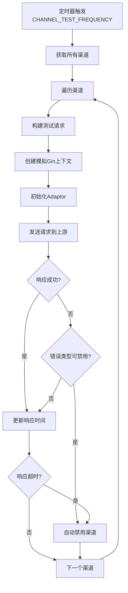

## 附录 E：上下文键值系统

One API 通过 `ctxkey` 包统一管理所有 Gin Context 中使用的键名：

```go
// common/ctxkey/key.go 第1-24行
const (
    Config            = "config"              // 渠道配置
    Id                = "id"                  // 用户ID
    Username          = "username"            // 用户名
    Role              = "role"                // 用户角色
    Status            = "status"              // 用户状态
    Channel           = "channel"             // 渠道类型
    ChannelId         = "channel_id"          // 渠道ID
    SpecificChannelId = "specific_channel_id" // 指定渠道ID
    RequestModel      = "request_model"       // 请求模型名
    ConvertedRequest  = "converted_request"   // 转换后的请求
    OriginalModel     = "original_model"      // 原始模型名
    Group             = "group"               // 用户分组
    ModelMapping      = "model_mapping"       // 模型映射
    ChannelName       = "channel_name"        // 渠道名称
    TokenId           = "token_id"            // Token ID
    TokenName         = "token_name"          // Token名称
    BaseURL           = "base_url"            // 基础URL
    AvailableModels   = "available_models"    // 可用模型列表
    KeyRequestBody    = "key_request_body"    // 缓存的请求体
    SystemPrompt      = "system_prompt"       // 系统提示词
)
```

**上下文传递链**：

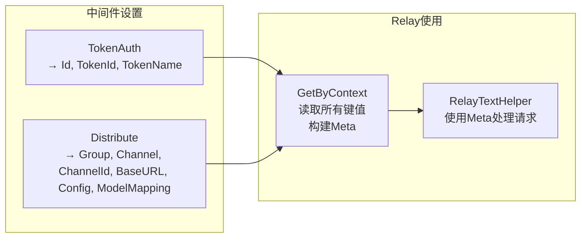

## 附录 F：消息模型分析

### F.1 消息结构

```go
// relay/model/message.go 第3-10行
type Message struct {
    Role             string  `json:"role,omitempty"`              // 角色：system/user/assistant/tool
    Content          any     `json:"content,omitempty"`           // 内容：string 或 []MessageContent
    ReasoningContent any     `json:"reasoning_content,omitempty"` // 推理内容（o1等模型）
    Name             *string `json:"name,omitempty"`              // 消息名称
    ToolCalls        []Tool  `json:"tool_calls,omitempty"`        // 工具调用
    ToolCallId       string  `json:"tool_call_id,omitempty"`      // 工具调用ID
}
```

### F.2 内容解析

Content 字段是一个 `any` 类型，可以是：
- `string`：纯文本消息
- `[]MessageContent`：多模态消息（文本+图片）

```go
// relay/model/message.go 第17-38行
func (m Message) StringContent() string {
    // 纯字符串内容
    content, ok := m.Content.(string)
    if ok {
        return content
    }
    // 多模态内容：提取所有文本部分
    contentList, ok := m.Content.([]any)
    if ok {
        var contentStr string
        for _, contentItem := range contentList {
            contentMap, ok := contentItem.(map[string]any)
            if !ok {
                continue
            }
            if contentMap["type"] == ContentTypeText {
                if subStr, ok := contentMap["text"].(string); ok {
                    contentStr += subStr
                }
            }
        }
        return contentStr
    }
    return ""
}
```

### F.3 请求体结构

```go
// relay/model/general.go 第24-69行
type GeneralOpenAIRequest struct {
    // Chat Completions
    Messages            []Message       `json:"messages,omitempty"`
    Model               string          `json:"model,omitempty"`
    FrequencyPenalty    *float64        `json:"frequency_penalty,omitempty"`
    MaxTokens           int             `json:"max_tokens,omitempty"`
    MaxCompletionTokens *int            `json:"max_completion_tokens,omitempty"`
    N                   int             `json:"n,omitempty"`
    PresencePenalty     *float64        `json:"presence_penalty,omitempty"`
    ResponseFormat      *ResponseFormat `json:"response_format,omitempty"`
    Seed                float64         `json:"seed,omitempty"`
    Stop                any             `json:"stop,omitempty"`
    Stream              bool            `json:"stream,omitempty"`
    StreamOptions       *StreamOptions  `json:"stream_options,omitempty"`
    Temperature         *float64        `json:"temperature,omitempty"`
    TopP                *float64        `json:"top_p,omitempty"`
    TopK                int             `json:"top_k,omitempty"`
    Tools               []Tool          `json:"tools,omitempty"`
    ToolChoice          any             `json:"tool_choice,omitempty"`
    User                string          `json:"user,omitempty"`
    
    // Embeddings
    Input          any    `json:"input,omitempty"`
    EncodingFormat string `json:"encoding_format,omitempty"`
    Dimensions     int    `json:"dimensions,omitempty"`
    
    // Images
    Prompt  any     `json:"prompt,omitempty"`
    Quality *string `json:"quality,omitempty"`
    Size    string  `json:"size,omitempty"`
    Style   *string `json:"style,omitempty"`
    
    // Ollama
    NumCtx      int    `json:"num_ctx,omitempty"`
    Instruction string `json:"instruction,omitempty"`
}
```

**设计特点**：使用单一的请求体结构来处理所有类型的请求（Chat、Embeddings、Images），通过 `omitempty` 标签在序列化时忽略空字段。这虽然简化了代码，但也导致结构体较为庞大。

## 附录 G：部署架构参考

### G.1 单机部署

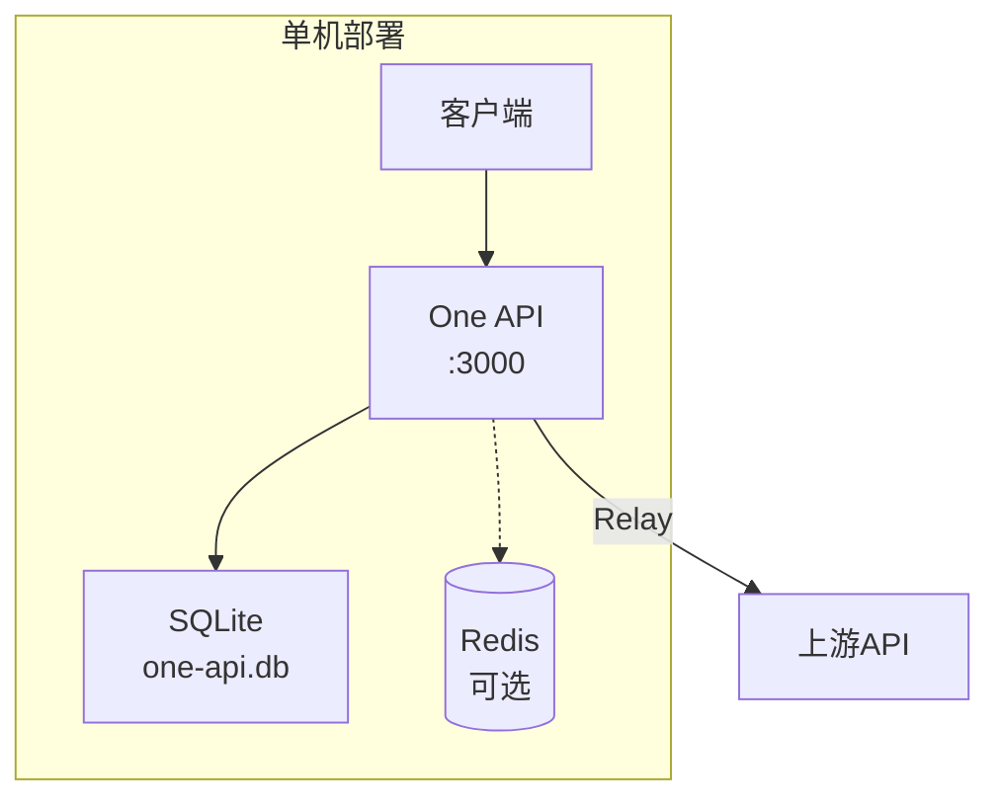

### G.2 生产环境部署

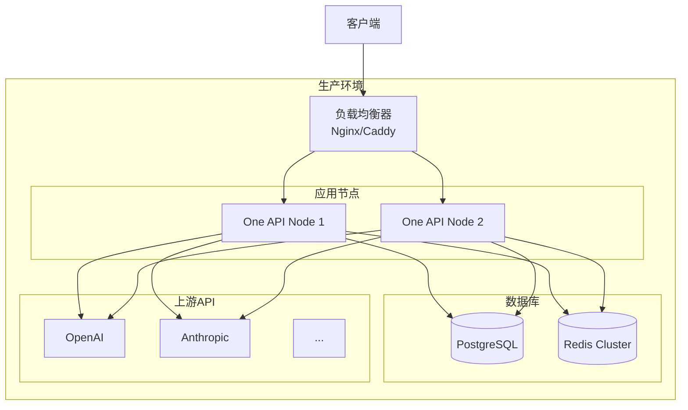

### G.3 环境变量配置表

| 变量名 | 默认值 | 说明 |
|--------|--------|------|
| `SQL_DSN` | (空=SQLite) | 数据库连接字符串 |
| `LOG_SQL_DSN` | (空=主DB) | 日志数据库连接字符串 |
| `REDIS_DSN` | (空=不使用) | Redis连接字符串 |
| `PORT` | 3000 | 服务端口 |
| `SYNC_FREQUENCY` | 600 | 缓存同步频率(秒) |
| `CHANNEL_TEST_FREQUENCY` | (空=不测试) | 渠道自动测试频率(分钟) |
| `BATCH_UPDATE_ENABLED` | false | 启用批量更新 |
| `BATCH_UPDATE_INTERVAL` | 5 | 批量更新间隔(秒) |
| `RELAY_TIMEOUT` | 0 | Relay超时(秒) |
| `RELAY_PROXY` | (空) | 代理服务器 |
| `ENABLE_METRIC` | false | 启用指标监控 |
| `METRIC_QUEUE_SIZE` | 10 | 指标队列大小 |
| `METRIC_SUCCESS_RATE_THRESHOLD` | 0.8 | 成功率阈值 |
| `GIN_MODE` | debug | Gin运行模式 |
| `NODE_TYPE` | master | 节点类型(master/slave) |
| `INITIAL_ROOT_TOKEN` | (空) | 初始Root Token |
| `DEBUG` | false | 调试模式 |
| `ENFORCE_INCLUDE_USAGE` | false | 强制返回usage |
| `TEST_PROMPT` | "Output only..." | 渠道测试提示词 |

### G.4 Docker Compose 参考

```yaml
# docker-compose.yml（One API 原版参考）
version: '3.8'
services:
  one-api:
    image: justsong/one-api
    ports:
      - "3000:3000"
    environment:
      - SQL_DSN=postgres://user:pass@db:5432/one-api
      - REDIS_DSN=redis://redis:6379
      - TZ=Asia/Shanghai
    depends_on:
      - db
      - redis
  
  db:
    image: postgres:15
    volumes:
      - pg_data:/var/lib/postgresql/data
  
  redis:
    image: redis:7-alpine

volumes:
  pg_data:
```

## 附录 H：DDW 插件开发快速参考

### H.1 ddw-llm-gateway 开发清单

- [ ] **Phase 1 - 核心 Relay 引擎**
  - [ ] 移植 `relay/adaptor/` 目录（Adaptor 接口 + OpenAI 适配器）
  - [ ] 移植 `relay/controller/text.go`（RelayTextHelper）
  - [ ] 移植 `relay/meta/`（Meta 元数据）
  - [ ] 适配 Gin Context → Hermes HTTP Plugin Context
  - [ ] 移植 `relay/channeltype/`（渠道类型定义 + URL映射）
  - [ ] 移植 `relay/apitype/`（API类型定义）

- [ ] **Phase 2 - 更多适配器**
  - [ ] Anthropic 适配器
  - [ ] Gemini 适配器
  - [ ] 国内渠道适配器（阿里/智谱/百度等）

- [ ] **Phase 3 - 高级功能**
  - [ ] 流式响应处理（SSE）
  - [ ] 图像生成支持
  - [ ] 音频处理支持
  - [ ] Proxy 模式支持

- [ ] **Phase 4 - 监控与运维**
  - [ ] 渠道测试系统
  - [ ] 指标监控
  - [ ] 自动禁用/启用

### H.2 ddw-token-manager 开发清单

- [ ] **Phase 1 - Token CRUD**
  - [ ] Token 数据模型（增强版）
  - [ ] Token CRUD API
  - [ ] Token 认证中间件
  - [ ] Token 密钥生成

- [ ] **Phase 2 - 额度引擎**
  - [ ] 预消费机制
  - [ ] 后调整机制
  - [ ] 批量更新器
  - [ ] 额度账本

- [ ] **Phase 3 - 高级额度管理**
  - [ ] 每日/每月额度限制
  - [ ] 模型白名单/黑名单
  - [ ] IP 白名单
  - [ ] 额度提醒通知

- [ ] **Phase 4 - 兑换与充值**
  - [ ] 兑换码系统
  - [ ] 充值接口
  - [ ] 邀请奖励
  - [ ] 额度转让

### H.3 关键 API 端点参考

| 功能 | One API 路径 | HTTP方法 | 认证 |
|------|-------------|---------|------|
| Chat Completions | `/v1/chat/completions` | POST | TokenAuth |
| Completions | `/v1/completions` | POST | TokenAuth |
| Embeddings | `/v1/embeddings` | POST | TokenAuth |
| Images | `/v1/images/generations` | POST | TokenAuth |
| Audio Speech | `/v1/audio/speech` | POST | TokenAuth |
| Audio Transcription | `/v1/audio/transcriptions` | POST | TokenAuth |
| Model List | `/v1/models` | GET | TokenAuth |
| Subscription | `/dashboard/billing/subscription` | GET | TokenAuth |
| Usage | `/dashboard/billing/usage` | GET | TokenAuth |
| 渠道管理 | `/api/channel/` | CRUD | AdminAuth |
| Token管理 | `/api/token/` | CRUD | UserAuth |
| 用户管理 | `/api/user/` | CRUD | AdminAuth |
| 系统配置 | `/api/option/` | GET/PUT | RootAuth |
| 日志查询 | `/api/log/` | GET | AdminAuth |
| 渠道测试 | `/api/channel/test/:id` | GET | AdminAuth |
| 批量测试 | `/api/channel/test` | GET | AdminAuth |
| 更新余额 | `/api/channel/update_balance` | GET | AdminAuth |

---

> **报告完成**。本报告基于对 One API 全部 235 个 Go 源文件的逐行分析，为 DDW AI Hub 的两个插件开发提供了全面的技术参考。报告覆盖了从整体架构到具体代码实现的各个层面，包括 15 个 Mermaid 架构图、50+ 个代码片段引用、完整的数据库 Schema 设计、以及针对 DDW 插件体系的具体适配建议。建议开发者重点参考第8节的可复用模式和第9节的适配建议，同时避免第10节中指出的问题。附录中的开发清单可作为项目计划的起点。
