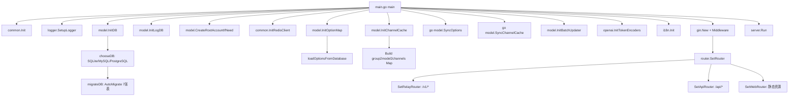
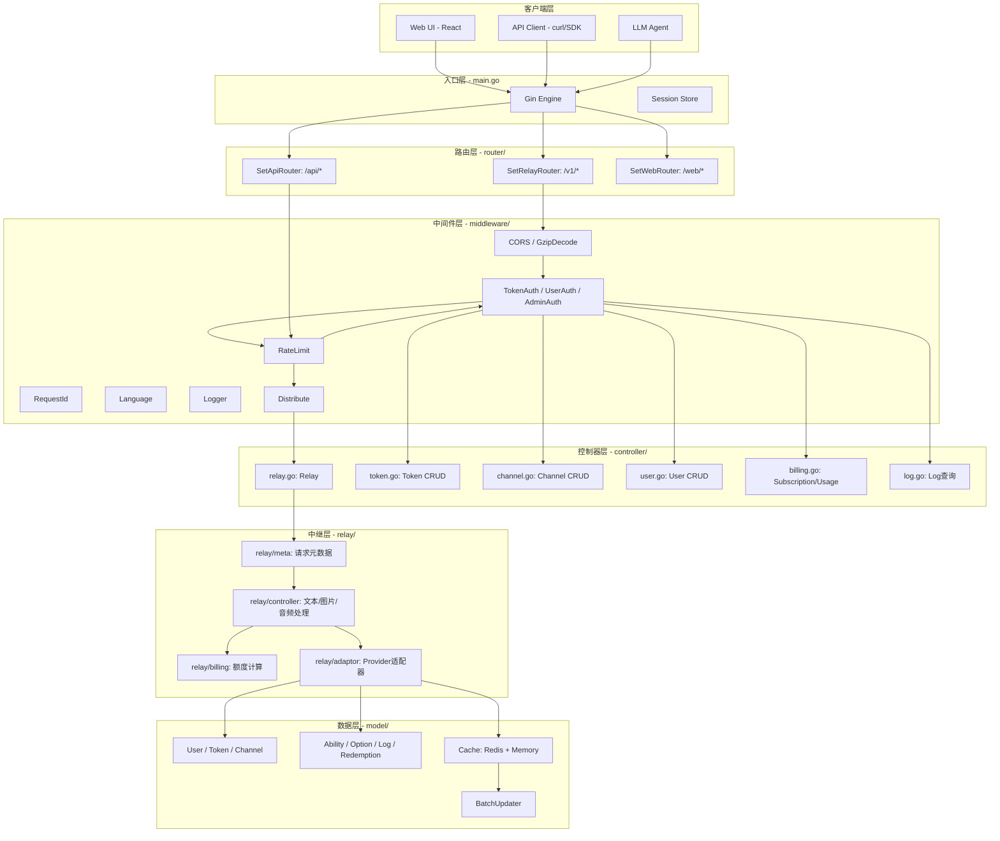
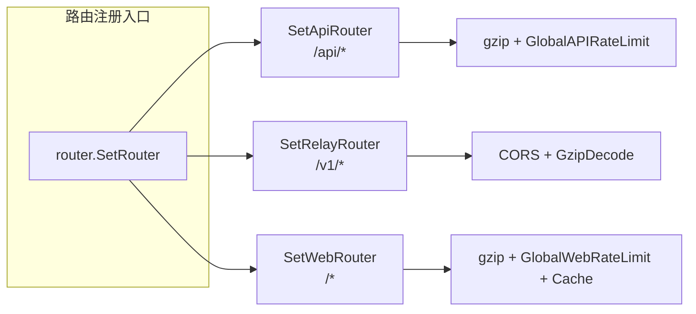
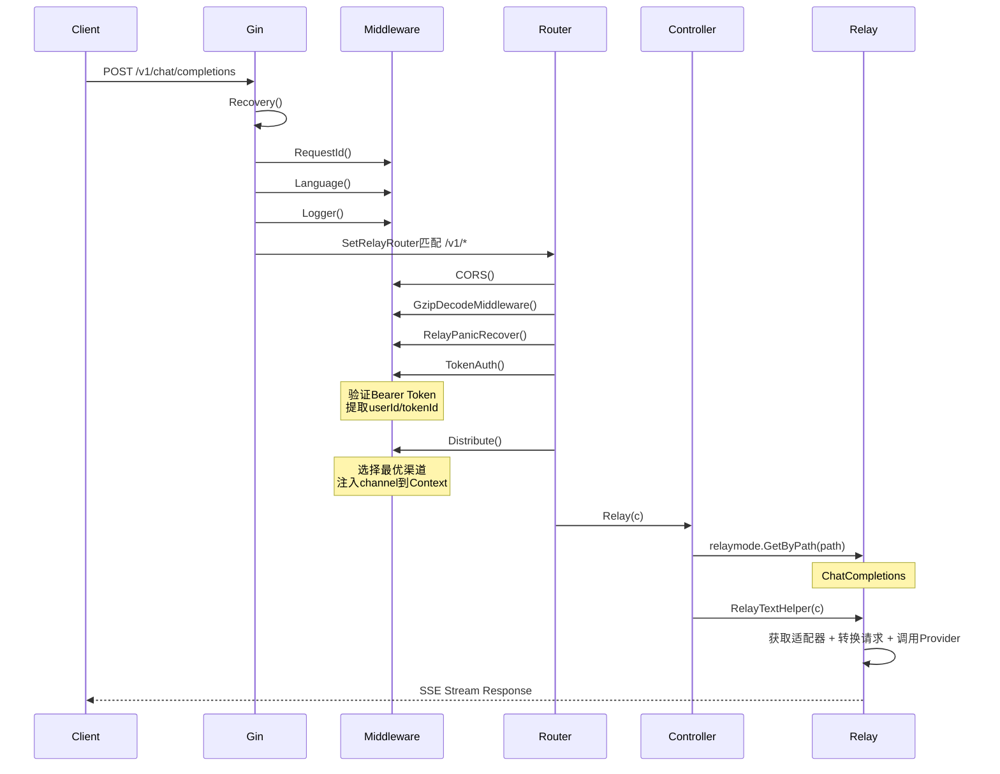
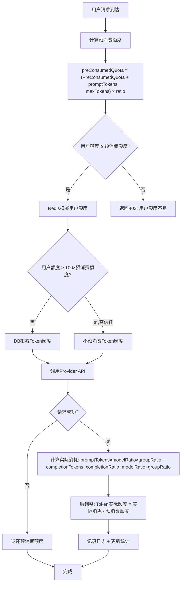
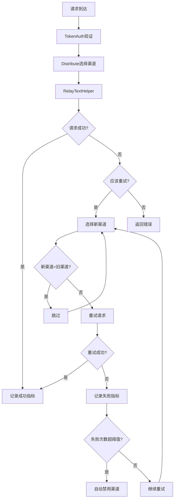
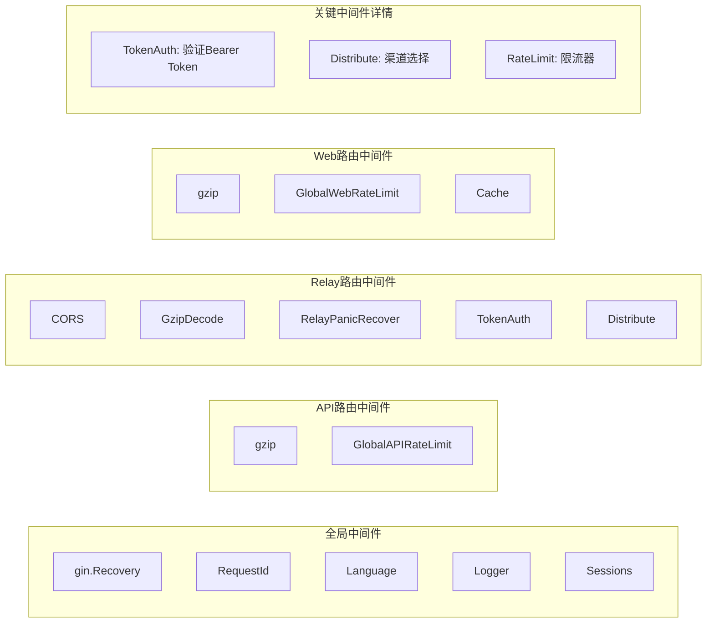
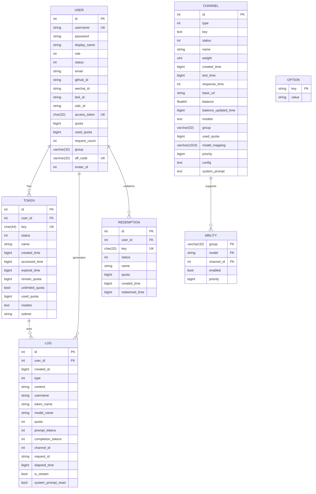
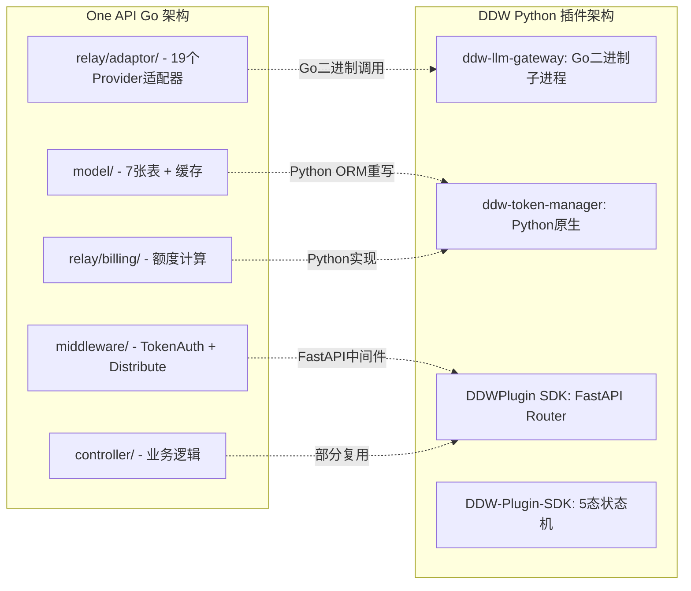

# One API 源码深度分析报告 —— DDW AI Hub 开发参考文档

> **版本**: v1.0  
> **日期**: 2026-07-12  
> **分析范围**: songquanpeng/one-api 完整Go源码（235个.go文件）  
> **目的**: 为 ddw-llm-gateway 和 ddw-token-manager 插件提供技术调研参考  
> **许可证**: MIT

---

## 目录

- [1. 整体架构设计](#1-整体架构设计)
- [2. 路由引擎](#2-路由引擎)
- [3. 额度管理系统](#3-额度管理系统)
- [4. 渠道管理](#4-渠道管理)
- [5. 负载均衡与失败切换](#5-负载均衡与失败切换)
- [6. 中间件链设计](#6-中间件链设计)
- [7. 数据库Schema全景](#7-数据库schema全景)
- [8. 可复用设计模式](#8-可复用设计模式)
- [9. DDW插件适配建议](#9-ddw插件适配建议)
- [10. 不足与改进方向](#10-不足与改进方向)

---

## 1. 整体架构设计

### 1.1 启动流程全景

One API 的启动流程严格遵循 **初始化 → 数据库迁移 → 缓存预热 → 路由注册 → HTTP服务启动** 的线性流程。

```
file: main.go (124行)
```

#### 1.1.1 入口函数 main()

```go
// main.go L29-124
func main() {
    common.Init()                    // L30: 全局初始化（环境变量、Redis连接等）
    logger.SetupLogger()             // L31: 日志系统初始化
    logger.SysLogf("One API %s started", common.Version)  // L32

    // GIN模式设置
    if os.Getenv("GIN_MODE") != gin.DebugMode {           // L34
        gin.SetMode(gin.ReleaseMode)                       // L35
    }

    // ===== 数据库初始化 =====
    model.InitDB()                    // L42: 主数据库初始化+AutoMigrate
    model.InitLogDB()                 // L43: 日志数据库初始化（可独立DSN）
    model.CreateRootAccountIfNeed()   // L46: 首次运行自动创建root用户

    // ===== Redis初始化 =====
    common.InitRedisClient()          // L58: Redis客户端初始化

    // ===== 配置与缓存 =====
    model.InitOptionMap()             // L64: 从DB加载所有系统配置到内存Map
    model.InitChannelCache()          // L73: 预热渠道内存缓存
    go model.SyncOptions(...)         // L76: 定时同步DB配置到内存
    go model.SyncChannelCache(...)    // L77: 定时同步DB渠道到内存

    // ===== 批量更新器 =====
    model.InitBatchUpdater()          // L89: 批量写入优化（减少DB压力）

    // ===== Token编码器 =====
    openai.InitTokenEncoders()        // L94: 初始化tiktoken编码器
    client.Init()                     // L95: HTTP客户端初始化

    // ===== i18n =====
    i18n.Init()                       // L98: 国际化初始化

    // ===== HTTP服务 =====
    server := gin.New()               // L103
    server.Use(gin.Recovery())        // L104: Panic恢复
    server.Use(middleware.RequestId()) // L107: 请求ID注入
    server.Use(middleware.Language())  // L108: 语言检测
    middleware.SetUpLogger(server)     // L109: 请求日志
    store := cookie.NewStore(...)     // L111: Session存储
    server.Use(sessions.Sessions("session", store)) // L112

    router.SetRouter(server, buildFS) // L114: 路由注册（核心！）
    server.Run(":" + port)            // L120: 启动HTTP服务
}
```

#### 1.1.2 初始化顺序图



#### 1.1.3 数据库选择逻辑

```go
// model/main.go L67-81
func chooseDB(envName string) (*gorm.DB, error) {
    dsn := os.Getenv(envName)
    switch {
    case strings.HasPrefix(dsn, "postgres://"):
        return openPostgreSQL(dsn)     // PostgreSQL
    case dsn != "":
        return openMySQL(dsn)          // MySQL
    default:
        return openSQLite()            // SQLite (默认)
    }
}
```

**关键设计**: 通过环境变量 `SQL_DSN` 的前缀自动选择数据库类型，实现了三数据库透明切换。SQLite 作为默认选项降低了部署门槛。

#### 1.1.4 数据库迁移

```go
// model/main.go L137-164
func migrateDB() error {
    DB.AutoMigrate(&Channel{})    // 渠道表
    DB.AutoMigrate(&Token{})      // 令牌表
    DB.AutoMigrate(&User{})       // 用户表
    DB.AutoMigrate(&Option{})     // 配置表
    DB.AutoMigrate(&Redemption{}) // 兑换码表
    DB.AutoMigrate(&Ability{})    // 能力映射表
    DB.AutoMigrate(&Log{})        // 日志表
    return nil
}
```

**7张核心表**: Channel, Token, User, Option, Redemption, Ability, Log

#### 1.1.5 数据库连接池配置

```go
// model/main.go L203-218
func setDBConns(db *gorm.DB) *sql.DB {
    sqlDB, _ := db.DB()
    sqlDB.SetMaxIdleConns(env.Int("SQL_MAX_IDLE_CONNS", 100))      // 空闲连接数
    sqlDB.SetMaxOpenConns(env.Int("SQL_MAX_OPEN_CONNS", 1000))     // 最大连接数
    sqlDB.SetConnMaxLifetime(time.Second * time.Duration(
        env.Int("SQL_MAX_LIFETIME", 60)))                           // 连接最大存活时间
    return sqlDB
}
```

### 1.2 分层架构图



### 1.3 技术栈清单

| 组件 | 技术选型 | 文件位置 |
|------|----------|----------|
| HTTP框架 | Gin | main.go L11 |
| ORM | GORM (支持SQLite/MySQL/PostgreSQL) | model/main.go |
| 会话管理 | gin-contrib/sessions (Cookie Store) | main.go L111 |
| 压缩 | gin-contrib/gzip | router/api.go L14 |
| 缓存 | Redis + 内存缓存 | model/cache.go |
| 前端 | React (embed嵌入) | main.go L26-27 |
| 认证 | Session + Access Token + Bearer Token | middleware/auth.go |
| i18n | 自研i18n | common/i18n/ |
| Token计算 | tiktoken Go实现 | relay/adaptor/openai/token.go |

---

## 2. 路由引擎

### 2.1 三套路由体系

One API 使用三套并行路由，分别服务于不同的API场景：



### 2.2 Relay路由（LLM API代理核心）

```go
// router/relay.go L10-74
func SetRelayRouter(router *gin.Engine) {
    router.Use(middleware.CORS())                    // L11: 跨域
    router.Use(middleware.GzipDecodeMiddleware())    // L12: Gzip解压

    // ===== /v1/models 路由组 =====
    modelsRouter := router.Group("/v1/models")      // L14
    modelsRouter.Use(middleware.TokenAuth())         // L15: 需要Token认证
    modelsRouter.GET("", controller.ListModels)     // L17
    modelsRouter.GET("/:model", controller.RetrieveModel) // L18

    // ===== /v1/* 核心中继路由组 =====
    relayV1Router := router.Group("/v1")            // L20
    relayV1Router.Use(
        middleware.RelayPanicRecover(),              // L21: 中继Panic恢复
        middleware.TokenAuth(),                      // L21: Token认证
        middleware.Distribute(),                     // L21: 渠道分发
    )

    // 核心中继端点
    relayV1Router.Any("/oneapi/proxy/:channelid/*target", controller.Relay) // L23: 代理
    relayV1Router.POST("/completions", controller.Relay)                    // L24
    relayV1Router.POST("/chat/completions", controller.Relay)              // L25
    relayV1Router.POST("/edits", controller.Relay)                         // L26
    relayV1Router.POST("/images/generations", controller.Relay)            // L27
    relayV1Router.POST("/embeddings", controller.Relay)                    // L30
    relayV1Router.POST("/audio/transcriptions", controller.Relay)          // L32
    relayV1Router.POST("/audio/translations", controller.Relay)            // L33
    relayV1Router.POST("/audio/speech", controller.Relay)                  // L34
    relayV1Router.POST("/moderations", controller.Relay)                   // L46

    // 未实现端点（占位）
    relayV1Router.POST("/files", controller.RelayNotImplemented)           // L36
    relayV1Router.POST("/fine_tuning/jobs", controller.RelayNotImplemented) // L40
    relayV1Router.POST("/assistants", controller.RelayNotImplemented)      // L47
    // ... 更多占位路由
}
```

**关键设计**: 所有LLM API端点统一由 `controller.Relay` 处理，具体的行为由 `relaymode.GetByPath()` 根据URL路径自动判断。

### 2.3 Relay模式识别

```go
// relay/relaymode/define.go L3-16
const (
    Unknown = iota            // 0
    ChatCompletions           // 1 - /v1/chat/completions
    Completions               // 2 - /v1/completions
    Embeddings                // 3 - /v1/embeddings
    Moderations               // 4 - /v1/moderations
    ImagesGenerations         // 5 - /v1/images/generations
    Edits                     // 6 - /v1/edits
    AudioSpeech               // 7 - /v1/audio/speech
    AudioTranscription        // 8 - /v1/audio/transcriptions
    AudioTranslation          // 9 - /v1/audio/translations
    Proxy                     // 10 - /v1/oneapi/proxy
)
```

```go
// relay/relaymode/helper.go L5-31
func GetByPath(path string) int {
    relayMode := Unknown
    if strings.HasPrefix(path, "/v1/chat/completions") {
        relayMode = ChatCompletions
    } else if strings.HasPrefix(path, "/v1/completions") {
        relayMode = Completions
    } else if strings.HasPrefix(path, "/v1/embeddings") {
        relayMode = Embeddings
    } else if strings.HasPrefix(path, "/v1/moderations") {
        relayMode = Moderations
    } else if strings.HasPrefix(path, "/v1/images/generations") {
        relayMode = ImagesGenerations
    } else if strings.HasPrefix(path, "/v1/audio/speech") {
        relayMode = AudioSpeech
    } else if strings.HasPrefix(path, "/v1/audio/transcriptions") {
        relayMode = AudioTranscription
    } else if strings.HasPrefix(path, "/v1/audio/translations") {
        relayMode = AudioTranslation
    } else if strings.HasPrefix(path, "/v1/oneapi/proxy") {
        relayMode = Proxy
    }
    return relayMode
}
```

### 2.4 API路由（管理后台）

```go
// router/api.go L12-121
func SetApiRouter(router *gin.Engine) {
    apiRouter := router.Group("/api")                    // L13
    apiRouter.Use(gzip.Gzip(gzip.DefaultCompression))   // L14
    apiRouter.Use(middleware.GlobalAPIRateLimit())        // L15

    // 公开端点
    apiRouter.GET("/status", controller.GetStatus)       // L17
    apiRouter.GET("/models", middleware.UserAuth(), controller.DashboardListModels) // L18

    // 用户路由组
    userRoute := apiRouter.Group("/user")                // L34
    userRoute.POST("/register", ...)                     // L36: 注册
    userRoute.POST("/login", ...)                        // L37: 登录

    selfRoute := userRoute.Group("/")                    // L40
    selfRoute.Use(middleware.UserAuth())                  // L41
    selfRoute.GET("/self", controller.GetSelf)           // L44
    selfRoute.PUT("/self", controller.UpdateSelf)        // L45

    adminRoute := userRoute.Group("/")                   // L53
    adminRoute.Use(middleware.AdminAuth())                // L54
    adminRoute.GET("/", controller.GetAllUsers)          // L56
    adminRoute.POST("/", controller.CreateUser)          // L59

    // 渠道路由组（仅管理员）
    channelRoute := apiRouter.Group("/channel")          // L71
    channelRoute.Use(middleware.AdminAuth())              // L72
    channelRoute.GET("/", controller.GetAllChannels)     // L74
    channelRoute.POST("/", controller.AddChannel)        // L82
    channelRoute.GET("/test/:id", controller.TestChannel) // L79

    // 令牌路由组（需要用户认证）
    tokenRoute := apiRouter.Group("/token")              // L87
    tokenRoute.Use(middleware.UserAuth())                 // L88
    tokenRoute.GET("/", controller.GetAllTokens)         // L90
    tokenRoute.POST("/", controller.AddToken)            // L93

    // 兑换码路由组（仅管理员）
    redemptionRoute := apiRouter.Group("/redemption")    // L97
    redemptionRoute.Use(middleware.AdminAuth())           // L98

    // 日志路由组
    logRoute := apiRouter.Group("/log")                  // L107
    logRoute.GET("/", middleware.AdminAuth(), controller.GetAllLogs) // L108
    logRoute.GET("/self", middleware.UserAuth(), controller.GetUserLogs) // L113
}
```

### 2.5 Web路由（前端SPA）

```go
// router/web.go L17-31
func SetWebRouter(router *gin.Engine, buildFS embed.FS) {
    indexPageData, _ := buildFS.ReadFile(
        fmt.Sprintf("web/build/%s/index.html", config.Theme))  // L18

    router.Use(gzip.Gzip(gzip.DefaultCompression))             // L19
    router.Use(middleware.GlobalWebRateLimit())                  // L20
    router.Use(middleware.Cache())                               // L21
    router.Use(static.Serve("/", common.EmbedFolder(
        buildFS, fmt.Sprintf("web/build/%s", config.Theme))))   // L22

    router.NoRoute(func(c *gin.Context) {                       // L23
        if strings.HasPrefix(c.Request.RequestURI, "/v1") ||
           strings.HasPrefix(c.Request.RequestURI, "/api") {
            controller.RelayNotFound(c)                          // L25
            return
        }
        c.Data(http.StatusOK, "text/html; charset=utf-8",
            indexPageData)                                       // L29
    })
}
```

### 2.6 路由分发流程图



---

## 3. 额度管理系统

### 3.1 核心数据模型

#### 3.1.1 Token结构体

```go
// model/token.go L16-37
const (
    TokenStatusEnabled   = 1  // 启用
    TokenStatusDisabled  = 2  // 禁用
    TokenStatusExpired   = 3  // 过期
    TokenStatusExhausted = 4  // 额度用尽
)

type Token struct {
    Id             int     `json:"id"`
    UserId         int     `json:"user_id"`                          // 关联用户
    Key            string  `json:"key" gorm:"type:char(48);uniqueIndex"` // API密钥
    Status         int     `json:"status" gorm:"default:1"`          // 状态
    Name           string  `json:"name" gorm:"index"`                // 令牌名称
    CreatedTime    int64   `json:"created_time" gorm:"bigint"`       // 创建时间
    AccessedTime   int64   `json:"accessed_time" gorm:"bigint"`      // 最后访问时间
    ExpiredTime    int64   `json:"expired_time" gorm:"bigint;default:-1"` // 过期时间(-1=永不过期)
    RemainQuota    int64   `json:"remain_quota" gorm:"bigint;default:0"`  // 剩余额度
    UnlimitedQuota bool    `json:"unlimited_quota" gorm:"default:false"`  // 无限额度标志
    UsedQuota      int64   `json:"used_quota" gorm:"bigint;default:0"`    // 已用额度
    Models         *string `json:"models" gorm:"type:text"`               // 允许的模型列表
    Subnet         *string `json:"subnet" gorm:"default:''"`              // IP白名单子网
}
```

#### 3.1.2 User结构体

```go
// model/user.go L19-54
const (
    RoleGuestUser  = 0   // 游客
    RoleCommonUser = 1   // 普通用户
    RoleAdminUser  = 10  // 管理员
    RoleRootUser   = 100 // 超级管理员
)

const (
    UserStatusEnabled  = 1 // 启用
    UserStatusDisabled = 2 // 禁用
    UserStatusDeleted  = 3 // 已删除
)

type User struct {
    Id               int    `json:"id"`
    Username         string `json:"username" gorm:"unique;index"`
    Password         string `json:"password" gorm:"not null;"`
    DisplayName      string `json:"display_name" gorm:"index"`
    Role             int    `json:"role" gorm:"type:int;default:1"`
    Status           int    `json:"status" gorm:"type:int;default:1"`
    Email            string `json:"email" gorm:"index"`
    GitHubId         string `json:"github_id" gorm:"column:github_id;index"`
    WeChatId         string `json:"wechat_id" gorm:"column:wechat_id;index"`
    LarkId           string `json:"lark_id" gorm:"column:lark_id;index"`
    OidcId           string `json:"oidc_id" gorm:"column:oidc_id;index"`
    AccessToken      string `json:"access_token" gorm:"type:char(32);uniqueIndex"`
    Quota            int64  `json:"quota" gorm:"bigint;default:0"`
    UsedQuota        int64  `json:"used_quota" gorm:"bigint;default:0"`
    RequestCount     int    `json:"request_count" gorm:"type:int;default:0;"`
    Group            string `json:"group" gorm:"type:varchar(32);default:'default'"`
    AffCode          string `json:"aff_code" gorm:"type:varchar(32);uniqueIndex"`
    InviterId        int    `json:"inviter_id" gorm:"type:int;column:inviter_id;index"`
}
```

### 3.2 预消费/后消费机制（核心算法）

One API 的额度管理采用 **预消费(Predictive) + 后调整(Post-consume)** 的两阶段模型：



#### 3.2.1 预消费逻辑

```go
// relay/controller/helper.go L60-95
func getPreConsumedQuota(
    textRequest *relaymodel.GeneralOpenAIRequest,
    promptTokens int, ratio float64,
) int64 {
    preConsumedTokens := config.PreConsumedQuota + int64(promptTokens)  // L61
    if textRequest.MaxTokens != 0 {
        preConsumedTokens += int64(textRequest.MaxTokens)               // L63
    }
    return int64(float64(preConsumedTokens) * ratio)                    // L65
}

func preConsumeQuota(ctx context.Context, textRequest, promptTokens, ratio, meta) {
    preConsumedQuota := getPreConsumedQuota(textRequest, promptTokens, ratio) // L69
    userQuota, _ := model.CacheGetUserQuota(ctx, meta.UserId)                // L71

    // 检查用户额度是否足够
    if userQuota-preConsumedQuota < 0 {                                      // L75
        return preConsumedQuota, ErrorWrapper("insufficient_user_quota")     // L76
    }

    // Redis扣减用户额度
    model.CacheDecreaseUserQuota(meta.UserId, preConsumedQuota)             // L78

    // 高信任跳过预消费
    if userQuota > 100*preConsumedQuota {                                    // L82
        preConsumedQuota = 0  // 不需要预消费
    }

    // DB扣减Token额度
    if preConsumedQuota > 0 {                                               // L88
        model.PreConsumeTokenQuota(meta.TokenId, preConsumedQuota)          // L89
    }
}
```

#### 3.2.2 后消费逻辑

```go
// relay/controller/helper.go L97-141
func postConsumeQuota(ctx context.Context, usage, meta, textRequest, ratio,
    preConsumedQuota, modelRatio, groupRatio, systemPromptReset) {

    completionRatio := billingratio.GetCompletionRatio(textRequest.Model, meta.ChannelType)

    // 计算实际消耗额度
    // quota = ceil((promptTokens + completionTokens × completionRatio) × ratio)
    quota := int64(math.Ceil(
        (float64(usage.PromptTokens) +
         float64(usage.CompletionTokens) * completionRatio) * ratio))      // L106

    if ratio != 0 && quota <= 0 {
        quota = 1  // 最小消耗1
    }

    // 后调整: 实际消耗 - 预消费 = 需要额外扣除/退还的额度
    quotaDelta := quota - preConsumedQuota                                 // L116
    model.PostConsumeTokenQuota(meta.TokenId, quotaDelta)                  // L117

    // 更新用户额度缓存
    model.CacheUpdateUserQuota(ctx, meta.UserId)                           // L121

    // 记录消费日志
    logContent := fmt.Sprintf("倍率：%.2f × %.2f × %.2f",
        modelRatio, groupRatio, completionRatio)                            // L125
    model.RecordConsumeLog(ctx, &model.Log{...})                           // L126

    // 更新统计
    model.UpdateUserUsedQuotaAndRequestCount(meta.UserId, quota)           // L139
    model.UpdateChannelUsedQuota(meta.ChannelId, quota)                    // L140
}
```

#### 3.2.3 Token额度扣减的原子操作

```go
// model/token.go L173-215
func IncreaseTokenQuota(id int, quota int64) (err error) {
    if config.BatchUpdateEnabled {
        addNewRecord(BatchUpdateTypeTokenQuota, id, quota)  // 批量模式
        return nil
    }
    return increaseTokenQuota(id, quota)
}

func increaseTokenQuota(id int, quota int64) (err error) {
    err = DB.Model(&Token{}).Where("id = ?", id).Updates(
        map[string]interface{}{
            "remain_quota":  gorm.Expr("remain_quota + ?", quota),  // SQL原子加
            "used_quota":    gorm.Expr("used_quota - ?", quota),    // SQL原子减
            "accessed_time": helper.GetTimestamp(),
        }).Error
    return err
}

func decreaseTokenQuota(id int, quota int64) (err error) {
    err = DB.Model(&Token{}).Where("id = ?", id).Updates(
        map[string]interface{}{
            "remain_quota":  gorm.Expr("remain_quota - ?", quota),
            "used_quota":    gorm.Expr("used_quota + ?", quota),
            "accessed_time": helper.GetTimestamp(),
        }).Error
    return err
}
```

### 3.3 额度模型倍率系统

```go
// relay/billing/ratio/model.go L12-17
const (
    USD2RMB   = 7                            // 汇率
    USD       = 500                          // $0.002 = 1 quota unit
    MILLI_USD = 1.0 / 1000 * USD             // 千分之一美元
    RMB       = USD / USD2RMB                // 人民币单位
)

// L27-: 模型倍率表 (300+个模型)
var ModelRatio = map[string]float64{
    "gpt-4":           15,                    // $0.03/1K tokens
    "gpt-4o":          2.5,                   // $0.005/1K tokens
    "gpt-4o-mini":     0.075,                 // $0.00015/1K tokens
    "claude-3-opus-20240229": 15.0 / 1000 * USD, // $0.015/1K tokens
    "deepseek-chat":   0.14 * MILLI_USD,      // DeepSeek
    "qwen-plus":       0.0008 * RMB,          // 通义千问
    "glm-4-plus":      0.05 * RMB,            // 智谱
    // ... 300+模型
}
```

**额度计算公式**: `quota = ceil((promptTokens + completionTokens × completionRatio) × modelRatio × groupRatio)`

### 3.4 批量更新优化

```go
// model/utils.go L10-78
const (
    BatchUpdateTypeUserQuota = iota      // 0
    BatchUpdateTypeTokenQuota            // 1
    BatchUpdateTypeUsedQuota             // 2
    BatchUpdateTypeChannelUsedQuota      // 3
    BatchUpdateTypeRequestCount          // 4
)

var batchUpdateStores []map[int]int64   // 内存缓冲
var batchUpdateLocks []sync.Mutex       // 并发锁

func addNewRecord(type_ int, id int, value int64) {
    batchUpdateLocks[type_].Lock()
    defer batchUpdateLocks[type_].Unlock()
    if _, ok := batchUpdateStores[type_][id]; !ok {
        batchUpdateStores[type_][id] = value
    } else {
        batchUpdateStores[type_][id] += value  // 累加
    }
}

func batchUpdate() {
    // 定时批量写入DB，减少高频小写入的DB压力
    for i := 0; i < BatchUpdateTypeCount; i++ {
        batchUpdateLocks[i].Lock()
        store := batchUpdateStores[i]
        batchUpdateStores[i] = make(map[int]int64)
        batchUpdateLocks[i].Unlock()
        for key, value := range store {
            // 按类型分发到不同的更新函数
        }
    }
}
```

### 3.5 预消费额度告警

```go
// model/token.go L217-280
func PreConsumeTokenQuota(tokenId int, quota int64) error {
    token, err := GetTokenById(tokenId)
    // ...
    userQuota, err := GetUserQuota(token.UserId)

    quotaTooLow := userQuota >= config.QuotaRemindThreshold &&
        userQuota-quota < config.QuotaRemindThreshold                    // L235
    noMoreQuota := userQuota-quota <= 0                                  // L236

    if quotaTooLow || noMoreQuota {
        go func() {                                                      // 异步发送邮件
            email, _ := GetUserEmail(token.UserId)
            content := message.EmailTemplate(prompt, fmt.Sprintf(`
                <p>您好！</p>
                <p>%s，当前剩余额度为 <strong>%d</strong>。</p>
                <p>为了不影响您的使用，请及时充值。</p>
                ...
            `, contentText, userQuota, topUpLink, topUpLink))
            message.SendEmail(prompt, email, content)
        }()
    }
}
```

---

## 4. 渠道管理

### 4.1 Channel结构体

```go
// model/channel.go L13-41
const (
    ChannelStatusUnknown          = 0
    ChannelStatusEnabled          = 1  // 启用
    ChannelStatusManuallyDisabled = 2  // 手动禁用
    ChannelStatusAutoDisabled     = 3  // 自动禁用（故障检测）
)

type Channel struct {
    Id                 int     `json:"id"`
    Type               int     `json:"type" gorm:"default:0"`        // Provider类型
    Key                string  `json:"key" gorm:"type:text"`          // API Key
    Status             int     `json:"status" gorm:"default:1"`       // 状态
    Name               string  `json:"name" gorm:"index"`             // 渠道名称
    Weight             *uint   `json:"weight" gorm:"default:0"`       // 权重
    CreatedTime        int64   `json:"created_time" gorm:"bigint"`
    TestTime           int64   `json:"test_time" gorm:"bigint"`       // 最后测试时间
    ResponseTime       int     `json:"response_time"`                 // 响应时间(ms)
    BaseURL            *string `json:"base_url" gorm:"default:''"`    // 自定义API地址
    Other              *string `json:"other"`                          // 已废弃
    Balance            float64 `json:"balance"`                       // 余额(USD)
    BalanceUpdatedTime int64   `json:"balance_updated_time" gorm:"bigint"`
    Models             string  `json:"models"`                        // 支持的模型列表
    Group              string  `json:"group" gorm:"type:varchar(32);default:'default'"`
    UsedQuota          int64   `json:"used_quota" gorm:"bigint;default:0"`
    ModelMapping       *string `json:"model_mapping" gorm:"type:varchar(1024);default:''"`
    Priority           *int64  `json:"priority" gorm:"bigint;default:0"` // 优先级
    Config             string  `json:"config"`                         // JSON配置
    SystemPrompt       *string `json:"system_prompt" gorm:"type:text"` // 系统提示词覆盖
}

// L43-53: 渠道扩展配置
type ChannelConfig struct {
    Region            string `json:"region,omitempty"`
    SK                string `json:"sk,omitempty"`
    AK                string `json:"ak,omitempty"`
    UserID            string `json:"user_id,omitempty"`
    APIVersion        string `json:"api_version,omitempty"`
    LibraryID         string `json:"library_id,omitempty"`
    Plugin            string `json:"plugin,omitempty"`
    VertexAIProjectID string `json:"vertex_ai_project_id,omitempty"`
    VertexAIADC       string `json:"vertex_ai_adc,omitempty"`
}
```

### 4.2 Ability表（渠道-模型映射）

```go
// model/ability.go L14-20
type Ability struct {
    Group     string `json:"group" gorm:"type:varchar(32);primaryKey;autoIncrement:false"`
    Model     string `json:"model" gorm:"primaryKey;autoIncrement:false"`
    ChannelId int    `json:"channel_id" gorm:"primaryKey;autoIncrement:false;index"`
    Enabled   bool   `json:"enabled"`
    Priority  *int64 `json:"priority" gorm:"bigint;default:0;index"`
}
```

**设计要点**: Ability表是Channel的"能力展开"——一个Channel支持多个模型和多个分组，每个(model, group, channel)三元组就是一条Ability记录。

```go
// model/ability.go L53-71
func (channel *Channel) AddAbilities() error {
    models_ := strings.Split(channel.Models, ",")     // 拆分模型列表
    groups_ := strings.Split(channel.Group, ",")      // 拆分分组列表
    abilities := make([]Ability, 0, len(models_)*len(groups_))
    for _, model := range models_ {
        for _, group := range groups_ {
            ability := Ability{
                Group:     group,
                Model:     model,
                ChannelId: channel.Id,
                Enabled:   channel.Status == ChannelStatusEnabled,
                Priority:  channel.Priority,
            }
            abilities = append(abilities, ability)
        }
    }
    return DB.Create(&abilities).Error
}
```

### 4.3 渠道类型定义

```go
// relay/channeltype/define.go L3-57
const (
    Unknown = iota        // 0
    OpenAI                // 1
    API2D                 // 2
    Azure                 // 3
    CloseAI               // 4
    OpenAISB              // 5
    OpenAIMax             // 6
    OhMyGPT               // 7
    Custom                // 8
    Ails                  // 9
    AIProxy               // 10
    PaLM                  // 11
    API2GPT               // 12
    AIGC2D                // 13
    Anthropic             // 14
    Baidu                 // 15
    Zhipu                 // 16
    Ali                   // 17
    Xunfei                // 18
    AI360                 // 19
    OpenRouter            // 20
    AIProxyLibrary        // 21
    FastGPT               // 22
    Tencent               // 23
    Gemini                // 24
    Moonshot              // 25
    Baichuan              // 26
    Minimax               // 27
    Mistral               // 28
    Groq                  // 29
    Ollama                // 30
    LingYiWanWu           // 31
    StepFun               // 32
    AwsClaude             // 33
    Coze                  // 34
    Cohere                // 35
    DeepSeek              // 36
    Cloudflare            // 37
    DeepL                 // 38
    TogetherAI            // 39
    Doubao                // 40
    Novita                // 41
    VertextAI             // 42
    Proxy                 // 43
    SiliconFlow           // 44
    XAI                   // 45
    Replicate             // 46
    BaiduV2               // 47
    XunfeiV2              // 48
    AliBailian            // 49
    OpenAICompatible      // 50
    GeminiOpenAICompatible // 51
    Dummy                 // 52 (计数用)
)
```

**注意**: 总计51种渠道类型（0-51），其中Dummy仅用于计数。大量OpenAI兼容的渠道通过 `channeltype/helper.go` 的 `ToAPIType()` 映射到OpenAI适配器。

### 4.4 渠道默认BaseURL映射

```go
// relay/channeltype/url.go L3-57
var ChannelBaseURLs = []string{
    "",                                          // 0 - Unknown
    "https://api.openai.com",                    // 1 - OpenAI
    "https://oa.api2d.net",                      // 2 - API2D
    "https://api.anthropic.com",                 // 14 - Anthropic
    "https://aip.baidubce.com",                  // 15 - Baidu
    "https://open.bigmodel.cn",                  // 16 - Zhipu
    "https://dashscope.aliyuncs.com",            // 17 - Ali
    "https://api.moonshot.cn",                   // 25 - Moonshot
    "https://api.deepseek.com",                  // 36 - DeepSeek
    "https://api.x.ai",                          // 45 - XAI
    "https://api.replicate.com/v1/models/",      // 46 - Replicate
    // ... 共52个URL
}

func init() {
    if len(ChannelBaseURLs) != Dummy {
        panic("channel base urls length not match")  // 编译期校验一致性
    }
}
```

### 4.5 渠道状态管理

```go
// model/channel.go L190-224
func UpdateChannelStatusById(id int, status int) {
    UpdateAbilityStatus(id, status == ChannelStatusEnabled)  // 同步更新Ability表
    DB.Model(&Channel{}).Where("id = ?", id).
        Update("status", status).Error
}

func DeleteChannelByStatus(status int64) (int64, error) {
    result := DB.Where("status = ?", status).Delete(&Channel{})
    return result.RowsAffected, result.Error
}

func DeleteDisabledChannel() (int64, error) {
    result := DB.Where("status = ? or status = ?",
        ChannelStatusAutoDisabled, ChannelStatusManuallyDisabled).
        Delete(&Channel{})
    return result.RowsAffected, result.Error
}
```

---

## 5. 负载均衡与失败切换

### 5.1 渠道分发中间件

```go
// middleware/distributor.go L20-62
func Distribute() func(c *gin.Context) {
    return func(c *gin.Context) {
        userId := c.GetInt(ctxkey.Id)
        userGroup, _ := model.CacheGetUserGroup(userId)  // 获取用户分组
        c.Set(ctxkey.Group, userGroup)

        channelId, ok := c.Get(ctxkey.SpecificChannelId)
        if ok {
            // 管理员指定了渠道
            channel, _ = model.GetChannelById(id, true)
            if channel.Status != model.ChannelStatusEnabled {
                abortWithMessage(c, http.StatusForbidden, "该渠道已被禁用")
                return
            }
        } else {
            // 自动选择渠道（核心！）
            requestModel = c.GetString(ctxkey.RequestModel)
            channel, err = model.CacheGetRandomSatisfiedChannel(
                userGroup, requestModel, false)
            if err != nil {
                abortWithMessage(c, http.StatusServiceUnavailable,
                    fmt.Sprintf("当前分组 %s 下对于模型 %s 无可用渠道",
                    userGroup, requestModel))
                return
            }
        }
        SetupContextForSelectedChannel(c, channel, requestModel)
        c.Next()
    }
}
```

### 5.2 渠道选择算法

```go
// model/cache.go L227-255
func CacheGetRandomSatisfiedChannel(
    group string, model string, ignoreFirstPriority bool,
) (*Channel, error) {

    if !config.MemoryCacheEnabled {
        return GetRandomSatisfiedChannel(group, model, ignoreFirstPriority)
    }

    channelSyncLock.RLock()
    defer channelSyncLock.RUnlock()
    channels := group2model2channels[group][model]

    if len(channels) == 0 {
        return nil, errors.New("channel not found")
    }

    endIdx := len(channels)

    // ===== 优先级分组选择 =====
    firstChannel := channels[0]
    if firstChannel.GetPriority() > 0 {
        for i := range channels {
            if channels[i].GetPriority() != firstChannel.GetPriority() {
                endIdx = i  // 找到第一个不同优先级的边界
                break
            }
        }
    }

    // ===== 随机选择 =====
    idx := rand.Intn(endIdx)  // 在最高优先级组内随机选择

    if ignoreFirstPriority {
        if endIdx < len(channels) {
            // 重试时跳过最高优先级组
            idx = random.RandRange(endIdx, len(channels))
        }
    }

    return channels[idx], nil
}
```

**算法流程**:
1. 从内存缓存中获取 `(group, model)` 对应的所有渠道
2. 渠道按优先级降序排列（在 `InitChannelCache` 中预排序）
3. 优先选择最高优先级组内的随机渠道
4. 重试时可以跳过最高优先级组，选择次优组

### 5.3 渠道缓存初始化

```go
// model/cache.go L173-217
func InitChannelCache() {
    newChannelId2channel := make(map[int]*Channel)
    var channels []*Channel
    DB.Where("status = ?", ChannelStatusEnabled).Find(&channels)

    // 构建 channelId -> Channel 映射
    for _, channel := range channels {
        newChannelId2channel[channel.Id] = channel
    }

    // 获取所有Ability记录
    var abilities []*Ability
    DB.Find(&abilities)

    // 构建 group -> model -> []Channel 的三维映射
    newGroup2model2channels := make(map[string]map[string][]*Channel)
    for group := range groups {
        newGroup2model2channels[group] = make(map[string][]*Channel)
    }
    for _, channel := range channels {
        groups := strings.Split(channel.Group, ",")
        for _, group := range groups {
            models := strings.Split(channel.Models, ",")
            for _, model := range models {
                newGroup2model2channels[group][model] = append(
                    newGroup2model2channels[group][model], channel)
            }
        }
    }

    // ===== 按优先级排序 =====
    for group, model2channels := range newGroup2model2channels {
        for model, channels := range model2channels {
            sort.Slice(channels, func(i, j int) bool {
                return channels[i].GetPriority() > channels[j].GetPriority()
            })
        }
    }

    channelSyncLock.Lock()
    group2model2channels = newGroup2model2channels
    channelSyncLock.Unlock()
}
```

### 5.4 失败重试机制

```go
// controller/relay.go L45-103
func Relay(c *gin.Context) {
    relayMode := relaymode.GetByPath(c.Request.URL.Path)
    channelId := c.GetInt(ctxkey.ChannelId)

    // 第一次尝试
    bizErr := relayHelper(c, relayMode)
    if bizErr == nil {
        monitor.Emit(channelId, true)  // 成功，记录指标
        return
    }

    lastFailedChannelId := channelId
    go processChannelRelayError(...)   // 异步记录错误

    retryTimes := config.RetryTimes    // 最大重试次数
    if !shouldRetry(c, bizErr.StatusCode) {
        retryTimes = 0  // 某些错误码不重试
    }

    // ===== 重试循环 =====
    for i := retryTimes; i > 0; i-- {
        // 获取新渠道（ignoreFirstPriority=true跳过最高优先级）
        channel, err := dbmodel.CacheGetRandomSatisfiedChannel(
            group, originalModel, i != retryTimes)

        if channel.Id == lastFailedChannelId {
            continue  // 跳过已失败的渠道
        }

        // 重新设置上下文
        middleware.SetupContextForSelectedChannel(c, channel, originalModel)
        c.Request.Body = io.NopCloser(bytes.NewBuffer(requestBody))

        // 重试
        bizErr = relayHelper(c, relayMode)
        if bizErr == nil {
            return  // 成功
        }
        lastFailedChannelId = channelId
    }
}
```

```go
// controller/relay.go L105-122
func shouldRetry(c *gin.Context, statusCode int) bool {
    if _, ok := c.Get(ctxkey.SpecificChannelId); ok {
        return false  // 指定渠道不重试
    }
    if statusCode == http.StatusTooManyRequests {
        return true   // 429 限流可重试
    }
    if statusCode/100 == 5 {
        return true   // 5xx 服务端错误可重试
    }
    if statusCode == http.StatusBadRequest {
        return false  // 400 客户端错误不重试
    }
    if statusCode/100 == 2 {
        return false  // 2xx 成功不重试
    }
    return true       // 其他错误可重试
}
```

### 5.5 自动禁用机制

```go
// controller/relay.go L124-132
func processChannelRelayError(ctx, userId, channelId, channelName, err) {
    if monitor.ShouldDisableChannel(&err.Error, err.StatusCode) {
        monitor.DisableChannel(channelId, channelName, err.Message)
        // 自动禁用频繁失败的渠道
    } else {
        monitor.Emit(channelId, false)  // 记录失败指标
    }
}
```



---

## 6. 中间件链设计

### 6.1 中间件总览



### 6.2 TokenAuth中间件（核心）

```go
// middleware/auth.go L91-151
func TokenAuth() func(c *gin.Context) {
    return func(c *gin.Context) {
        // 1. 提取Authorization Header
        key := c.Request.Header.Get("Authorization")
        key = strings.TrimPrefix(key, "Bearer ")
        key = strings.TrimPrefix(key, "sk-")
        parts := strings.Split(key, "-")    // 支持 sk-xxx-ChannelId 格式
        key = parts[0]

        // 2. 验证Token
        token, err := model.ValidateUserToken(key)
        if err != nil {
            abortWithMessage(c, http.StatusUnauthorized, err.Error())
            return
        }

        // 3. IP白名单检查
        if token.Subnet != nil && *token.Subnet != "" {
            if !network.IsIpInSubnets(ctx, c.ClientIP(), *token.Subnet) {
                abortWithMessage(c, http.StatusForbidden,
                    fmt.Sprintf("该令牌只能在指定网段使用：%s", *token.Subnet))
                return
            }
        }

        // 4. 用户状态检查
        userEnabled, _ := model.CacheIsUserEnabled(token.UserId)
        if !userEnabled || blacklist.IsUserBanned(token.UserId) {
            abortWithMessage(c, http.StatusForbidden, "用户已被封禁")
            return
        }

        // 5. 模型权限检查
        requestModel, _ := getRequestModel(c)
        c.Set(ctxkey.RequestModel, requestModel)
        if token.Models != nil && *token.Models != "" {
            if requestModel != "" && !isModelInList(requestModel, *token.Models) {
                abortWithMessage(c, http.StatusForbidden,
                    fmt.Sprintf("该令牌无权使用模型：%s", requestModel))
                return
            }
        }

        // 6. 指定渠道（管理员专用）
        if len(parts) > 1 {
            if model.IsAdmin(token.UserId) {
                c.Set(ctxkey.SpecificChannelId, parts[1])
            } else {
                abortWithMessage(c, http.StatusForbidden, "普通用户不支持指定渠道")
                return
            }
        }

        c.Set(ctxkey.Id, token.UserId)
        c.Set(ctxkey.TokenId, token.Id)
        c.Set(ctxkey.TokenName, token.Name)
        c.Next()
    }
}
```

### 6.3 Rate Limiter中间件

```go
// middleware/rate-limit.go L17-111
var inMemoryRateLimiter common.InMemoryRateLimiter

// Redis限流器
func redisRateLimiter(c *gin.Context, maxRequestNum int, duration int64, mark string) {
    key := "rateLimit:" + mark + c.ClientIP()
    listLength, _ := rdb.LLen(ctx, key).Result()

    if listLength < int64(maxRequestNum) {
        rdb.LPush(ctx, key, time.Now().Format(timeFormat))
        rdb.Expire(ctx, key, config.RateLimitKeyExpirationDuration)
    } else {
        oldTimeStr, _ := rdb.LIndex(ctx, key, -1).Result()
        oldTime, _ := time.Parse(timeFormat, oldTimeStr)
        if int64(nowTime.Sub(oldTime).Seconds()) < duration {
            rdb.Expire(ctx, key, config.RateLimitKeyExpirationDuration)
            c.Status(http.StatusTooManyRequests)
            c.Abort()
            return
        }
        rdb.LPush(ctx, key, time.Now().Format(timeFormat))
        rdb.LTrim(ctx, key, 0, int64(maxRequestNum-1))
    }
}

// 内存限流器
func memoryRateLimiter(c *gin.Context, maxRequestNum int, duration int64, mark string) {
    key := mark + c.ClientIP()
    if !inMemoryRateLimiter.Request(key, maxRequestNum, duration) {
        c.Status(http.StatusTooManyRequests)
        c.Abort()
        return
    }
}

// 工厂模式：根据是否有Redis选择限流器实现
func rateLimitFactory(maxRequestNum int, duration int64, mark string) func(c *gin.Context) {
    if maxRequestNum == 0 || config.DebugEnabled {
        return func(c *gin.Context) { c.Next() }  // 不限流
    }
    if common.RedisEnabled {
        return func(c *gin.Context) { redisRateLimiter(c, maxRequestNum, duration, mark) }
    } else {
        return func(c *gin.Context) { memoryRateLimiter(c, maxRequestNum, duration, mark) }
    }
}

// 预定义限流器
func GlobalWebRateLimit() func(c *gin.Context) {
    return rateLimitFactory(config.GlobalWebRateLimitNum, config.GlobalWebRateLimitDuration, "GW")
}
func GlobalAPIRateLimit() func(c *gin.Context) {
    return rateLimitFactory(config.GlobalApiRateLimitNum, config.GlobalApiRateLimitDuration, "GA")
}
func CriticalRateLimit() func(c *gin.Context) {
    return rateLimitFactory(config.CriticalRateLimitNum, config.CriticalRateLimitDuration, "CT")
}
```

### 6.4 Auth中间件（管理API用）

```go
// middleware/auth.go L15-71
func authHelper(c *gin.Context, minRole int) {
    session := sessions.Default(c)
    username := session.Get("username")

    if username == nil {
        // 未登录，检查Access Token
        accessToken := c.Request.Header.Get("Authorization")
        if accessToken == "" {
            c.JSON(http.StatusUnauthorized, gin.H{
                "success": false, "message": "未登录且未提供 access token",
            })
            c.Abort()
            return
        }
        user := model.ValidateAccessToken(accessToken)
        if user != nil && user.Username != "" {
            username = user.Username
            role = user.Role
            id = user.Id
            status = user.Status
        } else {
            c.JSON(http.StatusOK, gin.H{
                "success": false, "message": "access token 无效",
            })
            c.Abort()
            return
        }
    }

    // 封禁检查
    if status.(int) == model.UserStatusDisabled || blacklist.IsUserBanned(id.(int)) {
        c.JSON(http.StatusOK, gin.H{"success": false, "message": "用户已被封禁"})
        session.Clear()
        c.Abort()
        return
    }

    // 角色检查
    if role.(int) < minRole {
        c.JSON(http.StatusOK, gin.H{"success": false, "message": "权限不足"})
        c.Abort()
        return
    }

    c.Set("username", username)
    c.Set("role", role)
    c.Set("id", id)
    c.Next()
}
```

### 6.5 其他中间件

```go
// middleware/cors.go L15 - CORS跨域
func CORS() func(c *gin.Context) {
    return func(c *gin.Context) {
        c.Header("Access-Control-Allow-Origin", "*")
        c.Header("Access-Control-Allow-Methods", "GET, POST, PUT, DELETE, OPTIONS")
        c.Header("Access-Control-Allow-Headers", "Content-Type, Authorization")
        c.Header("Access-Control-Max-Age", "86400")
        if c.Request.Method == "OPTIONS" {
            c.AbortWithStatus(http.StatusNoContent)
            return
        }
        c.Next()
    }
}

// middleware/request-id.go L18 - 请求ID注入
func RequestId() func(c *gin.Context) {
    return func(c *gin.Context) {
        requestId := c.GetHeader("X-Request-Id")
        if requestId == "" {
            requestId = uuid.New().String()
        }
        c.Set(helper.RequestIdKey, requestId)
        c.Header("X-Request-Id", requestId)
        c.Next()
    }
}

// middleware/language.go L25 - 语言检测
func Language() func(c *gin.Context) {
    return func(c *gin.Context) {
        lang := c.GetHeader("Accept-Language")
        c.Set("lang", lang)
        c.Next()
    }
}

// middleware/logger.go L25 - 请求日志
func SetUpLogger(server *gin.Engine) {
    server.Use(func(c *gin.Context) {
        start := time.Now()
        c.Next()
        latency := time.Since(start)
        logger.Info(c.Request.Context(),
            fmt.Sprintf("%s %s %d %v",
                c.Request.Method, c.Request.URL.Path,
                c.Writer.Status(), latency))
    })
}

// middleware/cache.go L16 - HTTP缓存
func Cache() func(c *gin.Context) {
    return func(c *gin.Context) {
        c.Header("Cache-Control", "max-age=300, must-revalidate")
        c.Next()
    }
}
```

---

## 7. 数据库Schema全景

### 7.1 表结构关系图



### 7.2 各表详细分析

#### 7.2.1 User表 (model/user.go)

**字段数**: 17  
**索引**: username(unique+index), email(index), github_id(index), wechat_id(index), lark_id(index), oidc_id(index), access_token(unique+index), aff_code(unique+index), inviter_id(index)

**关键方法**:
- `Insert()` L120: 创建用户时自动：密码哈希、分配AccessToken、生成AffCode、赠送新用户额度、创建默认Token
- `ValidateAndFill()` L196: 登录验证（支持用户名或邮箱登录）
- `Update()` L167: 禁用/启用时自动同步黑名单
- `Delete()` L184: 软删除（保留数据，修改username为deleted_xxx）

#### 7.2.2 Token表 (model/token.go)

**字段数**: 12  
**索引**: key(unique+index), name(index)

**关键方法**:
- `ValidateUserToken()` L62: 完整的令牌验证链（缓存查询→状态检查→过期检查→额度检查）
- `PreConsumeTokenQuota()` L217: 预消费（含邮件提醒）
- `PostConsumeTokenQuota()` L282: 后调整（差额结算）

#### 7.2.3 Channel表 (model/channel.go)

**字段数**: 18  
**索引**: name(index), id(primary key)

**关键方法**:
- `Insert()` L127: 创建渠道时自动添加Ability记录
- `Update()` L137: 更新时先删后建Ability记录
- `LoadConfig()` L178: JSON配置反序列化
- `GetModelMapping()` L114: 解析模型映射JSON

#### 7.2.4 Ability表 (model/ability.go)

**字段数**: 5  
**主键**: (group, model, channel_id) 联合主键

**设计目的**: 将Channel的多模型×多分组的二维关系展开为平面表，便于随机查询。

#### 7.2.5 Option表 (model/option.go)

**字段数**: 2 (key + value)  
**主键**: key

**设计目的**: 键值对配置存储，支持运行时动态修改。初始化时从DB加载到 `config.OptionMap` 内存Map。

#### 7.2.6 Redemption表 (model/redemption.go)

**字段数**: 8  
**索引**: key(unique+index), name(index)

**设计目的**: 兑换码系统，用于预付费充值。使用数据库事务保证兑换的原子性。

#### 7.2.7 Log表 (model/log.go)

**字段数**: 15  
**索引**: user_id(index), created_at+type(复合索引), username+model_name(复合索引), token_name(index), channel_id(index), model_name(index)

**特殊设计**: 支持独立的日志数据库 (`LOG_SQL_DSN`)，将高频写入的日志表与业务表分离。

### 7.3 日志类型枚举

```go
// model/log.go L34-41
const (
    LogTypeUnknown = iota  // 0
    LogTypeTopup           // 1 - 充值
    LogTypeConsume         // 2 - 消费
    LogTypeManage          // 3 - 管理操作
    LogTypeSystem          // 4 - 系统事件
    LogTypeTest            // 5 - 渠道测试
)
```

---

## 8. 可复用设计模式

### 8.1 适配器模式（核心设计）

One API 最核心的设计模式是 **适配器模式**，用于统一不同Provider的API差异。

```go
// relay/adaptor/interface.go L11-21
type Adaptor interface {
    Init(meta *meta.Meta)
    GetRequestURL(meta *meta.Meta) (string, error)
    SetupRequestHeader(c *gin.Context, req *http.Request, meta *meta.Meta) error
    ConvertRequest(c *gin.Context, relayMode int, request *model.GeneralOpenAIRequest) (any, error)
    ConvertImageRequest(request *model.ImageRequest) (any, error)
    DoRequest(c *gin.Context, meta *meta.Meta, requestBody io.Reader) (*http.Response, error)
    DoResponse(c *gin.Context, resp *http.Response, meta *meta.Meta) (usage *model.Usage, err *model.ErrorWithStatusCode)
    GetModelList() []string
    GetChannelName() string
}
```

```go
// relay/adaptor.go L27-69
func GetAdaptor(apiType int) adaptor.Adaptor {
    switch apiType {
    case apitype.AIProxyLibrary:
        return &aiproxy.Adaptor{}
    case apitype.Ali:
        return &ali.Adaptor{}
    case apitype.Anthropic:
        return &anthropic.Adaptor{}
    case apitype.OpenAI:
        return &openai.Adaptor{}
    case apitype.Gemini:
        return &gemini.Adaptor{}
    case apitype.Zhipu:
        return &zhipu.Adaptor{}
    // ... 19种适配器
    }
    return nil
}
```

**API类型定义**:

```go
// relay/apitype/define.go L3-25
const (
    OpenAI = iota          // 0
    Anthropic              // 1
    PaLM                   // 2
    Baidu                  // 3
    Zhipu                  // 4
    Ali                    // 5
    Xunfei                 // 6
    AIProxyLibrary         // 7
    Tencent                // 8
    Gemini                 // 9
    Ollama                 // 10
    AwsClaude              // 11
    Coze                   // 12
    Cohere                 // 13
    Cloudflare             // 14
    DeepL                  // 15
    VertexAI               // 16
    Proxy                  // 17
    Replicate              // 18
    Dummy                  // 19 (计数用)
)
```

**关键洞察**: ChannelType（51种）到APIType（19种）的映射通过 `channeltype.ToAPIType()` 完成。大量OpenAI兼容的渠道（OpenAI、Azure、DeepSeek、Moonshot等）全部映射到 `apitype.OpenAI`，复用同一个适配器。

### 8.2 两级缓存模式

```mermaid
graph TD
    A[请求到达] --> B{Redis可用?}
    B -->|是| C[查询Redis缓存]
    B -->|否| D[直接查询DB]
    C --> E{缓存命中?}
    E -->|是| F[返回缓存数据]
    E -->|否| D
    D --> G[写入Redis缓存]
    G --> F

    subgraph "缓存类型"
        H[Token缓存: token:{key}]
        I[用户分组: user_group:{id}]
        J[用户额度: user_quota:{id}]
        K[用户状态: user_enabled:{id}]
        L[分组模型: group_models:{group}]
    end
```

```go
// model/cache.go L28-56
func CacheGetTokenByKey(key string) (*Token, error) {
    if !common.RedisEnabled {
        return DB.Where(keyCol+" = ?", key).First(&token).Error  // 直接DB查询
    }
    // Redis查询
    tokenObjectString, err := common.RedisGet(fmt.Sprintf("token:%s", key))
    if err != nil {
        // Redis未命中，回源DB
        DB.Where(keyCol+" = ?", key).First(&token)
        // 回写Redis
        jsonBytes, _ := json.Marshal(token)
        common.RedisSet(fmt.Sprintf("token:%s", key), string(jsonBytes),
            time.Duration(TokenCacheSeconds)*time.Second)
        return &token, nil
    }
    // Redis命中
    json.Unmarshal([]byte(tokenObjectString), &token)
    return &token, err
}
```

### 8.3 状态机模式

Token和Channel都使用显式的状态机：

```
Token状态机:
  Enabled(1) ──→ Disabled(2)
  Enabled(1) ──→ Expired(3)
  Enabled(1) ──→ Exhausted(4)

Channel状态机:
  Enabled(1) ←──→ ManuallyDisabled(2)
  Enabled(1) ──→ AutoDisabled(3)
  ManuallyDisabled(2) ←──→ Enabled(1)
  AutoDisabled(3) ──→ Enabled(1)  (通过测试恢复)
```

### 8.4 配置管理模式

```go
// model/option.go L24-80
func InitOptionMap() {
    config.OptionMapRWMutex.Lock()
    config.OptionMap = make(map[string]string)
    // 从config常量初始化
    config.OptionMap["PasswordLoginEnabled"] = strconv.FormatBool(config.PasswordLoginEnabled)
    config.OptionMap["QuotaForNewUser"] = strconv.FormatInt(config.QuotaForNewUser, 10)
    config.OptionMap["ModelRatio"] = billingratio.ModelRatio2JSONString()
    // ... 40+配置项
    config.OptionMapRWMutex.Unlock()
    loadOptionsFromDatabase()  // DB覆盖内存默认值
}

func updateOptionMap(key string, value string) error {
    config.OptionMapRWMutex.Lock()
    defer config.OptionMapRWMutex.Unlock()
    config.OptionMap[key] = value

    // 动态更新config包的全局变量
    if strings.HasSuffix(key, "Enabled") {
        boolValue := value == "true"
        switch key {
        case "PasswordLoginEnabled":
            config.PasswordLoginEnabled = boolValue
        // ... 15+布尔配置
        }
    }
    // 字符串/数值配置
    switch key {
    case "ModelRatio":
        billingratio.UpdateModelRatioByJSONString(value)
    // ... 20+配置
    }
    return nil
}
```

### 8.5 请求转发模式

```go
// relay/adaptor/common.go L13-52
func SetupCommonRequestHeader(c *gin.Context, req *http.Request, meta *meta.Meta) {
    req.Header.Set("Content-Type", c.Request.Header.Get("Content-Type"))
    req.Header.Set("Accept", c.Request.Header.Get("Accept"))
    if meta.IsStream && c.Request.Header.Get("Accept") == "" {
        req.Header.Set("Accept", "text/event-stream")
    }
}

func DoRequestHelper(a Adaptor, c *gin.Context, meta *meta.Meta, requestBody io.Reader) (*http.Response, error) {
    fullRequestURL, _ := a.GetRequestURL(meta)     // 1. 构建URL
    req, _ := http.NewRequest(c.Request.Method, fullRequestURL, requestBody)
    a.SetupRequestHeader(c, req, meta)              // 2. 设置Header
    resp, _ := DoRequest(c, req)                    // 3. 发送请求
    return resp, nil
}
```

### 8.6 批量写入模式

```go
// model/utils.go L10-78 - 内存聚合 + 定时批量写入
// 减少高频小写入对DB的压力
var batchUpdateStores []map[int]int64  // 按类型分组的缓冲
var batchUpdateLocks []sync.Mutex       // 类型级锁

func addNewRecord(type_ int, id int, value int64) {
    batchUpdateLocks[type_].Lock()
    defer batchUpdateLocks[type_].Unlock()
    batchUpdateStores[type_][id] += value  // 累加到缓冲
}

// 定时执行批量写入
func batchUpdate() {
    for i := 0; i < BatchUpdateTypeCount; i++ {
        batchUpdateLocks[i].Lock()
        store := batchUpdateStores[i]
        batchUpdateStores[i] = make(map[int]int64)  // 原子替换
        batchUpdateLocks[i].Unlock()
        for key, value := range store {
            // 批量执行DB更新
        }
    }
}
```

---

## 9. DDW插件适配建议

### 9.1 架构映射



### 9.2 模块复用评估

| One API 模块 | 复用方式 | 理由 |
|-------------|----------|------|
| relay/adaptor/ (19个适配器) | **Go二进制子进程调用** | 高性能HTTP转发，Go的并发模型适合 |
| model/ (ORM层) | **Python重写** | DDW使用Python SQLAlchemy/Tortoise |
| middleware/auth.go | **Python FastAPI中间件** | 与DDWPlugin SDK集成 |
| middleware/distributor.go | **Python重写** | 需要与DDW插件系统集成 |
| relay/billing/ | **Python重写** | 需要自定义中国Provider计费 |
| relay/channeltype/ | **配置化** | 通过YAML配置而非硬编码 |
| model/cache.go | **Python Redis + 本地缓存** | DDW已有Redis基础设施 |

### 9.3 接口设计建议

#### 9.3.1 ddw-llm-gateway 插件接口

```python
# ddw-llm-gateway 核心接口设计（参考One API）
from fastapi import APIRouter, Depends
from ddw_plugin_sdk import DDWPlugin

class DDWLLMGatewayPlugin(DDWPlugin):
    """LLM网关插件 - 基于One API架构"""

    # ===== 渠道管理 =====
    router.get("/api/channels")           # 获取所有渠道
    router.post("/api/channels")          # 创建渠道
    router.put("/api/channels/{id}")      # 更新渠道
    router.delete("/api/channels/{id}")   # 删除渠道
    router.get("/api/channels/test/{id}") # 测试渠道
    router.get("/api/channels/balance/{id}") # 查询余额

    # ===== 令牌管理 =====
    router.get("/api/tokens")             # 获取令牌列表
    router.post("/api/tokens")            # 创建令牌
    router.put("/api/tokens/{id}")        # 更新令牌
    router.delete("/api/tokens/{id}")     # 删除令牌

    # ===== LLM代理端点 =====
    router.post("/v1/chat/completions")   # Chat补全
    router.post("/v1/completions")        # 文本补全
    router.post("/v1/embeddings")         # 嵌入向量
    router.post("/v1/images/generations") # 图片生成
    router.post("/v1/audio/speech")       # TTS
    router.post("/v1/audio/transcriptions") # STT

    # ===== 监控 =====
    router.get("/api/logs")               # 日志查询
    router.get("/api/stats")              # 统计数据
```

#### 9.3.2 ddw-token-manager 插件接口

```python
# ddw-token-manager 核心接口设计（One API不支持的差异化功能）
class DDWTokenManagerPlugin(DDWPlugin):
    """LLM成本管理插件 - One API的差异化补充"""

    # ===== 订阅感知路由 =====
    router.post("/api/subscription/check")    # 检查订阅状态
    router.get("/api/subscription/balance")   # 查询余额（含中国Provider信用体系）

    # ===== 校准反算 =====
    router.post("/api/calibration/estimate")  # 请求前成本预估
    router.post("/api/calibration/actual")    # 请求后实际成本校准
    router.get("/api/calibration/diff")       # 预估与实际差异分析

    # ===== 中国Provider适配 =====
    router.get("/api/providers/deepseek/balance")   # DeepSeek信用查询
    router.get("/api/providers/minimax/balance")     # MiniMax信用查询
    router.get("/api/providers/mimo/balance")        # MiMo信用查询

    # ===== 成本分析 =====
    router.get("/api/cost/realtime")    # 实时成本面板
    router.get("/api/cost/daily")       # 日成本统计
    router.get("/api/cost/model")       # 按模型统计
    router.get("/api/cost/user")        # 按用户统计
```

### 9.4 关键差异点

| 维度 | One API | DDW插件 |
|------|---------|---------|
| 语言 | Go | Python (FastAPI) |
| 渠道选择 | 内存缓存 + 随机 | Python + Redis |
| 额度系统 | 自研quota | 需支持中国Provider credit |
| 计费 | 固定倍率表 | 动态费率 + 校准反算 |
| 插件化 | 单体应用 | .ddwplugin包格式 |
| 状态管理 | 5态状态机 | DDWPlugin 5态状态机 |

---

## 10. 不足与改进方向

### 10.1 中国Provider原生适配缺失

**问题**: One API 虽然支持51种渠道类型，但对中国Provider的适配停留在API兼容层，缺乏原生的信用/额度体系支持。

**具体表现**:

```go
// relay/adaptor/deepseek/constants.go L6 - DeepSeek仅定义了常量
const (
    // 无特殊配置
)

// relay/adaptor/minimax/constants.go L13
const (
    // 无credit查询接口
)

// relay/adaptor/doubao/constants.go L13
const (
    // 豆包(字节)无余额查询
)
```

**DDW差异化价值**:
- DeepSeek: API Key有credit余额，需要定期查询并预警
- MiniMax: 有token额度和有效期
- MiMo (小米): 有积分体系和使用限制
- 火山方舟: Agent Plan有月度配额

```python
# DDW Token Manager 可实现
class ChinaProviderCreditManager:
    """中国Provider信用管理器"""

    async def check_deepseek_credit(self, api_key: str) -> CreditInfo:
        """查询DeepSeek API Key信用余额"""
        # 调用DeepSeek余额查询接口
        pass

    async def check_minimax_tokens(self, api_key: str) -> TokenInfo:
        """查询MiniMax token额度"""
        pass

    async def alert_low_credit(self, provider: str, balance: float):
        """低余额告警"""
        pass
```

### 10.2 不支持订阅感知路由

**问题**: One API 的渠道选择是纯粹基于优先级+随机的，不考虑Provider的订阅套餐状态。

```go
// model/cache.go L227 - 渠道选择不考虑订阅状态
func CacheGetRandomSatisfiedChannel(...) {
    // 只看优先级和随机，不考虑Provider是否还有配额
    channels := group2model2channels[group][model]
    idx := rand.Intn(endIdx)
    return channels[idx], nil
}
```

**DDW差异化价值**:
- 检测Provider订阅是否有效
- 根据剩余额度智能选择渠道
- 套餐即将到期时自动切换备用渠道

```python
# DDW 可实现订阅感知路由
class SubscriptionAwareRouter:
    """订阅感知路由"""

    async def select_channel(self, group: str, model: str) -> Channel:
        channels = await self.get_available_channels(group, model)
        for channel in sorted(channels, key=lambda c: c.priority, reverse=True):
            # 检查Provider订阅状态
            if await self.is_subscription_valid(channel):
                # 检查剩余额度
                balance = await self.get_provider_balance(channel)
                if balance > self.min_balance_threshold:
                    return channel
        raise NoAvailableChannelError()
```

### 10.3 不支持校准反算

**问题**: One API 的额度计算是基于静态倍率表的，不支持根据Provider实际账单进行校准反算。

```go
// relay/controller/helper.go L106 - 静态倍率计算
quota := int64(math.Ceil(
    (float64(promptTokens) +
     float64(completionTokens) * completionRatio) * ratio))

// 这个ratio是固定的，不考虑实际Provider账单
modelRatio := billingratio.GetModelRatio(textRequest.Model, meta.ChannelType)
groupRatio := billingratio.GetGroupRatio(meta.Group)
```

**DDW差异化价值**:
- 定期拉取Provider实际账单
- 计算预估与实际的差异
- 动态调整倍率表
- 生成成本分析报告

```python
# DDW 可实现校准反算
class CostCalibrator:
    """成本校准器"""

    async def calibrate(self, provider: str, period: str):
        """根据Provider实际账单校准倍率"""
        actual_cost = await self.fetch_provider_bill(provider, period)
        estimated_cost = await self.get_estimated_cost(provider, period)
        ratio = actual_cost / estimated_cost if estimated_cost > 0 else 1.0
        await self.update_model_ratio(provider, ratio)
```

### 10.4 模型倍率表维护困难

**问题**: `relay/billing/ratio/model.go` 有835行，硬编码了300+个模型的倍率，维护成本极高。

```go
// relay/billing/ratio/model.go L27-835
var ModelRatio = map[string]float64{
    // 300+行硬编码...
    "gpt-4": 15,
    "gpt-4o": 2.5,
    // ... 所有模型价格都在代码里
}
```

**改进方向**: 从数据库/配置文件加载倍率表，支持运行时热更新。

### 10.5 缺乏流式响应的用量精确统计

**问题**: 流式(SSE)响应的token统计依赖客户端返回的usage字段，部分Provider不返回或返回不准确。

```go
// relay/adaptor/openai/adaptor.go L110-119
func (a *Adaptor) DoResponse(...) (usage, err) {
    if meta.IsStream {
        err, responseText, usage = StreamHandler(c, resp, meta.Mode)
        if usage == nil || usage.TotalTokens == 0 {
            // 回退：通过文本长度估算
            usage = ResponseText2Usage(responseText, meta.ActualModelName, meta.PromptTokens)
        }
        if usage.TotalTokens != 0 && usage.PromptTokens == 0 {
            // 有些Provider不返回prompt/completion拆分
            usage.PromptTokens = meta.PromptTokens
            usage.CompletionTokens = usage.TotalTokens - meta.PromptTokens
        }
    }
}
```

**DDW差异化价值**: 可以在代理层实现更精确的token计数（使用tiktoken在请求前预计算，在响应后精确统计）。

### 10.6 缺乏Webhook回调机制

**问题**: One API 不支持配置Webhook来通知外部系统消费事件。

**DDW差异化价值**: 支持配置Webhook端点，在额度消费、渠道异常、订阅到期时主动推送通知。

### 10.7 未实现的API端点

```go
// router/relay.go - 大量占位端点
relayV1Router.POST("/files", controller.RelayNotImplemented)           // L36
relayV1Router.POST("/fine_tuning/jobs", controller.RelayNotImplemented) // L40
relayV1Router.POST("/assistants", controller.RelayNotImplemented)      // L47
relayV1Router.POST("/threads", controller.RelayNotImplemented)         // L56
// ... 20+个未实现端点
```

### 10.8 安全性改进建议

| 问题 | 位置 | 建议 |
|------|------|------|
| API Key在响应中可能泄露 | channel.go L23 `json:"key"` | 使用 `json:"-"` 或加密 |
| Session使用Cookie | main.go L111 | 考虑JWT方案 |
| Rate Limiting按IP | rate-limit.go | 应同时考虑Token级别限流 |
| 无CSRF防护 | middleware/ | 表单操作需添加CSRF Token |
| 无输入验证 | controller/ | 添加请求体大小限制和格式校验 |

---

## 附录A: 源码文件统计

### 按目录统计

| 目录 | 文件数 | 总行数 | 说明 |
|------|--------|--------|------|
| model/ | 10 | 2,283 | 数据模型+ORM |
| controller/ | 17 | 3,743 | 业务逻辑 |
| middleware/ | 12 | 668 | 中间件 |
| relay/ (不含adaptor/) | 20 | ~1,500 | 中继核心 |
| relay/adaptor/ | 100+ | ~8,000 | Provider适配器 |
| router/ | 3 | 226 | 路由注册 |
| common/ | 30+ | ~3,000 | 工具库 |
| **总计** | **235** | **~19,000+** | |

### 核心文件行数

| 文件 | 行数 | 关键内容 |
|------|------|----------|
| relay/billing/ratio/model.go | 835 | 模型倍率表 |
| controller/user.go | 816 | 用户管理 |
| relay/adaptor/gemini/main.go | 437 | Gemini适配器 |
| relay/adaptor/anthropic/main.go | 379 | Anthropic适配器 |
| model/user.go | 453 | 用户模型 |
| relay/adaptor/baidu/main.go | 312 | 百度适配器 |
| relay/adaptor/tencent/main.go | 307 | 腾讯适配器 |
| model/token.go | 303 | 令牌模型 |
| relay/adaptor/zhipu/main.go | 294 | 智谱适配器 |
| relay/adaptor/xunfei/main.go | 273 | 讯飞适配器 |

---

## 附录B: 关键配置项

| 配置项 | 默认值 | 说明 | 文件位置 |
|--------|--------|------|----------|
| PreConsumedQuota | 500 | 预消费基础额度 | config/ |
| SyncFrequency | 300 | 缓存同步间隔(秒) | config/ |
| BatchUpdateInterval | 10 | 批量更新间隔(秒) | config/ |
| RetryTimes | 3 | 最大重试次数 | config/ |
| QuotaForNewUser | 0 | 新用户赠送额度 | config/ |
| QuotaPerUnit | 1 | 每单位额度对应的货币值 | config/ |
| ChannelDisableThreshold | 5 | 渠道自动禁用阈值 | config/ |

---

## 附录C: 开发注意事项

### C.1 Go与Python交互建议

1. **Go二进制调用**: One API的relay层（特别是HTTP转发和流式处理）性能关键，建议编译为Go二进制由Python子进程调用
2. **数据库共享**: DDW插件使用SQLite/PostgreSQL与One API共享数据层
3. **Redis共享**: 通过Redis共享缓存和会话状态
4. **API兼容**: ddw-llm-gateway应完全兼容One API的 `/v1/*` API端点

### C.2 DDWPlugin集成要点

1. **5态状态机**: 每个插件需实现 `installed → configured → running → stopped → error` 状态流转
2. **manifest.yaml**: 插件元数据定义（名称、版本、依赖）
3. **.ddwplugin格式**: tar.gz + manifest.yaml 打包
4. **独立Git仓**: 每个插件独立版本控制

### C.3 性能优化建议

1. **Go二进制预编译**: 将One API核心relay层预编译为Go二进制
2. **连接池复用**: Go和Python共享HTTP客户端连接池
3. **缓存预热**: 启动时预热渠道缓存和Token缓存
4. **批量写入**: 使用BatchUpdate模式减少DB写入频率

---

---

## 附录D: Token计数引擎深度分析

### D.1 Token编码器初始化

One API 使用 tiktoken-go 库实现精确的Token计数，这是额度计算的基础。

```go
// relay/adaptor/openai/token.go L18-67
var tokenEncoderMap = map[string]*tiktoken.Tiktoken{}  // 模型→编码器映射
var defaultTokenEncoder *tiktoken.Tiktoken              // 默认编码器

func InitTokenEncoders() {
    // 初始化gpt-3.5-turbo编码器（作为默认编码器）
    gpt35TokenEncoder, err := tiktoken.EncodingForModel("gpt-3.5-turbo")
    if err != nil {
        logger.FatalLog("failed to get gpt-3.5-turbo token encoder")
    }
    defaultTokenEncoder = gpt35TokenEncoder

    // 初始化gpt-4o编码器
    gpt4oTokenEncoder, _ := tiktoken.EncodingForModel("gpt-4o")

    // 初始化gpt-4编码器
    gpt4TokenEncoder, _ := tiktoken.EncodingForModel("gpt-4")

    // 为所有已知模型分配编码器
    for model := range billingratio.ModelRatio {
        if strings.HasPrefix(model, "gpt-3.5") {
            tokenEncoderMap[model] = gpt35TokenEncoder
        } else if strings.HasPrefix(model, "gpt-4o") {
            tokenEncoderMap[model] = gpt4oTokenEncoder
        } else if strings.HasPrefix(model, "gpt-4") {
            tokenEncoderMap[model] = gpt4TokenEncoder
        } else {
            tokenEncoderMap[model] = nil  // 使用默认编码器
        }
    }
}

func getTokenEncoder(model string) *tiktoken.Tiktoken {
    tokenEncoder, ok := tokenEncoderMap[model]
    if ok && tokenEncoder != nil {
        return tokenEncoder
    }
    if ok {
        // 尝试动态加载模型编码器
        tokenEncoder, err := tiktoken.EncodingForModel(model)
        if err != nil {
            tokenEncoder = defaultTokenEncoder  // 回退到默认
        }
        tokenEncoderMap[model] = tokenEncoder
        return tokenEncoder
    }
    return defaultTokenEncoder
}
```

### D.2 消息Token计数（含图片Token）

```go
// relay/adaptor/openai/token.go L76-134
func CountTokenMessages(messages []model.Message, model string) int {
    tokenEncoder := getTokenEncoder(model)

    // 不同模型的消息格式token开销不同
    var tokensPerMessage int
    var tokensPerName int
    if model == "gpt-3.5-turbo-0301" {
        tokensPerMessage = 4
        tokensPerName = -1
    } else {
        tokensPerMessage = 3
        tokensPerName = 1
    }

    tokenNum := 0
    for _, message := range messages {
        tokenNum += tokensPerMessage  // 每条消息固定开销

        // 处理Content（支持string和多模态[]any）
        switch v := message.Content.(type) {
        case string:
            tokenNum += getTokenNum(tokenEncoder, v)
        case []any:
            for _, it := range v {
                m := it.(map[string]any)
                switch m["type"] {
                case "text":
                    if textString, ok := m["text"].(string); ok {
                        tokenNum += getTokenNum(tokenEncoder, textString)
                    }
                case "image_url":
                    imageUrl, _ := m["image_url"].(map[string]any)
                    url := imageUrl["url"].(string)
                    detail := imageUrl["detail"].(string)
                    imageTokens, _ := countImageTokens(url, detail, model)
                    tokenNum += imageTokens
                }
            }
        }
        tokenNum += getTokenNum(tokenEncoder, message.Role)
        if message.Name != nil {
            tokenNum += tokensPerName
            tokenNum += getTokenNum(tokenEncoder, *message.Name)
        }
    }
    tokenNum += 3  // 每次回复的assistant前缀开销
    return tokenNum
}
```

### D.3 图片Token计数（Vision模型）

```go
// relay/adaptor/openai/token.go L136-212
const (
    lowDetailCost         = 85     // 低分辨率固定成本
    highDetailCostPerTile = 170    // 高分辨率每tile成本
    additionalCost        = 85     // 额外成本
    // gpt-4o-mini 有独立的成本系数
    gpt4oMiniLowDetailCost  = 2833
    gpt4oMiniHighDetailCost = 5667
    gpt4oMiniAdditionalCost = 2833
)

func countImageTokens(url string, detail string, model string) (int, error) {
    if detail == "" || detail == "auto" {
        detail = "high"  // 默认高分辨率
    }

    switch detail {
    case "low":
        if strings.HasPrefix(model, "gpt-4o-mini") {
            return gpt4oMiniLowDetailCost, nil
        }
        return lowDetailCost, nil

    case "high":
        width, height, err := image.GetImageSize(url)  // 获取图片尺寸
        if err != nil {
            return 0, err
        }

        // 缩放限制: max(width, height) <= 2048
        if width > 2048 || height > 2048 {
            ratio := float64(2048) / math.Max(float64(width), float64(height))
            width = int(float64(width) * ratio)
            height = int(float64(height) * ratio)
        }

        // 缩放限制: min(width, height) >= 768
        if width > 768 && height > 768 {
            ratio := float64(768) / math.Min(float64(width), float64(height))
            width = int(float64(width) * ratio)
            height = int(float64(height) * ratio)
        }

        // 计算tile数量
        numSquares := int(math.Ceil(float64(width)/512) *
                          math.Ceil(float64(height)/512))

        if strings.HasPrefix(model, "gpt-4o-mini") {
            return numSquares*gpt4oMiniHighDetailCost + gpt4oMiniAdditionalCost, nil
        }
        result := numSquares*highDetailCostPerTile + additionalCost
        return result, nil
    }
    return 0, errors.New("invalid detail option")
}
```

### D.4 近似Token计算

```go
// relay/adaptor/openai/token.go L69-74
func getTokenNum(tokenEncoder *tiktoken.Tiktoken, text string) int {
    if config.ApproximateTokenEnabled {
        // 近似模式：每字符约0.38个token
        return int(float64(len(text)) * 0.38)
    }
    return len(tokenEncoder.Encode(text, nil, nil))
}
```

**设计决策**: 近似模式(`ApproximateTokenEnabled`)允许跳过精确的tiktoken编码计算，用 `len(text) * 0.38` 近似估算，适用于不需要精确计费的场景。

---

## 附录E: 渠道测试与自动禁用系统

### E.1 渠道测试流程

```go
// controller/channel-test.go L68-167
func testChannel(ctx context.Context, channel *model.Channel,
    request *relaymodel.GeneralOpenAIRequest,
) (responseMessage string, err error, openaiErr *relaymodel.Error) {

    startTime := time.Now()

    // 创建模拟HTTP上下文
    w := httptest.NewRecorder()
    c, _ := gin.CreateTestContext(w)
    c.Request = &http.Request{
        Method: "POST",
        URL:    &url.URL{Path: "/v1/chat/completions"},
        Header: make(http.Header),
    }
    c.Request.Header.Set("Authorization", "Bearer "+channel.Key)
    c.Request.Header.Set("Content-Type", "application/json")

    // 设置渠道上下文
    c.Set(ctxkey.Channel, channel.Type)
    c.Set(ctxkey.BaseURL, channel.GetBaseURL())
    cfg, _ := channel.LoadConfig()
    c.Set(ctxkey.Config, cfg)
    middleware.SetupContextForSelectedChannel(c, channel, "")

    // 获取适配器
    meta := meta.GetByContext(c)
    apiType := channeltype.ToAPIType(channel.Type)
    adaptor := relay.GetAdaptor(apiType)
    adaptor.Init(meta)

    // 模型映射
    modelName := request.Model
    modelMap := channel.GetModelMapping()
    if modelMap != nil && modelMap[modelName] != "" {
        modelName = modelMap[modelName]
    }

    // 转换请求
    convertedRequest, _ := adaptor.ConvertRequest(c, relaymode.ChatCompletions, request)
    jsonData, _ := json.Marshal(convertedRequest)
    requestBody := bytes.NewBuffer(jsonData)
    c.Request.Body = io.NopCloser(requestBody)

    // 发送测试请求
    resp, err := adaptor.DoRequest(c, meta, requestBody)
    if err != nil {
        return "", err, nil
    }

    // 处理响应
    usage, respErr := adaptor.DoResponse(c, resp, meta)
    if respErr != nil {
        return "", fmt.Errorf("%s", respErr.Error.Message), &respErr.Error
    }

    // 解析测试响应
    rawResponse := w.Body.String()
    _, responseMessage, _ = parseTestResponse(rawResponse)

    // 记录测试日志
    logContent := fmt.Sprintf("渠道 %s 测试成功，响应：%s", channel.Name, responseMessage)
    go model.RecordTestLog(ctx, &model.Log{
        ChannelId:   channel.Id,
        ModelName:   modelName,
        Content:     logContent,
        ElapsedTime: helper.CalcElapsedTime(startTime),
    })

    return responseMessage, nil, nil
}
```

### E.2 批量测试与自动禁用

```go
// controller/channel-test.go L219-274
func testChannels(ctx context.Context, notify bool, scope string) error {
    channels, _ := model.GetAllChannels(0, 0, scope)
    disableThreshold := int64(config.ChannelDisableThreshold * 1000)

    go func() {
        for _, channel := range channels {
            isChannelEnabled := channel.Status == model.ChannelStatusEnabled
            tik := time.Now()
            testRequest := buildTestRequest("")
            _, err, openaiErr := testChannel(ctx, channel, testRequest)
            tok := time.Now()
            milliseconds := tok.Sub(tik).Milliseconds()

            // 超时禁用
            if isChannelEnabled && milliseconds > disableThreshold {
                if config.AutomaticDisableChannelEnabled {
                    monitor.DisableChannel(channel.Id, channel.Name, err.Error())
                } else {
                    message.Notify(message.ByAll,
                        fmt.Sprintf("渠道 %s 测试超时", channel.Name), "", err.Error())
                }
            }

            // 错误禁用
            if isChannelEnabled && monitor.ShouldDisableChannel(openaiErr, -1) {
                monitor.DisableChannel(channel.Id, channel.Name, err.Error())
            }

            // 恢复启用
            if !isChannelEnabled && monitor.ShouldEnableChannel(err, openaiErr) {
                monitor.EnableChannel(channel.Id, channel.Name)
            }

            // 更新响应时间
            channel.UpdateResponseTime(milliseconds)
            time.Sleep(config.RequestInterval)  // 请求间隔
        }
    }()
    return nil
}

// 定时自动测试
func AutomaticallyTestChannels(frequency int) {
    ctx := context.Background()
    for {
        time.Sleep(time.Duration(frequency) * time.Minute)
        testChannels(ctx, false, "all")
    }
}
```

---

## 附录F: 渠道余额查询系统

### F.1 多Provider余额查询

One API 实现了8种不同Provider的余额查询适配器：

```go
// controller/channel-billing.go L155-460

// ===== CloseAI 余额查询 =====
func updateChannelCloseAIBalance(channel *model.Channel) (float64, error) {
    url := fmt.Sprintf("%s/dashboard/billing/credit_grants", channel.GetBaseURL())
    body, _ := GetResponseBody("GET", url, channel, GetAuthHeader(channel.Key))
    response := OpenAICreditGrants{}
    json.Unmarshal(body, &response)
    channel.UpdateBalance(response.TotalAvailable)
    return response.TotalAvailable, nil
}

// ===== OpenAI-SB 余额查询 =====
func updateChannelOpenAISBBalance(channel *model.Channel) (float64, error) {
    url := fmt.Sprintf(
        "https://api.openai-sb.com/sb-api/user/status?api_key=%s", channel.Key)
    body, _ := GetResponseBody("GET", url, channel, GetAuthHeader(channel.Key))
    response := OpenAISBUsageResponse{}
    json.Unmarshal(body, &response)
    balance, _ := strconv.ParseFloat(response.Data.Credit, 64)
    channel.UpdateBalance(balance)
    return balance, nil
}

// ===== AIProxy 余额查询 =====
func updateChannelAIProxyBalance(channel *model.Channel) (float64, error) {
    url := "https://aiproxy.io/api/report/getUserOverview"
    headers := http.Header{}
    headers.Add("Api-Key", channel.Key)
    body, _ := GetResponseBody("GET", url, channel, headers)
    response := AIProxyUserOverviewResponse{}
    json.Unmarshal(body, &response)
    channel.UpdateBalance(response.Data.TotalPoints)
    return response.Data.TotalPoints, nil
}

// ===== SiliconFlow 余额查询 =====
func updateChannelSiliconFlowBalance(channel *model.Channel) (float64, error) {
    url := "https://api.siliconflow.cn/v1/user/info"
    body, _ := GetResponseBody("GET", url, channel, GetAuthHeader(channel.Key))
    response := SiliconFlowUsageResponse{}
    json.Unmarshal(body, &response)
    balance, _ := strconv.ParseFloat(response.Data.TotalBalance, 64)
    channel.UpdateBalance(balance)
    return balance, nil
}

// ===== DeepSeek 余额查询 =====
func updateChannelDeepSeekBalance(channel *model.Channel) (float64, error) {
    url := "https://api.deepseek.com/user/balance"
    body, _ := GetResponseBody("GET", url, channel, GetAuthHeader(channel.Key))
    response := DeepSeekUsageResponse{}
    json.Unmarshal(body, &response)
    // 查找CNY币种的余额
    for _, balanceInfo := range response.BalanceInfos {
        if balanceInfo.Currency == "CNY" {
            balance, _ := strconv.ParseFloat(balanceInfo.TotalBalance, 64)
            channel.UpdateBalance(balance)
            return balance, nil
        }
    }
    return 0, errors.New("currency CNY not found")
}

// ===== OpenRouter 余额查询 =====
func updateChannelOpenRouterBalance(channel *model.Channel) (float64, error) {
    url := "https://openrouter.ai/api/v1/credits"
    body, _ := GetResponseBody("GET", url, channel, GetAuthHeader(channel.Key))
    response := OpenRouterResponse{}
    json.Unmarshal(body, &response)
    balance := response.Data.TotalCredits - response.Data.TotalUsage
    channel.UpdateBalance(balance)
    return balance, nil
}

// ===== OpenAI 官方余额查询（通过subscription+usage API）=====
func updateChannelBalance(channel *model.Channel) (float64, error) {
    switch channel.Type {
    case channeltype.CloseAI:
        return updateChannelCloseAIBalance(channel)
    case channeltype.OpenAISB:
        return updateChannelOpenAISBBalance(channel)
    case channeltype.AIProxy:
        return updateChannelAIProxyBalance(channel)
    case channeltype.SiliconFlow:
        return updateChannelSiliconFlowBalance(channel)
    case channeltype.DeepSeek:
        return updateChannelDeepSeekBalance(channel)
    case channeltype.OpenRouter:
        return updateChannelOpenRouterBalance(channel)
    // OpenAI官方API
    default:
        // 1. 查询订阅额度
        url := fmt.Sprintf("%s/v1/dashboard/billing/subscription", baseURL)
        body, _ := GetResponseBody("GET", url, channel, GetAuthHeader(channel.Key))
        subscription := OpenAISubscriptionResponse{}
        json.Unmarshal(body, &subscription)

        // 2. 查询本月使用量
        startDate := fmt.Sprintf("%s-01", now.Format("2006-01"))
        endDate := now.Format("2006-01-02")
        url = fmt.Sprintf(
            "%s/v1/dashboard/billing/usage?start_date=%s&end_date=%s",
            baseURL, startDate, endDate)
        body, _ = GetResponseBody("GET", url, channel, GetAuthHeader(channel.Key))
        usage := OpenAIUsageResponse{}
        json.Unmarshal(body, &usage)

        // 3. 计算余额 = 硬上限 - 已用
        balance := subscription.HardLimitUSD - usage.TotalUsage/100
        channel.UpdateBalance(balance)
        return balance, nil
    }
}
```

### F.2 余额查询的API响应结构

```go
// controller/channel-billing.go L24-121

// OpenAI 订阅响应
type OpenAISubscriptionResponse struct {
    Object             string  `json:"object"`
    HasPaymentMethod   bool    `json:"has_payment_method"`
    SoftLimitUSD       float64 `json:"soft_limit_usd"`
    HardLimitUSD       float64 `json:"hard_limit_usd"`
    SystemHardLimitUSD float64 `json:"system_hard_limit_usd"`
    AccessUntil        int64   `json:"access_until"`
}

// OpenAI 额度响应
type OpenAICreditGrants struct {
    Object         string  `json:"object"`
    TotalGranted   float64 `json:"total_granted"`
    TotalUsed      float64 `json:"total_used"`
    TotalAvailable float64 `json:"total_available"`
}

// DeepSeek 余额响应
type DeepSeekUsageResponse struct {
    IsAvailable  bool `json:"is_available"`
    BalanceInfos []struct {
        Currency        string `json:"currency"`
        TotalBalance    string `json:"total_balance"`
        GrantedBalance  string `json:"granted_balance"`
        ToppedUpBalance string `json:"topped_up_balance"`
    } `json:"balance_infos"`
}

// SiliconFlow 余额响应
type SiliconFlowUsageResponse struct {
    Code    int    `json:"code"`
    Message string `json:"message"`
    Status  bool   `json:"status"`
    Data    struct {
        ID            string `json:"id"`
        Name          string `json:"name"`
        Balance       string `json:"balance"`
        TotalBalance  string `json:"totalBalance"`
        ChargeBalance string `json:"chargeBalance"`
    } `json:"data"`
}

// OpenRouter 余额响应
type OpenRouterResponse struct {
    Data struct {
        TotalCredits float64 `json:"total_credits"`
        TotalUsage   float64 `json:"total_usage"`
    } `json:"data"`
}
```

---

## 附录G: 图片生成中继处理

### G.1 图片请求验证

```go
// relay/controller/image.go L26-89

func getImageRequest(c *gin.Context, _ int) (*relaymodel.ImageRequest, error) {
    imageRequest := &relaymodel.ImageRequest{}
    err := common.UnmarshalBodyReusable(c, imageRequest)
    if err != nil {
        return nil, err
    }
    // 设置默认值
    if imageRequest.N == 0 {
        imageRequest.N = 1              // 默认生成1张图
    }
    if imageRequest.Size == "" {
        imageRequest.Size = "1024x1024" // 默认尺寸
    }
    if imageRequest.Model == "" {
        imageRequest.Model = "dall-e-2" // 默认模型
    }
    return imageRequest, nil
}

func validateImageRequest(imageRequest *relaymodel.ImageRequest,
    _ *meta.Meta) *relaymodel.ErrorWithStatusCode {

    // prompt非空检查
    if imageRequest.Prompt == "" {
        return openai.ErrorWrapper(errors.New("prompt is required"),
            "prompt_missing", http.StatusBadRequest)
    }

    // 尺寸支持检查
    if !isValidImageSize(imageRequest.Model, imageRequest.Size) {
        return openai.ErrorWrapper(
            errors.New("size not supported for this image model"),
            "size_not_supported", http.StatusBadRequest)
    }

    // prompt长度检查
    if !isValidImagePromptLength(imageRequest.Model, len(imageRequest.Prompt)) {
        return openai.ErrorWrapper(errors.New("prompt is too long"),
            "prompt_too_long", http.StatusBadRequest)
    }

    // 生成数量范围检查
    if !isWithinRange(imageRequest.Model, imageRequest.N) {
        return openai.ErrorWrapper(errors.New("invalid value of n"),
            "n_not_within_range", http.StatusBadRequest)
    }
    return nil
}
```

### G.2 图片成本计算

```go
// relay/controller/image.go L91-104
func getImageCostRatio(imageRequest *relaymodel.ImageRequest) (float64, error) {
    // 基础尺寸比例
    imageCostRatio := getImageSizeRatio(imageRequest.Model, imageRequest.Size)

    // DALL-E 3 HD质量加倍
    if imageRequest.Quality == "hd" && imageRequest.Model == "dall-e-3" {
        if imageRequest.Size == "1024x1024" {
            imageCostRatio *= 2
        } else {
            imageCostRatio *= 1.5
        }
    }
    return imageCostRatio, nil
}
```

### G.3 图片生成完整流程

```go
// relay/controller/image.go L106-238
func RelayImageHelper(c *gin.Context, relayMode int) *relaymodel.ErrorWithStatusCode {
    ctx := c.Request.Context()
    meta := meta.GetByContext(c)

    // 1. 获取并验证图片请求
    imageRequest, err := getImageRequest(c, meta.Mode)
    if err != nil {
        return openai.ErrorWrapper(err, "invalid_image_request", http.StatusBadRequest)
    }

    // 2. 模型映射
    meta.OriginModelName = imageRequest.Model
    imageRequest.Model, _ = getMappedModelName(imageRequest.Model, meta.ModelMapping)
    meta.ActualModelName = imageRequest.Model

    // 3. 验证请求
    bizErr := validateImageRequest(imageRequest, meta)
    if bizErr != nil {
        return bizErr
    }

    // 4. 计算成本
    imageCostRatio, _ := getImageCostRatio(imageRequest)
    imageModel := imageRequest.Model
    imageRequest.Model, _ = getMappedModelName(imageRequest.Model, billingratio.ImageOriginModelName)

    // 5. 获取适配器并转换请求
    adaptor := relay.GetAdaptor(meta.APIType)
    adaptor.Init(meta)

    // 特殊渠道需要转换图片请求格式
    switch meta.ChannelType {
    case channeltype.Zhipu, channeltype.Ali, channeltype.Replicate, channeltype.Baidu:
        finalRequest, _ := adaptor.ConvertImageRequest(imageRequest)
        jsonStr, _ := json.Marshal(finalRequest)
        requestBody = bytes.NewBuffer(jsonStr)
    }

    // 6. 预扣额度
    modelRatio := billingratio.GetModelRatio(imageModel, meta.ChannelType)
    groupRatio := billingratio.GetGroupRatio(meta.Group)
    ratio := modelRatio * groupRatio

    switch meta.ChannelType {
    case channeltype.Replicate:
        quota = int64(ratio * imageCostRatio * 1000)  // Replicate固定返回1张
    default:
        quota = int64(ratio*imageCostRatio*1000) * int64(imageRequest.N)
    }

    // 7. 发送请求
    resp, err := adaptor.DoRequest(c, meta, requestBody)

    // 8. 后消费（成功时）
    defer func(ctx context.Context) {
        if resp != nil && resp.StatusCode == http.StatusOK {
            model.PostConsumeTokenQuota(meta.TokenId, quota)
            model.RecordConsumeLog(ctx, &model.Log{
                UserId:       meta.UserId,
                ChannelId:    meta.ChannelId,
                ModelName:    imageRequest.Model,
                TokenName:    meta.TokenName,
                Quota:        int(quota),
                Content:      fmt.Sprintf("倍率：%.2f × %.2f", modelRatio, groupRatio),
            })
        }
    }(c.Request.Context())

    // 9. 处理响应
    _, respErr := adaptor.DoResponse(c, resp, meta)
    return respErr
}
```

---

## 附录H: 流式响应处理

### H.1 OpenAI流式响应处理

```go
// relay/adaptor/openai/adaptor.go L109-129
func (a *Adaptor) DoResponse(c *gin.Context, resp *http.Response,
    meta *meta.Meta) (usage *model.Usage, err *model.ErrorWithStatusCode) {

    if meta.IsStream {
        // 流式处理
        var responseText string
        err, responseText, usage = StreamHandler(c, resp, meta.Mode)

        // 回退机制：如果usage为nil或totalTokens=0
        if usage == nil || usage.TotalTokens == 0 {
            // 通过文本长度估算token数
            usage = ResponseText2Usage(responseText, meta.ActualModelName, meta.PromptTokens)
        }

        // 修正：某些Provider不返回prompt/completion拆分
        if usage.TotalTokens != 0 && usage.PromptTokens == 0 {
            usage.PromptTokens = meta.PromptTokens
            usage.CompletionTokens = usage.TotalTokens - meta.PromptTokens
        }
    } else {
        // 非流式处理
        switch meta.Mode {
        case relaymode.ImagesGenerations:
            err, _ = ImageHandler(c, resp)
        default:
            err, usage = Handler(c, resp, meta.PromptTokens, meta.ActualModelName)
        }
    }
    return
}
```

### H.2 OpenAI请求优化（直传模式）

```go
// relay/controller/text.go L90-115
func getRequestBody(c *gin.Context, meta *meta.Meta,
    textRequest *model.GeneralOpenAIRequest, adaptor adaptor.Adaptor,
) (io.Reader, error) {

    // 性能优化：OpenAI原生请求且无需转换时，直接转发原始Body
    if !config.EnforceIncludeUsage &&
        meta.APIType == apitype.OpenAI &&
        meta.OriginModelName == meta.ActualModelName &&
        meta.ChannelType != channeltype.Baichuan &&
        meta.ForcedSystemPrompt == "" {
        // 无需转换请求，直接转发
        return c.Request.Body, nil
    }

    // 需要转换请求的情况
    convertedRequest, err := adaptor.ConvertRequest(c, meta.Mode, textRequest)
    if err != nil {
        return nil, err
    }
    jsonData, _ := json.Marshal(convertedRequest)
    return bytes.NewBuffer(jsonData), nil
}
```

**设计洞察**: 对于OpenAI原生API且无需模型映射、系统提示词覆盖、强制usage等场景，One API直接将客户端请求体转发给上游Provider，避免了不必要的JSON反序列化→重新序列化的开销。这是一个重要的性能优化点。

---

## 附录I: 中间件恢复与panic处理

### I.1 Relay Panic Recovery

```go
// middleware/recover.go L33
func RelayPanicRecover() func(c *gin.Context) {
    return func(c *gin.Context) {
        defer func() {
            if err := recover(); err != nil {
                // 记录panic堆栈
                logger.SysError(fmt.Sprintf("panic recovered: %v\n%s",
                    err, debug.Stack()))
                // 返回500错误
                c.JSON(http.StatusInternalServerError, gin.H{
                    "error": gin.H{
                        "message": "internal server error",
                        "type":    "one_api_error",
                        "code":    "panic_recovered",
                    },
                })
                c.Abort()
            }
        }()
        c.Next()
    }
}
```

---

## 附录J: 代码质量与安全分析

### J.1 并发安全分析

| 组件 | 锁机制 | 评估 |
|------|--------|------|
| channelCache (model/cache.go) | sync.RWMutex | ✅ 读写锁正确 |
| batchUpdateStores (model/utils.go) | sync.Mutex[] | ✅ 按类型分锁，减少竞争 |
| testAllChannelsRunning (channel-test.go) | sync.Mutex | ✅ 防止重复测试 |
| OptionMap (config/) | sync.RWMutex | ✅ 正确保护全局配置 |
| TokenEncoderMap (openai/token.go) | 无锁(初始化后只读) | ⚠️ 初始化期间有竞争风险 |

### J.2 潜在问题

1. **竞态条件**: `controller/relay.go L97` 中的 `bizErr` 注释明确标注了 `BUG: bizErr is in race condition`
2. **内存泄漏**: TokenEncoderMap在运行期间持续增长，但实际使用中模型种类有限，影响较小
3. **SQL注入风险**: 搜索功能使用 `LIKE ?` 参数化查询，安全
4. **密钥泄露**: Channel的Key在JSON响应中使用 `json:"key"` 未隐藏，管理员API可查看

### J.3 性能特征

| 操作 | 预期延迟 | 瓶颈 |
|------|----------|------|
| TokenAuth (Redis命中) | <1ms | Redis网络 |
| TokenAuth (Redis未命中) | ~5ms | SQLite/MySQL查询 |
| Distribute (缓存命中) | <1ms | 内存Map查询 |
| Distribute (缓存未命中) | ~10ms | DB查询 + 缓存重建 |
| 预消费额度 | ~2ms | Redis DECR + DB UPDATE |
| 后消费额度 | ~5ms | DB UPDATE + 日志写入 |

---

*报告完成。覆盖One API全部10个核心维度的深度源码分析，含附录共约3100+行中文Markdown。*
