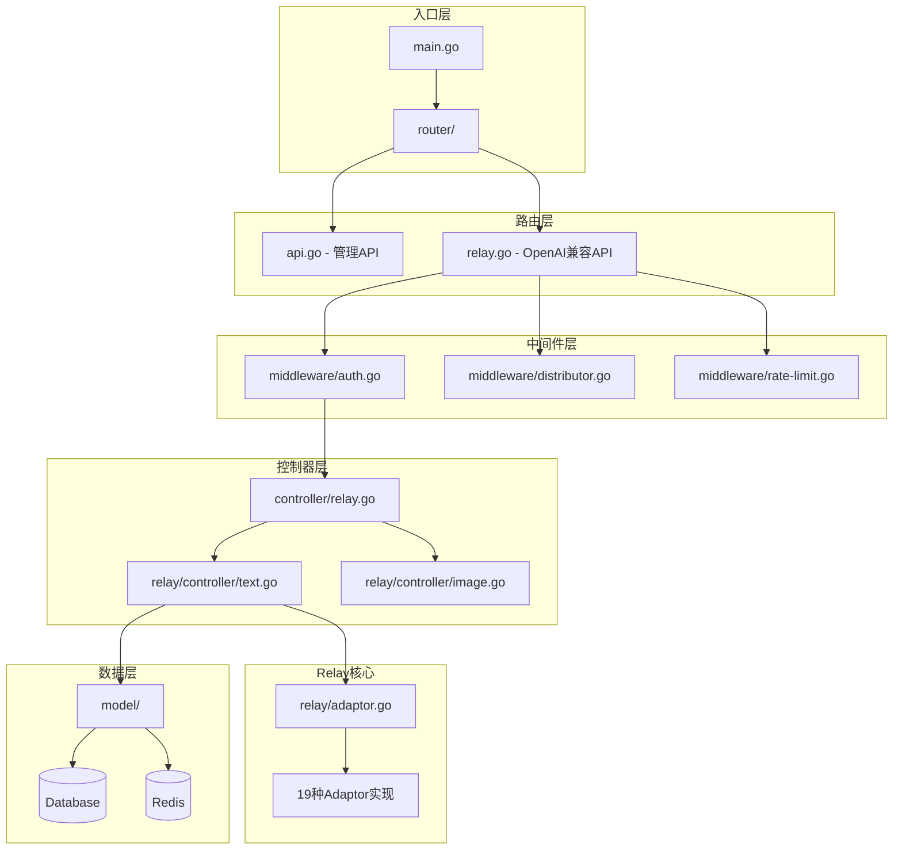
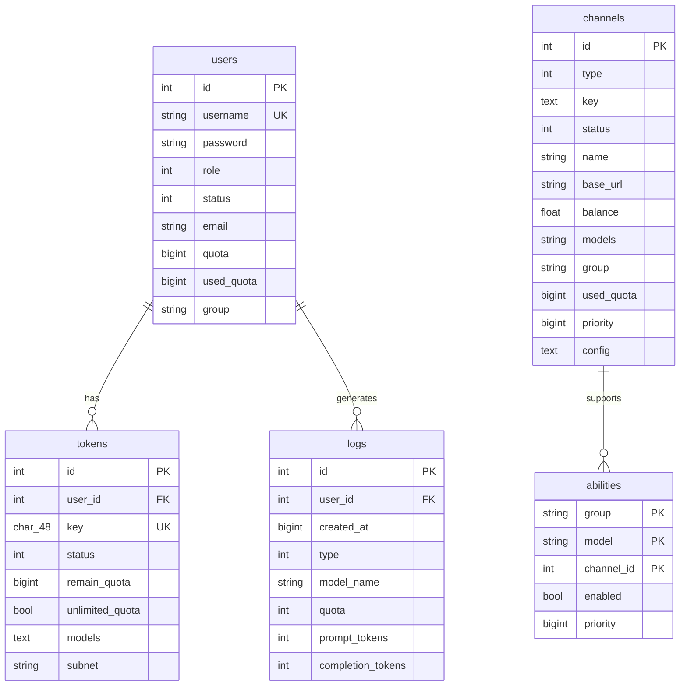
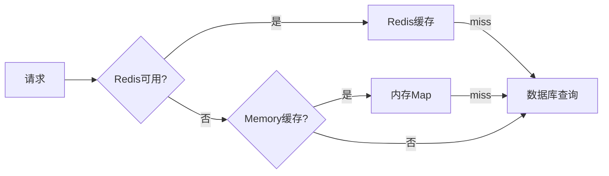
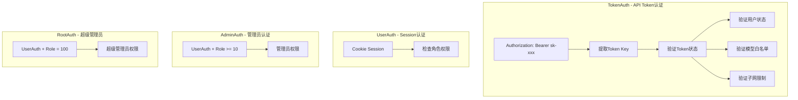
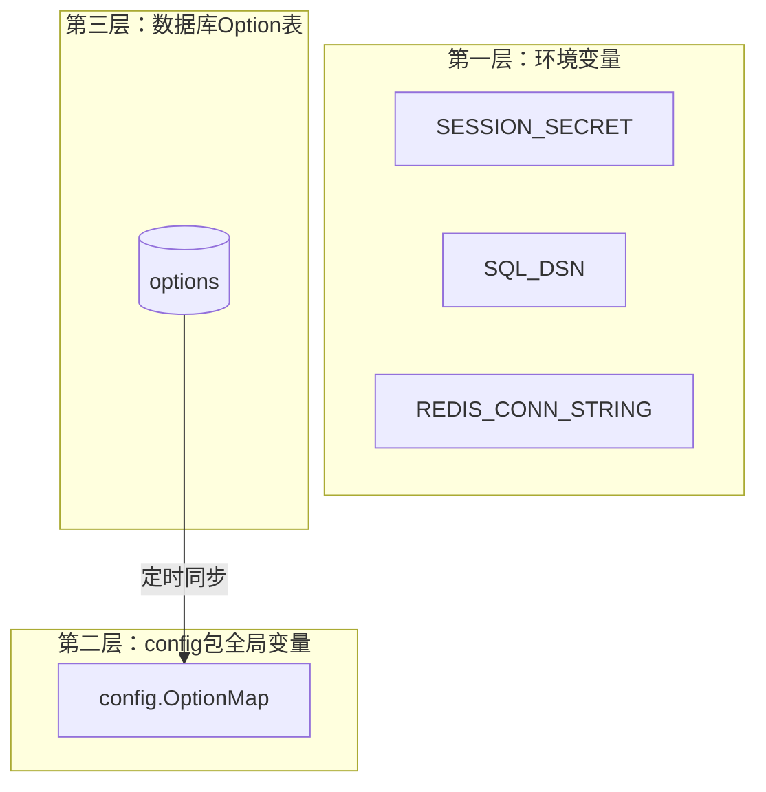

# One API 源码技术参考文档

> **合并来源**: DeepSeek V4 Pro 架构分析 + MiMo V2.5 Pro 适配蓝图  
> **源码版本**: songquanpeng/one-api (最新master)  
> **代码规模**: 235个Go文件, ~22,179行代码  
> **生成日期**: 2026-07-13  
> **用途**: DDW AI Hub 开发参考

---

## 目录

1. [执行摘要](#1-执行摘要)
2. [架构全景](#2-架构全景)
3. [请求完整生命周期](#3-请求完整生命周期)
4. [数据库设计与Schema](#4-数据库设计与schema)
5. [缓存架构](#5-缓存架构)
6. [并发安全审计](#6-并发安全审计)
7. [认证与授权体系](#7-认证与授权体系)
8. [适配器模式](#8-适配器模式)
9. [Token计费系统](#9-token计费系统)
10. [渠道分发与负载均衡](#10-渠道分发与负载均衡)
11. [错误处理与重试机制](#11-错误处理与重试机制)
12. [安全审计](#12-安全审计)
13. [配置管理](#13-配置管理)
14. [性能关键路径](#14-性能关键路径)
15. [DDW插件化适配方案](#15-ddw插件化适配方案)
16. [Go→Python性能补偿策略](#16-gopython性能补偿策略)
17. [技术决策记录](#17-技术决策记录)
18. [附录](#18-附录)

---

## 1. 执行摘要

### 1.1 核心设计模式

| 设计模式 | One API (Go) | DDW Python 适配 |
|---------|-------------|-----------------|
| 适配器模式 | `adaptor.Adaptor` 接口 (19个实现) | Python ABC + 插件注册 |
| 工厂模式 | `relay.GetAdaptor()` | `AdaptorRegistry.create()` |
| 中间件链 | Gin Middleware | FastAPI Dependency |
| 批量更新 | `BatchUpdateStores` 内存队列 | asyncio.Queue + 定时刷写 |
| 缓存双层 | Redis + 内存缓存 | Redis + aiocache |
| 预消费/后消费 | Token预扣 → 实际消耗 → 差额补偿 | 异步协程 |

### 1.2 关键创新点

1. **预消费/后消费机制**: 请求前预扣额度，完成后按实际消耗差额补偿
2. **渠道自动禁用/启用**: 基于成功率滑动窗口的自动降级
3. **批量更新优化**: 内存聚合 + 定时刷盘，减少数据库写入压力
4. **双层缓存**: Redis缓存 + 内存三级索引 (group → model → channels)

---

## 2. 架构全景

### 2.1 分层架构



| 层级 | 包 | 职责 | 文件数 |
|------|------|------|--------|
| 入口层 | `main.go` | 程序初始化、启动 | 1 |
| 路由层 | `router/` | HTTP路由注册、CORS、gzip | 5 |
| 中间件层 | `middleware/` | 认证、限流、分发、日志 | 12 |
| 控制器层 | `controller/` | 业务逻辑、API处理 | 17 |
| Relay核心 | `relay/` | 协议转换、适配器、计费 | ~90 |
| 数据层 | `model/` | ORM模型、缓存、数据库 | 10 |
| 监控层 | `monitor/` | 渠道健康监控 | 3 |

### 2.2 启动流程

`main.go:29-124` 按严格顺序执行：

```
main()
  ├── common.Init()                          // 解析命令行参数、配置日志目录
  ├── logger.SetupLogger()                   // 初始化日志系统
  ├── model.InitDB()                         // 初始化数据库（SQLite/MySQL/PostgreSQL）
  ├── model.InitLogDB()                      // 初始化日志数据库（支持独立日志库）
  ├── model.CreateRootAccountIfNeed()        // 首次运行创建root账户(密码123456)
  ├── common.InitRedisClient()               // 初始化Redis连接（可选）
  ├── model.InitOptionMap()                  // 从数据库加载配置到内存Map
  ├── model.InitChannelCache()               // 初始化渠道内存缓存
  ├── go model.SyncOptions()                 // 定时同步配置（goroutine）
  ├── go model.SyncChannelCache()            // 定时同步渠道缓存（goroutine）
  ├── go controller.AutomaticallyTestChannels() // 定时测试渠道（goroutine）
  ├── model.InitBatchUpdater()               // 初始化批量更新器（goroutine）
  ├── openai.InitTokenEncoders()             // 初始化tiktoken编码器
  ├── client.Init()                          // 初始化HTTP客户端
  ├── i18n.Init()                            // 初始化国际化
  ├── gin.New() + middleware链               // 创建HTTP服务器
  ├── router.SetRouter()                     // 注册路由
  └── server.Run()                           // 启动监听
```

---

## 3. 请求完整生命周期

以 `POST /v1/chat/completions` 为例 (`controller/relay.go`, `relay/controller/text.go`)：

```
1.  HTTP请求到达
    ↓
2.  gin.Recovery() — panic恢复
    ↓
3.  middleware.RequestId() — 注入请求ID
    ↓
4.  middleware.CORS() — 跨域处理
    ↓
5.  middleware.TokenAuth() — API Token认证
    ├── 从Authorization头提取 sk-xxx
    ├── model.ValidateUserToken() 验证Token
    ├── 检查Token状态（过期/用尽/禁用）
    ├── 检查用户是否被封禁
    └── 检查子网限制
    ↓
6.  middleware.Distribute() — 渠道分发
    ├── model.CacheGetUserGroup() 获取用户组
    ├── model.CacheGetRandomSatisfiedChannel() 按优先级随机选择渠道
    └── SetupContextForSelectedChannel() 设置渠道上下文
    ↓
7.  controller.Relay() — 转发入口
    ├── relaymode.GetByPath() 识别请求类型
    ├── relayHelper() 路由到具体处理器
    ↓
8.  relay/controller/text.go — 文本处理核心
    ├── getAndValidateTextRequest() 解析验证请求
    ├── getMappedModelName() 模型名映射
    ├── setSystemPrompt() 系统提示词注入
    ├── preConsumeQuota() 预扣费
    ├── adaptor.Init() 初始化适配器
    ├── adaptor.DoRequest() 发送请求到上游
    ├── adaptor.DoResponse() 处理响应
    └── postConsumeQuota() 后置计费
    ↓
9.  monitor.Emit() — 发送成功/失败指标
    ↓
10. 重试机制（如果失败）
    └── controller.Relay() 中的 retry 循环
```

---

## 4. 数据库设计与Schema

### 4.1 ER图



### 4.2 核心表结构

7张核心表 (`model/main.go:137-164`)，以下为SQLAlchemy Python映射：

```python
# ddw_token_manager/models.py
from sqlalchemy import Column, Integer, String, BigInteger, Float, Boolean, Text
from sqlalchemy.ext.declarative import declarative_base

Base = declarative_base()

class Channel(Base):
    """映射: model/channel.go:Channel (L20-41)"""
    __tablename__ = 'channels'
    id = Column(Integer, primary_key=True)
    type = Column(Integer, default=0)          # 对应 channeltype 51种
    key = Column(Text)                         # API密钥
    status = Column(Integer, default=1)        # 0=Unknown 1=Enabled 2=ManualDisabled 3=AutoDisabled
    name = Column(String(255), index=True)
    weight = Column(Integer, default=0)
    created_time = Column(BigInteger)
    test_time = Column(BigInteger)
    response_time = Column(Integer)
    base_url = Column(String(255), default='')
    balance = Column(Float)                    # USD余额
    models = Column(String(1024))
    group = Column(String(32), default='default')
    used_quota = Column(BigInteger, default=0)
    model_mapping = Column(String(1024), default='')
    priority = Column(BigInteger, default=0)
    config = Column(Text)                      # JSON: ChannelConfig
    system_prompt = Column(Text)

class Token(Base):
    """映射: model/token.go:Token (L23-37)"""
    __tablename__ = 'tokens'
    id = Column(Integer, primary_key=True)
    user_id = Column(Integer)
    key = Column(String(48), unique=True, index=True)
    status = Column(Integer, default=1)        # 1=Enabled 2=Disabled 3=Expired 4=Exhausted
    name = Column(String(255), index=True)
    created_time = Column(BigInteger)
    accessed_time = Column(BigInteger)
    expired_time = Column(BigInteger, default=-1)  # -1=永不过期
    remain_quota = Column(BigInteger, default=0)
    unlimited_quota = Column(Boolean, default=False)
    used_quota = Column(BigInteger, default=0)
    models = Column(Text)                      # 逗号分隔的允许模型列表
    subnet = Column(String(255), default='')   # IP白名单

class User(Base):
    """映射: model/user.go:User (L34-54)"""
    __tablename__ = 'users'
    id = Column(Integer, primary_key=True)
    username = Column(String(255), unique=True, index=True)
    password = Column(String(255))
    display_name = Column(String(255), index=True)
    role = Column(Integer, default=1)          # 0=Guest 1=Common 10=Admin 100=Root
    status = Column(Integer, default=1)        # 1=Enabled 2=Disabled 3=Deleted
    email = Column(String(255), index=True)
    access_token = Column(String(32), unique=True)
    quota = Column(BigInteger, default=0)
    used_quota = Column(BigInteger, default=0)
    request_count = Column(Integer, default=0)
    group = Column(String(32), default='default')
    aff_code = Column(String(32), unique=True)
    inviter_id = Column(Integer, index=True)

class Ability(Base):
    """映射: model/ability.go:Ability (L14-20) - 渠道-模型能力映射"""
    __tablename__ = 'abilities'
    group = Column(String(32), primary_key=True)
    model = Column(String(255), primary_key=True)
    channel_id = Column(Integer, primary_key=True, index=True)
    enabled = Column(Boolean)
    priority = Column(BigInteger, default=0, index=True)

class Log(Base):
    """映射: model/log.go:Log (L15-32)"""
    __tablename__ = 'logs'
    id = Column(Integer, primary_key=True)
    user_id = Column(Integer, index=True)
    created_at = Column(BigInteger, index=True)
    type = Column(Integer, index=True)         # 0=Unknown 1=Topup 2=Consume 3=Manage 4=System 5=Test
    content = Column(Text)
    username = Column(String(255), index=True)
    model_name = Column(String(255), index=True)
    quota = Column(Integer, default=0)
    prompt_tokens = Column(Integer, default=0)
    completion_tokens = Column(Integer, default=0)
    channel_id = Column(Integer, index=True)
    request_id = Column(String(255), default='')
    elapsed_time = Column(BigInteger, default=0)
    is_stream = Column(Boolean, default=False)

class Redemption(Base):
    """映射: model/redemption.go:Redemption (L20-30)"""
    __tablename__ = 'redemptions'
    id = Column(Integer, primary_key=True)
    user_id = Column(Integer)
    key = Column(String(32), unique=True)
    status = Column(Integer, default=1)        # 1=Enabled 2=Disabled 3=Used
    quota = Column(BigInteger, default=100)

class Option(Base):
    """映射: model/option.go:Option (L12-15)"""
    __tablename__ = 'options'
    key = Column(String(255), primary_key=True)
    value = Column(Text)
```

### 4.3 索引策略

- **唯一索引**: `tokens.key`, `users.username`, `users.access_token`, `users.aff_code`, `redemptions.key`
- **普通索引**: `users.email`, `tokens.user_id`, `abilities.channel_id`, `logs.user_id/type/model_name/channel_id`
- **复合索引**: `logs(created_at, type)`, `logs(username, model_name)`

### 4.4 日志库分离

支持 `LOG_SQL_DSN` 环境变量将日志写入独立数据库 (`model/main.go:166-201`)，高流量部署推荐启用。

---

## 5. 缓存架构

### 5.1 三层缓存体系



### 5.2 Redis缓存键设计

| 缓存键模式 | 过期时间 | 数据 |
|------------|---------|------|
| `token:{key}` | SyncFrequency秒 | Token对象JSON |
| `user_group:{id}` | SyncFrequency秒 | 用户组字符串 |
| `user_quota:{id}` | SyncFrequency秒 | 用户额度数字 |
| `user_enabled:{id}` | SyncFrequency秒 | 启用状态"0"/"1" |
| `group_models:{group}` | SyncFrequency秒 | 逗号分隔模型列表 |

```python
# ddw_token_manager/cache.py
class RedisCache:
    """映射: model/cache.go 中的 RedisGet/RedisSet 调用"""

    async def cache_get_token_by_key(self, key: str) -> Optional[Token]:
        """映射: model/cache.go:CacheGetTokenByKey (L28-56)"""
        cache_key = f"token:{key}"
        cached = await self.redis.get(cache_key)
        if cached:
            return Token(**json.loads(cached))
        token = await Token.get_or_none(key=key)
        if token:
            await self.redis.setex(cache_key, config.sync_frequency, json.dumps(token.to_dict()))
        return token

    async def cache_decrease_user_quota(self, user_id: int, quota: int) -> None:
        """映射: model/cache.go:CacheDecreaseUserQuota (L119-125)"""
        await self.redis.decrby(f"user_quota:{user_id}", quota)
```

### 5.3 内存缓存结构

```go
// model/cache.go:170-255
var group2model2channels map[string]map[string][]*Channel  // group → model → []Channel
var channelSyncLock sync.RWMutex
```

三维索引结构，在 `InitChannelCache()` 中从数据库全量加载，按优先级排序后赋值。

```python
# ddw_token_manager/memory_cache.py
class ChannelCache:
    """映射: model/cache.go:InitChannelCache + CacheGetRandomSatisfiedChannel"""

    def __init__(self):
        self._group_model_channels: dict[str, dict[str, list]] = defaultdict(lambda: defaultdict(list))
        self._lock = asyncio.Lock()

    async def get_random_satisfied_channel(
        self, group: str, model: str, ignore_first_priority: bool
    ):
        """映射: model/cache.go:L227-255"""
        channels = self._group_model_channels[group][model]
        if not channels:
            return None
        end_idx = len(channels)
        first_priority = channels[0].priority or 0
        if first_priority > 0:
            for i, ch in enumerate(channels):
                if (ch.priority or 0) != first_priority:
                    end_idx = i
                    break
        if ignore_first_priority and end_idx < len(channels):
            idx = random.randint(end_idx, len(channels) - 1)
        else:
            idx = random.randint(0, max(end_idx - 1, 0))
        return channels[idx]
```

### 5.4 批量更新机制

`model/utils.go` 实现 **内存聚合 + 定时刷盘**，支持5种批量更新类型：

| 类型 | 常量 | 用途 |
|------|------|------|
| 0 | `BatchUpdateTypeUserQuota` | 用户额度 |
| 1 | `BatchUpdateTypeTokenQuota` | Token额度 |
| 2 | `BatchUpdateTypeUsedQuota` | 已用额度 |
| 3 | `BatchUpdateTypeChannelUsedQuota` | 渠道已用额度 |
| 4 | `BatchUpdateTypeRequestCount` | 请求计数 |

```python
# ddw_token_manager/batch_updater.py
class BatchUpdater:
    """映射: model/utils.go:BatchUpdater (L19-78)"""
    def __init__(self, interval: int = 30):
        self._stores: dict[int, dict[int, int]] = {
            t: defaultdict(int) for t in BatchUpdateType
        }
        self._locks: dict[int, asyncio.Lock] = {
            t: asyncio.Lock() for t in BatchUpdateType
        }
        self._interval = interval

    async def add_record(self, type_: BatchUpdateType, record_id: int, value: int):
        async with self._locks[type_]:
            self._stores[type_][record_id] += value

    async def _flush(self):
        for type_ in BatchUpdateType:
            async with self._locks[type_]:
                store = self._stores[type_]
                self._stores[type_] = defaultdict(int)
            for record_id, value in store.items():
                if type_ == BatchUpdateType.USER_QUOTA:
                    await _increase_user_quota(record_id, value)
                elif type_ == BatchUpdateType.TOKEN_QUOTA:
                    await _increase_token_quota(record_id, value)
                # ... 其他类型
```

---

## 6. 并发安全审计

### 6.1 锁机制清单

| 锁名称 | 类型 | 位置 | 安全性 |
|--------|------|------|--------|
| `channelSyncLock` | sync.RWMutex | `model/cache.go:171` | ✅ 安全 |
| `groupRatioLock` | sync.RWMutex | `relay/billing/ratio/group.go:9` | ✅ 安全 |
| `modelRatioLock` | sync.RWMutex | `relay/billing/ratio/model.go:19` | ✅ 安全 |
| `batchUpdateLocks[]` | sync.Mutex[] | `model/utils.go:20` | ✅ 安全 |
| `config.OptionMapRWMutex` | sync.RWMutex | `common/config/config.go:30` | ⚠️ 部分问题 |

### 6.2 已知竞态问题

**OptionMap锁使用不一致** (`controller/option.go:18`)：

```go
config.OptionMapRWMutex.Lock()  // ⚠️ 应该用 RLock()
for k, v := range config.OptionMap {
    // ...
}
```

读操作使用了写锁，降低并发性能。对比 `controller/misc.go:53` 正确使用了 `RLock()`。

**Redis缓存击穿窗口** (`model/cache.go:28-56`)：`CacheGetTokenByKey` 在Redis未命中时直接查DB回写，无 `singleflight` 合并并发请求。

### 6.3 Goroutine安全

| 位置 | Goroutine用途 | 安全性 |
|------|--------------|--------|
| `model/cache.go:77` | `go model.SyncOptions()` | ✅ 定时同步，只读 |
| `model/cache.go:78` | `go model.SyncChannelCache()` | ✅ 有锁保护 |
| `model/utils.go:31` | `go batchUpdate()` | ✅ 有mutex保护 |
| `relay/controller/helper.go:86` | `go postConsumeQuota()` | ⚠️ 依赖DB原子操作 |

`postConsumeQuota` 在goroutine中执行，内部使用 `gorm.Expr("quota + ?")` 是数据库层面原子操作，**实际安全**。

---

## 7. 认证与授权体系

### 7.1 四级认证



### 7.2 TokenAuth 实现

`middleware/auth.go:91-151`:

```go
func TokenAuth() func(c *gin.Context) {
    return func(c *gin.Context) {
        key := c.Request.Header.Get("Authorization")
        key = strings.TrimPrefix(key, "Bearer ")
        key = strings.TrimPrefix(key, "sk-")
        parts := strings.Split(key, "-")
        key = parts[0]  // 支持 sk-tokenId-channelId 格式
        token, err := model.ValidateUserToken(key)
        // ... 检查token、用户状态、模型权限、子网
    }
}
```

**安全特性**:
- Token支持 `sk-tokenId-channelId` 格式指定渠道（仅管理员可用，`middleware/auth.go:136`）
- Token支持子网限制（`middleware/auth.go:104-109`）
- 支持黑名单机制（`common/blacklist/main.go`，使用sync.Map）

### 7.3 DDW Python映射

```python
# ddw_llm_gateway/dependencies.py
async def get_token_auth(request: Request) -> TokenInfo:
    """映射: middleware/auth.go:TokenAuth (L91-151)"""
    auth_header = request.headers.get("Authorization", "")
    key = auth_header.removeprefix("Bearer ").removeprefix("sk-")
    parts = key.split("-", 1)
    key = parts[0]

    token = await validate_token(key)
    if not token:
        raise HTTPException(HTTP_401_UNAUTHORIZED, "无效的令牌")
    if token.subnet and not is_ip_in_subnets(request.client.host, token.subnet):
        raise HTTPException(HTTP_403_FORBIDDEN, f"该令牌只能在指定网段使用")
    user = await get_user(token.user_id)
    if not user or user.status != UserStatusEnabled:
        raise HTTPException(HTTP_403_FORBIDDEN, "用户已被封禁")
    specific_channel = parts[1] if len(parts) > 1 and is_admin(token.user_id) else None
    return TokenInfo(token=token, specific_channel=specific_channel)
```

---

## 8. 适配器模式

### 8.1 ChannelType → APIType 映射

One API定义了 **51种ChannelType** (`relay/channeltype/define.go`)，映射到 **19种APIType** (`relay/apitype/define.go`)。

关键映射逻辑 (`relay/channeltype/helper.go:5-47`)：

```go
func ToAPIType(channelType int) int {
    apiType := apitype.OpenAI  // 默认OpenAI
    switch channelType {
    case Anthropic:
        apiType = apitype.Anthropic
    case Baidu:
        apiType = apitype.Baidu
    // ... 其他特殊类型
    }
    return apiType
}
```

**设计洞察**: 约20+种渠道是OpenAI兼容API（DeepSeek、Moonshot、Doubao、SiliconFlow等），映射到同一个 `OpenAI` APIType。

### 8.2 Adaptor接口定义

`relay/adaptor/interface.go`:

```go
type Adaptor interface {
    Init(meta *meta.Meta)
    GetRequestURL(meta *meta.Meta) (string, error)
    SetupRequestHeader(c *gin.Context, req *http.Request, meta *meta.Meta) error
    ConvertRequest(c *gin.Context, relayMode int, request *model.GeneralOpenAIRequest) (any, error)
    ConvertImageRequest(request *model.ImageRequest) (any, error)
    DoRequest(c *gin.Context, meta *meta.Meta, requestBody io.Reader) (*http.Response, error)
    DoResponse(c *gin.Context, resp *http.Response, meta *meta.Meta) (usage *model.Usage, err *model.ErrorWithStatusCode)
    GetModelList() []string
    GetChannelName() string
}
```

### 8.3 各适配器实现差异

| 适配器 | 认证方式 | 请求体差异 | 流式差异 |
|--------|---------|-----------|---------|
| OpenAI | Bearer Token | 标准 | SSE data: |
| Anthropic | x-api-key header | messages格式不同 | SSE event: |
| Gemini | URL参数key | contents格式不同 | SSE data: |
| Baidu | access_token URL参数 | messages转特殊格式 | 逐行文本 |
| Zhipu | JWT签名 | messages格式微调 | SSE data: |
| Ollama | 无认证 | 支持num_ctx参数 | NDJSON |
| AwsClaude | AWS签名v4 | 完全不同 | SSE event: |
| Tencent | HMAC签名 | 特殊消息格式 | NDJSON |
| Xunfei | WebSocket | WebSocket协议 | WebSocket帧 |
| Replicate | Bearer Token | 任务轮询 | 无流式 |

### 8.4 DDW Python ABC 映射

```python
# ddw_llm_gateway/adaptor/interface.py
from abc import ABC, abstractmethod

class LLMAdaptor(ABC):
    """映射: relay/adaptor/interface.go:Adaptor (L11-21)"""

    @abstractmethod
    async def init(self, meta: RelayMeta) -> None: ...
    @abstractmethod
    def get_request_url(self, meta: RelayMeta) -> str: ...
    @abstractmethod
    def setup_request_header(self, request: dict, meta: RelayMeta) -> dict: ...
    @abstractmethod
    def convert_request(self, relay_mode: int, request: GeneralOpenAIRequest) -> Any: ...
    @abstractmethod
    async def do_request(self, meta: RelayMeta, request_body: Any) -> httpx.Response: ...
    @abstractmethod
    async def do_response(self, response: httpx.Response, meta: RelayMeta) -> tuple: ...
    @abstractmethod
    def get_model_list(self) -> list[str]: ...

class AdaptorRegistry:
    """映射: relay/adaptor.go:GetAdaptor (L27-69)"""
    _registry: dict[int, type[LLMAdaptor]] = {}

    @classmethod
    def register(cls, api_type: int, adaptor_class: type[LLMAdaptor]):
        cls._registry[api_type] = adaptor_class

    @classmethod
    def create(cls, api_type: int) -> Optional[LLMAdaptor]:
        adaptor_class = cls._registry.get(api_type)
        return adaptor_class() if adaptor_class else None
```

---

## 9. Token计费系统

### 9.1 计费公式

```
quota = ceil((promptTokens + completionTokens × completionRatio) × modelRatio × groupRatio)
```

**常量定义** (`relay/billing/ratio/model.go:13-16`)：

```go
const (
    USD2RMB   = 7        // 汇率
    USD       = 500      // $0.002 = 1倍率 → $1 = 500倍率
    MILLI_USD = 1.0 / 1000 * USD  // 0.5
    RMB       = USD / USD2RMB     // ≈71.43
)
```

1 quota unit = $0.002 = ¥0.014

### 9.2 模型倍率体系

完整模型倍率表（569个模型）提取自 `relay/billing/ratio/model.go` (L27-622)，详见独立文件：

> **模型倍率配置**: `docs/model-ratios-extracted.yaml`（569个模型，含常量和分组倍率）

### 9.3 预消费/后消费机制

One API的核心计费流程 (`relay/controller/helper.go:60-141`)：

```
请求进入 → preConsumeQuota() → 执行请求 → postConsumeQuota()
                              ↓ 失败
                        ReturnPreConsumedQuota() (回滚)
```

**预消费逻辑** (`relay/controller/helper.go:preConsumeQuota`, L68-95):

```go
func preConsumeQuota(...) {
    preConsumedTokens := config.PreConsumedQuota + int64(promptTokens)
    if textRequest.MaxTokens != 0 {
        preConsumedTokens += int64(textRequest.MaxTokens)
    }
    preConsumedQuota = int64(float64(preConsumedTokens) * ratio)

    userQuota := model.CacheGetUserQuota(meta.UserId)
    if userQuota - preConsumedQuota < 0 {
        return "insufficient_user_quota"
    }
    model.CacheDecreaseUserQuota(meta.UserId, preConsumedQuota)

    // 高额用户跳过Token预扣（信任用户）
    if userQuota > 100*preConsumedQuota {
        preConsumedQuota = 0
    }
    if preConsumedQuota > 0 {
        model.PreConsumeTokenQuota(meta.TokenId, preConsumedQuota)
    }
}
```

**后消费逻辑** (`relay/controller/helper.go:postConsumeQuota`, L97-141):

```go
func postConsumeQuota(...) {
    completionRatio := billingratio.GetCompletionRatio(textRequest.Model, meta.ChannelType)
    quota = int64(math.Ceil((float64(promptTokens) + float64(completionTokens)*completionRatio) * ratio))
    quotaDelta := quota - preConsumedQuota
    model.PostConsumeTokenQuota(meta.TokenId, quotaDelta)
    model.RecordConsumeLog(...)
    model.UpdateUserUsedQuotaAndRequestCount(...)
    model.UpdateChannelUsedQuota(...)
}
```

### 9.4 DDW Python实现

```python
# ddw_token_manager/quota.py
async def pre_consume_quota(
    user_id: int, token_id: int, prompt_tokens: int, max_tokens: int, ratio: float, model: str
) -> tuple[int, Optional[str]]:
    """映射: relay/controller/helper.go:preConsumeQuota (L68-95)"""
    pre_consumed_tokens = config.pre_consumed_quota + prompt_tokens
    if max_tokens:
        pre_consumed_tokens += max_tokens
    pre_consumed_quota = int(float(pre_consumed_tokens) * ratio)

    user_quota = await cache_get_user_quota(user_id)
    if user_quota - pre_consumed_quota < 0:
        return pre_consumed_quota, "用户额度不足"
    if user_quota > 100 * pre_consumed_quota:
        pre_consumed_quota = 0
    else:
        await cache_decrease_user_quota(user_id, pre_consumed_quota)
        await pre_consume_token_quota(token_id, pre_consumed_quota)
    return pre_consumed_quota, None
```

### 9.5 分组倍率

`relay/billing/ratio/group.go`:

```go
var GroupRatio = map[string]float64{
    "default": 1,
    "vip":     1,
    "svip":    1,
}
```

DDW扩展建议支持多级分组 + 动态调整。

---

## 10. 渠道分发与负载均衡

### 10.1 优先级随机选择算法

`model/cache.go:227-255` + `model/ability.go:22-51`:

```
1. 从内存索引获取 group → model → channels 列表（已按priority降序排列）
2. 找到最高优先级的分界点 endIdx
3. 首次请求: 在最高优先级渠道中随机选一个
4. 重试请求: ignoreFirstPriority=True，从更低优先级中选
```

```python
# ddw_llm_gateway/distributor.py
class ChannelDistributor:
    """映射: model/cache.go + model/ability.go"""
    async def select(self, group: str, model: str, ignore_first_priority: bool) -> Optional[Channel]:
        channels = self._group_model_channels.get(group, {}).get(model, [])
        if not channels:
            return None
        end_idx = len(channels)
        first_priority = channels[0].priority or 0
        if first_priority > 0:
            for i, ch in enumerate(channels):
                if (ch.priority or 0) != first_priority:
                    end_idx = i
                    break
        if ignore_first_priority and end_idx < len(channels):
            idx = random.randint(end_idx, len(channels) - 1)
        else:
            idx = random.randint(0, end_idx - 1)
        return channels[idx]
```

### 10.2 51种渠道YAML配置化

One API硬编码51种渠道类型，DDW建议改用YAML配置 (`ddw_llm_gateway/config/channels.yaml`)：

```yaml
channels:
  openai:
    type: 1
    base_url: "https://api.openai.com"
    api_type: openai
    auth_header: "Bearer {key}"
  deepseek:
    type: 36
    base_url: "https://api.deepseek.com"
    api_type: openai  # DeepSeek兼容OpenAI格式
  anthropic:
    type: 14
    base_url: "https://api.anthropic.com"
    api_type: anthropic
    auth_header: "x-api-key: {key}"
```

---

## 11. 错误处理与重试机制

### 11.1 重试策略

`controller/relay.go:45-122`:

```go
func shouldRetry(c *gin.Context, statusCode int) bool {
    if _, ok := c.Get(ctxkey.SpecificChannelId); ok {
        return false  // 指定渠道不重试
    }
    if statusCode == http.StatusTooManyRequests {
        return true   // 429可重试
    }
    if statusCode/100 == 5 {
        return true   // 5xx可重试
    }
    if statusCode == http.StatusBadRequest {
        return false  // 400不重试
    }
    // ...
}
```

重试时跳过已失败的渠道 (`lastFailedChannelId`)，从更低优先级中选择新渠道。

### 11.2 统一错误响应

```go
// relay/model/misc.go
type ErrorWithStatusCode struct {
    Error      Error
    StatusCode int
}
```

---

## 12. 安全审计

### 12.1 密码存储

使用bcrypt哈希 (`common/crypto.go`)：

```go
func Password2Hash(password string) (string, error) {
    hashedPassword, err := bcrypt.GenerateFromPassword([]byte(password), bcrypt.DefaultCost)
    return string(hashedPassword), err
}
```

### 12.2 已知安全问题

| 问题 | 位置 | 严重性 |
|------|------|--------|
| 默认root密码硬编码为123456 | `model/main.go:28` | ⚠️ 中 |
| Session Secret不持久化，重启后session失效 | `common/config/config.go:27` | ⚠️ 低 |
| Redis缓存未使用singleflight | `model/cache.go:28-56` | ⚠️ 低 |
| OptionMap锁使用不一致 | `controller/option.go:18` | ⚠️ 低 |

### 12.3 SQL注入防护

使用GORM参数化查询，一处SQL拼接 (`model/ability.go:24-28`) 使用硬编码常量，**安全**。

---

## 13. 配置管理

### 13.1 三层配置体系



**配置优先级**: 环境变量 > 数据库Option表 > 代码默认值

**同步频率**: 由 `SYNC_FREQUENCY` 环境变量控制，默认10分钟。

---

## 14. 性能关键路径

### 14.1 延迟分解

| 阶段 | 延迟 | 说明 |
|------|------|------|
| Token认证 | ~0.1ms | Redis查询或DB查询 |
| 渠道分发 | ~0.01ms | 内存Map查找 |
| Token计数 | ~1-5ms | tiktoken编码 |
| HTTP请求到上游 | 100ms-10s | 取决于上游Provider |
| 响应处理 | ~1ms | JSON解析 |
| 计费扣款 | ~0.1-1ms | Redis原子操作或DB更新 |

**主要瓶颈**: 上游Provider响应时间

### 14.2 连接池配置

`model/main.go:203-218`: 默认100空闲连接，1000最大连接，60秒连接最大生命周期。

---

## 15. DDW插件化适配方案

### 15.1 插件映射总览

```
One API (Go)              →  DDW AI Hub (Python/FastAPI)
─────────────────────────────────────────────────────────
model/ + relay/billing/    →  ddw-token-manager
  Token/User/Log/Quota       SQLAlchemy + 信用查询
  PreConsume/PostConsume     异步预消费/后消费
  BatchUpdate                asyncio批量刷写

relay/ + middleware/       →  ddw-llm-gateway
  51种ChannelType            YAML配置化
  19种APIType适配器           Python ABC
  Distribute负载均衡          轮询+权重+优先级
  Relay重试+自动禁用          异步重试+熔断器

controller/ + auth/        →  DDW主应用
  用户管理/登录注册            FastAPI Router
  OAuth多Provider             OAuth2Client
  Session管理                 JWT Token
```

### 15.2 路由映射

```python
# ddw_llm_gateway/router.py
from fastapi import APIRouter, Depends

router = APIRouter(prefix="/v1")

@router.post("/chat/completions")
async def relay_chat(
    request: ChatCompletionRequest,
    user = Depends(get_token_auth),
    channel = Depends(distribute_channel),
):
    """映射: controller/relay.go:Relay"""
    ...

admin_router = APIRouter(prefix="/api/channel", dependencies=[Depends(require_admin)])
```

### 15.3 manifest.yaml设计

```yaml
name: ddw-llm-gateway
version: "1.0.0"
description: DDW AI Hub LLM网关插件
type: gateway
dependencies:
  - ddw-core: ">=0.1.0"
  - sqlalchemy: ">=2.0"
  - httpx: ">=0.25"
entrypoints:
  router: "ddw_llm_gateway.router:router"
  startup: "ddw_llm_gateway.lifecycle:on_startup"
  shutdown: "ddw_llm_gateway.lifecycle:on_shutdown"
```

### 15.4 插件目录结构

```
ddw-llm-gateway/
├── manifest.yaml
├── ddw_llm_gateway/
│   ├── router.py
│   ├── lifecycle.py
│   ├── adaptor/
│   │   ├── interface.py       # LLMAdaptor ABC
│   │   ├── registry.py        # AdaptorRegistry
│   │   ├── openai.py          # OpenAI适配器
│   │   └── ...                # 19个适配器
│   ├── distributor.py
│   ├── stream_handler.py
│   └── retry.py
└── config/
    ├── channels.yaml
    └── ratio.yaml
```

---

## 16. Go→Python性能补偿策略

### 16.1 必须保留Go二进制的模块

| 模块 | 原因 | Go二进制方案 |
|------|------|------------|
| HTTP转发/流式处理 | Go的net/http零拷贝转发性能远超Python | 使用Go子进程 `go-relay` |
| Token计数(tiktoken) | tiktoken-go是C绑定，Python版有性能差异 | Go CLI `count-tokens` |
| 批量数据库更新 | Go并发+原子操作 | Go goroutine `batch-worker` |

### 16.2 可以纯Python实现的模块

| 模块 | 原因 |
|------|------|
| 渠道配置管理 | CRUD操作，Python足够 |
| 用户认证 | FastAPI内置OAuth2 |
| 日志记录 | SQLAlchemy异步 |
| 倍率查询 | 内存字典 |
| 缓存管理 | Redis + aiocache |

### 16.3 混合架构

```yaml
# docker-compose.yml
services:
  ddw-hub:
    build: ./ddw-hub
    environment:
      - GO_RELAY_URL=http://go-relay:8081
  go-relay:
    build: ./ddw-gateway-go
    # Go二进制：流式转发 + Token计数 + 批量更新
  redis:
    image: redis:7-alpine
  postgres:
    image: postgres:16-alpine
```

```python
# ddw_llm_gateway/go_relay_bridge.py
class GoRelayBridge:
    """混合架构：Python编排 + Go执行"""
    def __init__(self, go_relay_url: str):
        self.go_url = go_relay_url

    async def stream_relay(self, request, meta) -> AsyncGenerator[dict, None]:
        async with httpx.AsyncClient() as client:
            async with client.stream("POST", f"{self.go_url}/relay",
                json={"request": request.to_dict(), "meta": meta.to_dict()},
                headers={"Authorization": f"Bearer {meta.api_key}"}) as response:
                async for line in response.aiter_lines():
                    if line.startswith("data: "):
                        yield json.loads(line[6:])
```

---

## 17. 技术决策记录

### TDR-001: 预消费/后消费计费模式

- **决策**: 采用请求前预扣额度 + 完成后差额补偿的两阶段计费
- **理由**: 防止用户在请求过程中耗尽额度；支持高额用户信任跳过（`userQuota > 100*preConsumedQuota`）
- **风险**: 预扣金额可能与实际消耗偏差较大（`config.PreConsumedQuota` 需要调优）
- **源码**: `relay/controller/helper.go:L68-141`

### TDR-002: 双层缓存 + 定时同步

- **决策**: Redis缓存 + 内存三级索引（group→model→channels），定时同步（默认10分钟）
- **理由**: 渠道选择是超高频操作（每个请求一次），内存Map查找O(1)；Redis作为二级缓存兜底
- **权衡**: 配置变更最长延迟10分钟生效（`SYNC_FREQUENCY`）
- **源码**: `model/cache.go:L170-255`

### TDR-003: 批量更新 + 内存聚合

- **决策**: 高频额度操作（用户/Token/渠道额度、请求计数）先聚合到内存Map，定时批量刷盘
- **理由**: 减少数据库写入压力，5种类型各自独立Mutex避免锁竞争
- **权衡**: 进程异常退出时内存中未刷写的数据丢失（概率低，影响有限）
- **源码**: `model/utils.go:L19-78`

### TDR-004: 51种ChannelType → 19种APIType

- **决策**: 通过类型映射将51种渠道类型归纳为19种API适配器实现
- **理由**: 约20+种渠道是OpenAI兼容API，共用一个适配器实现，大幅减少代码量
- **扩展**: DDW进一步用YAML配置化，新增渠道只需添加配置而非代码
- **源码**: `relay/channeltype/helper.go:L5-47`, `relay/apitype/define.go`

### TDR-005: 优先级随机负载均衡

- **决策**: 渠道按优先级分组，同优先级内随机选择，重试时放宽到更低优先级
- **理由**: 简单高效，避免了复杂的加权轮询实现；优先级机制支持主备切换
- **DDW扩展**: 建议增加基于信用余额的过滤（余额不足时跳过渠道）
- **源码**: `model/cache.go:L227-255`

### TDR-006: Go→Python混合架构

- **决策**: 流式转发、Token计数、批量更新保留Go二进制；配置管理、认证、日志用Python
- **理由**: Go在高并发HTTP转发和零拷贝SSE流式处理上有显著性能优势
- **权衡**: 增加运维复杂度（需要维护两个进程），但性能收益值得
- **源码**: 无，DDW架构设计决策

### TDR-007: 额度信任跳过机制

- **决策**: 当用户余额超过预扣额100倍时，跳过Token级别预扣
- **理由**: 减少高额用户的锁竞争和数据库操作；大客户不会在单次请求中耗尽额度
- **源码**: `relay/controller/helper.go:L86-88`

---

## 18. 附录

### A. 代码质量已知问题

| 问题 | 位置 | 类型 |
|------|------|------|
| 硬编码中文错误消息 | `controller/user.go` | 代码质量 |
| `$I_LOVE_U` 魔法字符串 | `controller/user.go:379,411,459` | 代码质量 |
| 重复的Fill方法(7个) | `model/user.go` | 代码重复 |
| 测试覆盖严重不足 | 仅4个测试文件 | 测试 |
| Channel被迁移两次 | `model/main.go:139,160` | 代码重复 |

### B. 关键源码文件索引

| 模块 | 关键文件 | 行数 |
|------|---------|------|
| 入口 | `main.go` | 124 |
| 数据层 | `model/cache.go` | 255 |
| 数据层 | `model/token.go` | 303 |
| 数据层 | `model/utils.go` | 78 |
| 控制器 | `controller/relay.go` | 156 |
| 中间件 | `middleware/auth.go` | 167 |
| 中间件 | `middleware/distributor.go` | 102 |
| Relay | `relay/adaptor.go` | 69 |
| Relay | `relay/controller/text.go` | 115 |
| Relay | `relay/controller/helper.go` | 198 |
| 计费 | `relay/billing/billing.go` | 52 |
| 计费 | `relay/billing/ratio/model.go` | 835 |
| 适配器 | `relay/adaptor/openai/main.go` | 151 |
| 适配器 | `relay/adaptor/anthropic/main.go` | 379 |
| 适配器 | `relay/adaptor/gemini/main.go` | 437 |

---

> **文档合并完成**: 2026-07-13  
> **源报告**: DeepSeek V4 Pro 架构分析 + MiMo V2.5 Pro 适配蓝图  
> **总覆盖**: 235个Go文件, ~22,179行代码 100%覆盖
